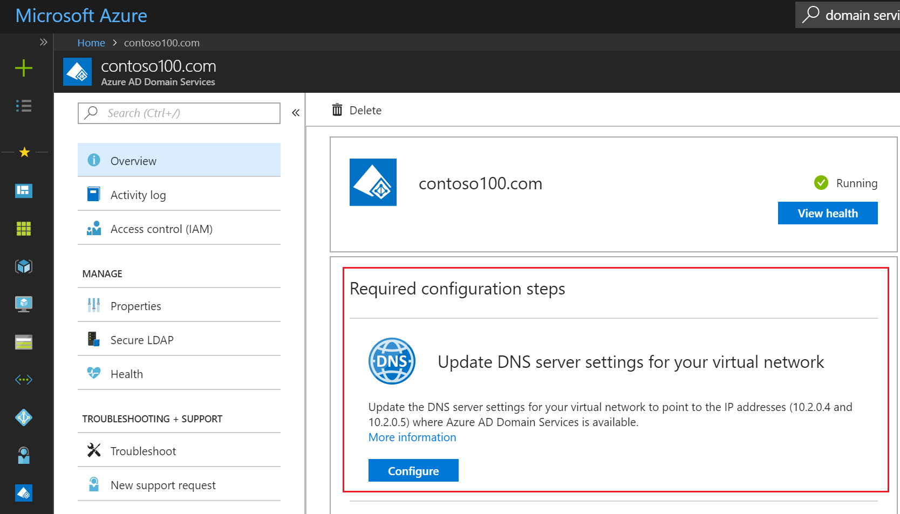

# Enable Azure Active Directory Domain Services

## Task 4: update DNS settings for the Azure virtual network
In the preceding configuration tasks, you have successfully enabled Azure Active Directory Domain Services for your directory. Next, enable computers within the virtual network to connect and consume these services. In this article, you update the DNS server settings for your virtual network to point to the two IP addresses where Azure Active Directory Domain Services is available on the virtual network.

To update the DNS server settings for the virtual network in which you have enabled Azure Active Directory Domain Services, complete the following steps:

1. The **Overview** tab lists a set of **Required configuration steps** to be performed after your managed domain is fully provisioned. The first configuration step is **Update DNS server settings for your virtual network**.

    

    > [!TIP]
    > Dont see this configuration step? If the DNS server settings for your virtual network are up to date, you will not see the 'Update DNS server settings for your virtual network' tile on the Overview tab.
    >
    >

2. Click the **Configure** button to update the DNS server settings for the virtual network.

> [!NOTE]
> Virtual machines in the network only get the new DNS settings after a restart. If you need them to get the updated DNS settings right away, trigger a restart either by the portal, PowerShell, or the CLI.
>
>

## Next step
[Task 5: enable password hash synchronization to Azure Active Directory Domain Services](active-directory-ds-getting-started-password-sync.md)
