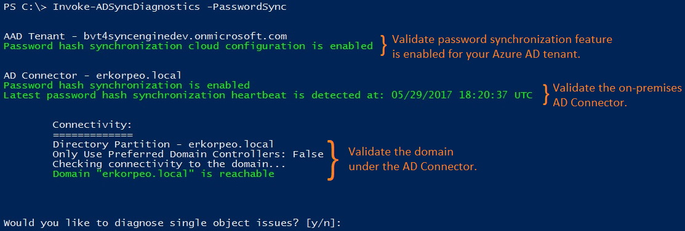
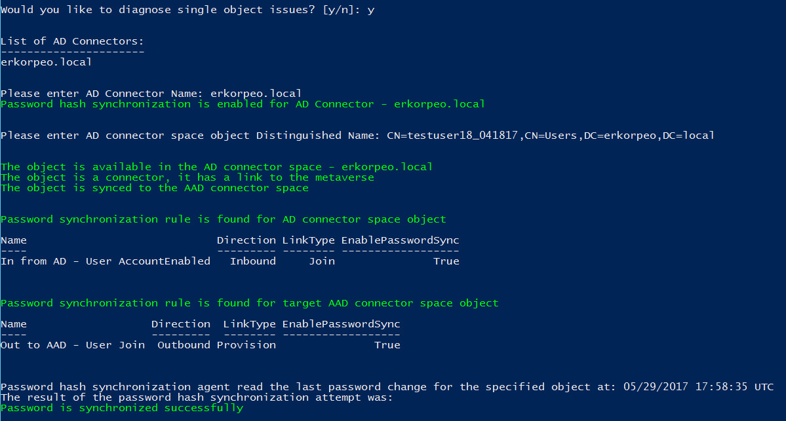
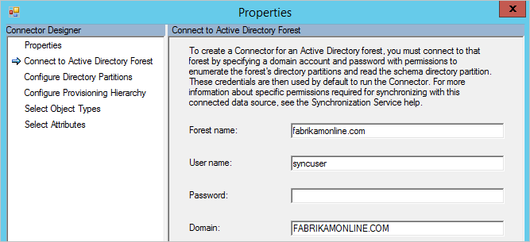
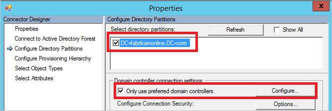
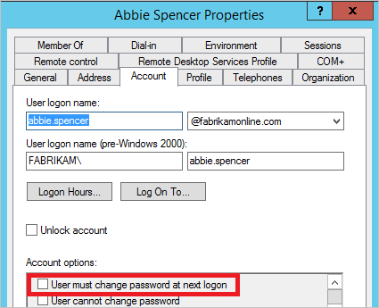
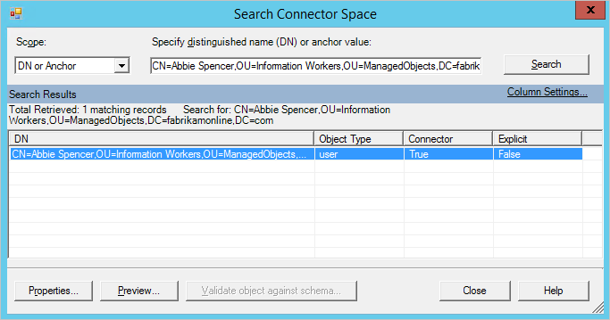
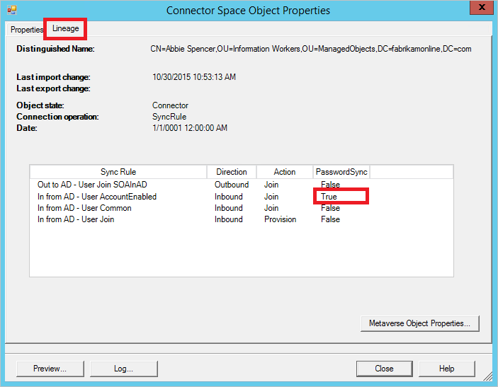
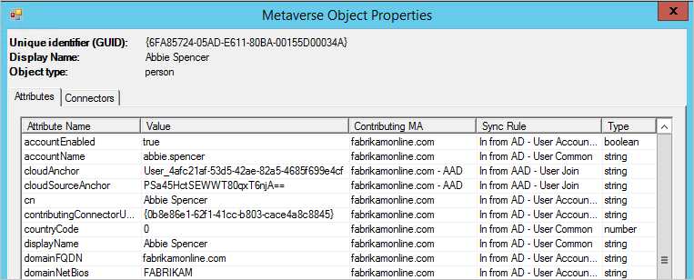

# Troubleshoot password hash synchronization with Azure AD Connect sync
This topic provides steps for how to troubleshoot issues with password hash synchronization. If passwords are not synchronizing as expected, it can be either for a subset of users or for all users.

For Azure Active Directory (Azure AD) Connect deployment with version 1.1.614.0 or after, use the troubleshooting task in the wizard to troubleshoot password hash synchronization issues:

* If you have an issue where no passwords are synchronized, refer to the [No passwords are synchronized: troubleshoot by using the troubleshooting task](#no-passwords-are-synchronized-troubleshoot-by-using-the-troubleshooting-task) section.

* If you have an issue with individual objects, refer to the [One object is not synchronizing passwords: troubleshoot by using the troubleshooting task](#one-object-is-not-synchronizing-passwords-troubleshoot-by-using-the-troubleshooting-task) section.

For deployment with version 1.1.524.0 or later, there is a diagnostic cmdlet that you can use to troubleshoot password hash synchronization issues:

* If you have an issue where no passwords are synchronized, refer to the [No passwords are synchronized: troubleshoot by using the diagnostic cmdlet](#no-passwords-are-synchronized-troubleshoot-by-using-the-diagnostic-cmdlet) section.

* If you have an issue with individual objects, refer to the [One object is not synchronizing passwords: troubleshoot by using the diagnostic cmdlet](#one-object-is-not-synchronizing-passwords-troubleshoot-by-using-the-diagnostic-cmdlet) section.

For older versions of Azure AD Connect deployment:

* If you have an issue where no passwords are synchronized, refer to the [No passwords are synchronized: manual troubleshooting steps](#no-passwords-are-synchronized-manual-troubleshooting-steps) section.

* If you have an issue with individual objects, refer to the [One object is not synchronizing passwords: manual troubleshooting steps](#one-object-is-not-synchronizing-passwords-manual-troubleshooting-steps) section.


## No passwords are synchronized: troubleshoot by using the troubleshooting task
You can use the troubleshooting task to figure out why no passwords are synchronized.

> [!NOTE]
> The troubleshooting task is available only for Azure AD Connect version 1.1.614.0 or later.

### Run the troubleshooting task
To troubleshoot issues where no passwords are synchronized:

1. Open a new Windows PowerShell session on your Azure AD Connect server with the **Run as Administrator** option.

2. Run `Set-ExecutionPolicy RemoteSigned` or `Set-ExecutionPolicy Unrestricted`.

3. Start the Azure AD Connect wizard.

4. Navigate to the **Additional Tasks** page, select **Troubleshoot**, and click **Next**.

5. On the Troubleshooting page, click **Launch** to start the troubleshooting menu in PowerShell.

6. In the main menu, select **Troubleshoot password hash synchronization**.

7. In the sub menu, select **Password hash synchronization does not work at all**.

### Understand the results of the troubleshooting task
The troubleshooting task performs the following checks:

* Validates that the password hash synchronization feature is enabled for your Azure AD tenant.

* Validates that the Azure AD Connect server is not in staging mode.

* For each existing on-premises Active Directory connector (which corresponds to an existing Active Directory forest):

   * Validates that the password hash synchronization feature is enabled.
   
   * Searches for password hash synchronization heartbeat events in the Windows Application Event logs.

   * For each Active Directory domain under the on-premises Active Directory connector:

      * Validates that the domain is reachable from the Azure AD Connect server.

      * Validates that the Active Directory Domain Services (AD DS) accounts used by the on-premises Active Directory connector has the correct username, password, and permissions required for password hash synchronization.

The following diagram illustrates the results of the cmdlet for a single-domain, on-premises Active Directory topology:



The rest of this section describes specific results that are returned by the task and corresponding issues.

#### password hash synchronization feature isn't enabled
If you haven't enabled password hash synchronization by using the Azure AD Connect wizard, the following error is returned:


#### Azure AD Connect server is in staging mode
If the Azure AD Connect server is in staging mode, password hash synchronization is temporarily disabled, and the following error is returned:


#### No password hash synchronization heartbeat events
Each on-premises Active Directory connector has its own password hash synchronization channel. When the password hash synchronization channel is established and there aren't any password changes to be synchronized, a heartbeat event (EventId 654) is generated once every 30 minutes under the Windows Application Event Log. For each on-premises Active Directory connector, the cmdlet searches for corresponding heartbeat events in the past three hours. If no heartbeat event is found, the following error is returned:


#### AD DS account does not have correct permissions
If the AD DS account that's used by the on-premises Active Directory connector to synchronize password hashes does not have the appropriate permissions, the following error is returned:


#### Incorrect AD DS account username or password
If the AD DS account used by the on-premises Active Directory connector to synchronize password hashes has an incorrect username or password, the following error is returned:


## One object is not synchronizing passwords: troubleshoot by using the troubleshooting task

You can use the troubleshooting task to determine why one object is not synchronizing passwords.

> [!NOTE]
> The troubleshooting task is available only for Azure AD Connect version 1.1.614.0 or later.

### Run the diagnostics cmdlet
To troubleshoot issues for a specific user object:

1. Open a new Windows PowerShell session on your Azure AD Connect server with the **Run as Administrator** option.

2. Run `Set-ExecutionPolicy RemoteSigned` or `Set-ExecutionPolicy Unrestricted`.

3. Start the Azure AD Connect wizard.

4. Navigate to the **Additional Tasks** page, select **Troubleshoot**, and click **Next**.

5. On the Troubleshooting page, click **Launch** to start the troubleshooting menu in PowerShell.

6. In the main menu, select **Troubleshoot password hash synchronization**.

7. In the sub menu, select **Password is not synchronized for a specific user account**.

### Understand the results of the troubleshooting task
The troubleshooting task performs the following checks:

* Examines the state of the Active Directory object in the Active Directory connector space, Metaverse, and Azure AD connector space.

* Validates that there are synchronization rules with password hash synchronization enabled and applied to the Active Directory object.

* Attempts to retrieve and display the results of the last attempt to synchronize the password for the object.

The following diagram illustrates the results of the cmdlet when troubleshooting password hash synchronization for a single object:



The rest of this section describes specific results returned by the cmdlet and corresponding issues.

#### The Active Directory object isn't exported to Azure AD
password hash synchronization for this on-premises Active Directory account fails because there is no corresponding object in the Azure AD tenant. The following error is returned:


#### User has a temporary password
Currently, Azure AD Connect does not support synchronizing temporary passwords with Azure AD. A password is considered to be temporary if the **Change password at next logon** option is set on the on-premises Active Directory user. The following error is returned:


#### Results of last attempt to synchronize password aren't available
By default, Azure AD Connect stores the results of password hash synchronization attempts for seven days. If there are no results available for the selected Active Directory object, the following warning is returned:


## No passwords are synchronized: troubleshoot by using the diagnostic cmdlet
You can use the `Invoke-ADSyncDiagnostics` cmdlet to figure out why no passwords are synchronized.

> [!NOTE]
> The `Invoke-ADSyncDiagnostics` cmdlet is available only for Azure AD Connect version 1.1.524.0 or later.

### Run the diagnostics cmdlet
To troubleshoot issues where no passwords are synchronized:

1. Open a new Windows PowerShell session on your Azure AD Connect server with the **Run as Administrator** option.

2. Run `Set-ExecutionPolicy RemoteSigned` or `Set-ExecutionPolicy Unrestricted`.

3. Run `Import-Module ADSyncDiagnostics`.

4. Run `Invoke-ADSyncDiagnostics -PasswordSync`.


## One object is not synchronizing passwords: troubleshoot by using the diagnostic cmdlet
You can use the `Invoke-ADSyncDiagnostics` cmdlet to determine why one object is not synchronizing passwords.

> [!NOTE]
> The `Invoke-ADSyncDiagnostics` cmdlet is available only for Azure AD Connect version 1.1.524.0 or later.

### Run the diagnostics cmdlet
To troubleshoot issues where no passwords are synchronized for a user:

1. Open a new Windows PowerShell session on your Azure AD Connect server with the **Run as Administrator** option.

2. Run `Set-ExecutionPolicy RemoteSigned` or `Set-ExecutionPolicy Unrestricted`.

3. Run `Import-Module ADSyncDiagnostics`.

4. Run the following cmdlet:
   ```
   Invoke-ADSyncDiagnostics -PasswordSync -ADConnectorName <Name-of-AD-Connector> -DistinguishedName <DistinguishedName-of-AD-object>
   ```
   For example:
   ```
   Invoke-ADSyncDiagnostics -PasswordSync -ADConnectorName "contoso.com" -DistinguishedName "CN=TestUserCN=Users,DC=contoso,DC=com"
   ```


## No passwords are synchronized: manual troubleshooting steps
Follow these steps to determine why no passwords are synchronized:

1. Is the Connect server in [staging mode](active-directory-aadconnectsync-operations.md#staging-mode)? A server in staging mode does not synchronize any passwords.

2. Run the script in the [Get the status of password sync settings](#get-the-status-of-password-sync-settings) section. It gives you an overview of the password sync configuration.  

      

3. If the feature is not enabled in Azure AD or if the sync channel status is not enabled, run the Connect installation wizard. Select **Customize synchronization options**, and unselect password sync. This change temporarily disables the feature. Then run the wizard again and re-enable password sync. Run the script again to verify that the configuration is correct.

4. Look in the event log for errors. Look for the following events, which would indicate a problem:
    * Source: "Directory synchronization" ID: 0, 611, 652, 655
    If you see these events, you have a connectivity problem. The event log message contains forest information where you have a problem. For more information, see [Connectivity problem](#connectivity problem).

5. If you see no heartbeat or if nothing else worked, run [Trigger a full sync of all passwords](#trigger-a-full-sync-of-all-passwords). Run the script only once.

6. See the [Troubleshoot one object that is not synchronizing passwords](#one-object-is-not-synchronizing-passwords) section.

### Connectivity problems

Do you have connectivity with Azure AD?

Does the account have required permissions to read the password hashes in all domains? If you installed Connect by using Express settings, the permissions should already be correct. 

If you used custom installation, set the permissions manually by doing the following:
    
1. To find the account used by the Active Directory connector, start **Synchronization Service Manager**. 
 
2. Go to **Connectors**, and then search for the on-premises Active Directory forest you are troubleshooting. 
 
3. Select the connector, and then click **Properties**. 
 
4. Go to **Connect to Active Directory Forest**.  
    
      
    Note the username and the domain where the account is located.
    
5. Start **Active Directory Users and Computers**, and then verify that the account you found earlier has the follow permissions set at the root of all domains in your forest:
    * Replicate Directory Changes
    * Replicate Directory Changes All

6. Are the domain controllers reachable by Azure AD Connect? If the Connect server cannot connect to all domain controllers, configure **Only use preferred domain controller**.  
    
      
    
7. Go back to **Synchronization Service Manager** and **Configure Directory Partition**. 
 
8. Select your domain in **Select directory partitions**, select the **Only use preferred domain controllers** check box, and then click **Configure**. 

9. In the list, enter the domain controllers that Connect should use for password sync. The same list is used for import and export as well. Do these steps for all your domains.

10. If the script shows that there is no heartbeat, run the script in [Trigger a full sync of all passwords](#trigger-a-full-sync-of-all-passwords).

## One object is not synchronizing passwords: manual troubleshooting steps
You can easily troubleshoot password hash synchronization issues by reviewing the status of an object.

1. In **Active Directory Users and Computers**, search for the user, and then verify that the **User must change password at next logon** check box is cleared.  

      

    If the check box is selected, ask the user to sign in and change the password. Temporary passwords are not synchronized with Azure AD.

2. If the password looks correct in Active Directory, follow the user in the sync engine. By following the user from on-premises Active Directory to Azure AD, you can see whether there is a descriptive error on the object.

    a. Start the [Synchronization Service Manager](active-directory-aadconnectsync-service-manager-ui.md).

    b. Click **Connectors**.

    c. Select the **Active Directory Connector** where the user is located.

    d. Select **Search Connector Space**.

    e. In the **Scope** box, select **DN or Anchor**, and then enter the full DN of the user you are troubleshooting.

      

    f. Locate the user you are looking for, and then click **Properties** to see all the attributes. If the user is not in the search result, verify your [filtering rules](active-directory-aadconnectsync-configure-filtering.md) and make sure that you run [Apply and verify changes](active-directory-aadconnectsync-configure-filtering.md#apply-and-verify-changes) for the user to appear in Connect.

    g. To see the password sync details of the object for the past week, click **Log**.  

      

    If the object log is empty, Azure AD Connect has been unable to read the password hash from Active Directory. Continue your troubleshooting with [Connectivity Errors](#connectivity-errors). If you see any other value than **success**, refer to the table in [Password sync log](#password-sync-log).

    h. Select the **lineage** tab, and make sure that at least one sync rule in the **PasswordSync** column is **True**. In the default configuration, the name of the sync rule is **In from AD - User AccountEnabled**.  

      

    i. Click **Metaverse Object Properties** to display a list of user attributes.  

      

    Verify that there is no **cloudFiltered** attribute present. Make sure that the domain attributes (domainFQDN and domainNetBios) have the expected values.

    j. Click the **Connectors** tab. Make sure that you see connectors to both on-premises Active Directory and Azure AD.

      

    k. Select the row that represents Azure AD, click **Properties**, and then click the **Lineage** tab. The connector space object should have an outbound rule in the **PasswordSync** column set to **True**. In the default configuration, the name of the sync rule is **Out to AAD - User Join**.  

      

### Password sync log
The status column can have the following values:

| Status | Description |
| --- | --- |
| Success |Password has been successfully synchronized. |
| FilteredByTarget |Password is set to **User must change password at next logon**. Password has not been synchronized. |
| NoTargetConnection |No object in the metaverse or in the Azure AD connector space. |
| SourceConnectorNotPresent |No object found in the on-premises Active Directory connector space. |
| TargetNotExportedToDirectory |The object in the Azure AD connector space has not yet been exported. |
| MigratedCheckDetailsForMoreInfo |Log entry was created before build 1.0.9125.0 and is shown in its legacy state. |
| Error |Service returned an unknown error. |
| Unknown |An error occurred while trying to process a batch of password hashes.  |
| MissingAttribute |Specific attributes (for example, Kerberos hash) required by Azure AD Domain Services are not available. |
| RetryRequestedByTarget |Specific attributes (for example, Kerberos hash) required by Azure AD Domain Services were not available previously. An attempt to resynchronize the user's password hash is made. |

## Scripts to help troubleshooting

### Get the status of password sync settings
```
Import-Module ADSync
$connectors = Get-ADSyncConnector
$aadConnectors = $connectors | Where-Object {$_.SubType -eq "Windows Azure Active Directory (Microsoft)"}
$adConnectors = $connectors | Where-Object {$_.ConnectorTypeName -eq "AD"}
if ($aadConnectors -ne $null -and $adConnectors -ne $null)
{
    if ($aadConnectors.Count -eq 1)
    {
        $features = Get-ADSyncAADCompanyFeature -ConnectorName $aadConnectors[0].Name
        Write-Host
        Write-Host "Password sync feature enabled in your Azure AD directory: "  $features.PasswordHashSync
        foreach ($adConnector in $adConnectors)
        {
            Write-Host
            Write-Host "Password sync channel status BEGIN ------------------------------------------------------- "
            Write-Host
            Get-ADSyncAADPasswordSyncConfiguration -SourceConnector $adConnector.Name
            Write-Host
            $pingEvents =
                Get-EventLog -LogName "Application" -Source "Directory Synchronization" -InstanceId 654  -After (Get-Date).AddHours(-3) |
                    Where-Object { $_.Message.ToUpperInvariant().Contains($adConnector.Identifier.ToString("D").ToUpperInvariant()) } |
                    Sort-Object { $_.Time } -Descending
            if ($pingEvents -ne $null)
            {
                Write-Host "Latest heart beat event (within last 3 hours). Time " $pingEvents[0].TimeWritten
            }
            else
            {
                Write-Warning "No ping event found within last 3 hours."
            }
            Write-Host
            Write-Host "Password sync channel status END ------------------------------------------------------- "
            Write-Host
        }
    }
    else
    {
        Write-Warning "More than one Azure AD Connectors found. Please update the script to use the appropriate Connector."
    }
}
Write-Host
if ($aadConnectors -eq $null)
{
    Write-Warning "No Azure AD Connector was found."
}
if ($adConnectors -eq $null)
{
    Write-Warning "No AD DS Connector was found."
}
Write-Host
```

#### Trigger a full sync of all passwords
> [!NOTE]
> Run this script only once. If you need to run it more than once, something else is the problem. To troubleshoot the problem, contact Microsoft support.

You can trigger a full sync of all passwords by using the following script:

```
$adConnector = "<CASE SENSITIVE AD CONNECTOR NAME>"
$aadConnector = "<CASE SENSITIVE AAD CONNECTOR NAME>"
Import-Module adsync
$c = Get-ADSyncConnector -Name $adConnector
$p = New-Object Microsoft.IdentityManagement.PowerShell.ObjectModel.ConfigurationParameter "Microsoft.Synchronize.ForceFullPasswordSync", String, ConnectorGlobal, $null, $null, $null
$p.Value = 1
$c.GlobalParameters.Remove($p.Name)
$c.GlobalParameters.Add($p)
$c = Add-ADSyncConnector -Connector $c
Set-ADSyncAADPasswordSyncConfiguration -SourceConnector $adConnector -TargetConnector $aadConnector -Enable $false
Set-ADSyncAADPasswordSyncConfiguration -SourceConnector $adConnector -TargetConnector $aadConnector -Enable $true
```

## Next steps
* [Implementing password hash synchronization with Azure AD Connect sync](active-directory-aadconnectsync-implement-password-hash-synchronization.md)
* [Azure AD Connect Sync: Customizing synchronization options](active-directory-aadconnectsync-whatis.md)
* [Integrating your on-premises identities with Azure Active Directory](active-directory-aadconnect.md)
