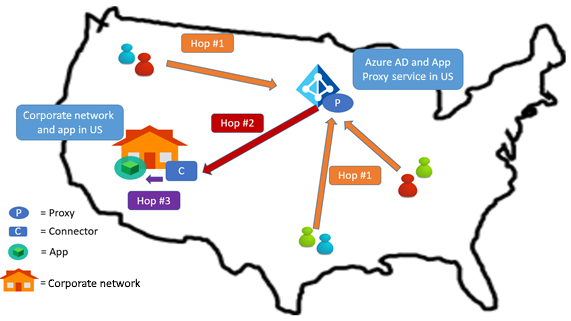
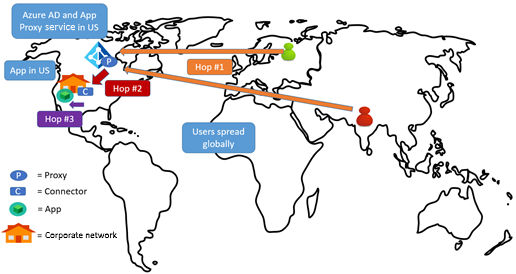
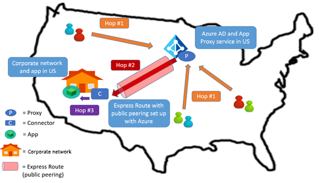
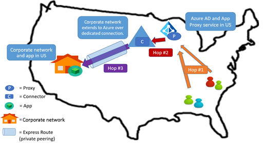
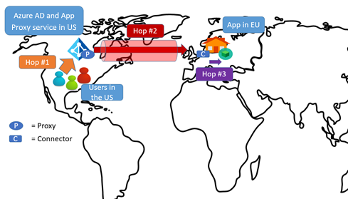
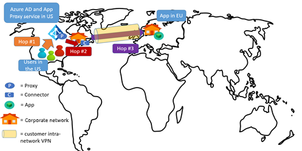

# Network topology considerations when using Azure Active Directory Application Proxy

This article explains network topology considerations when using Azure Active Directory (Azure AD) Application Proxy for publishing and accessing your applications remotely.

## Traffic flow

When an application is published through Azure AD Application Proxy, traffic from the users to the applications flows through three connections:

1. The user connects to the Azure AD Application Proxy service public endpoint on Azure
2. The Application Proxy service connects to the Application Proxy connector
3. The Application Proxy connector connects to the target application

## Tenant location and Application Proxy service

When you sign up for an Azure AD tenant, the region of your tenant is determined by the country you specify. When you enable Application Proxy, the Application Proxy service instances for your tenant are chosen or created in the same region as your Azure AD tenant, or the closest region to it.

For example, if your Azure AD tenant’s region is the European Union (EU), all your Application Proxy connectors use service instances in Azure datacenters in the EU. When your users access published applications, their traffic goes through the Application Proxy service instances in this location.

## Considerations for reducing latency

All proxy solutions introduce latency into your network connection. No matter which proxy or VPN solution you choose as your remote access solution, it always includes a set of servers enabling the connection to inside your corporate network.

Organizations typically include server endpoints in their perimeter network. With Azure AD Application Proxy, however, traffic flows through the proxy service in the cloud while the connectors reside on your corporate network. No perimeter network is required.

The next sections contain additional suggestions to help you reduce latency even further. 

### Connector placement

Application Proxy chooses the location of instances for you, based on your tenant location. However, you get to decide where to install the connector, giving you the power to define the latency characteristics of your network traffic.

When setting up the Application Proxy service, ask the following questions:

* Where is the app located?
* Where are most users who access the app located?
* Where is the Application Proxy instance located?
* Do you already have a dedicated network connection to Azure datacenters set up, like Azure ExpressRoute or a similar VPN?

The connector has to communicate with both Azure and your applications (steps 2 and 3 in the Traffic flow diagram), so the placement of the connector affects the latency of those two connections. When evaluating the placement of the connector, keep in mind the following points:

* If you want to use Kerberos constrained delegation (KCD) for single sign-on, then the connector needs a line of sight to a datacenter. Additionally, the connector server needs to be domain joined.  
* When in doubt, install the connector closer to the application.

### General approach to minimize latency

You can minimize the latency of the end-to-end traffic by optimizing each network connection. Each connection can be optimized by:

* Reducing the distance between the two ends of the hop.
* Choosing the right network to traverse. For example, traversing a private network rather than the public Internet may be faster, due to dedicated links.

If you have a dedicated VPN or ExpressRoute link between Azure and your corporate network, you may want to use that.

## Focus your optimization strategy

There's little that you can do to control the connection between your users and the Application Proxy service. Users may access your apps from a home network, a coffee shop, or a different country. Instead, you can optimize the connections from the Application Proxy service to the Application Proxy connectors to the apps. Consider incorporating the following patterns in your environment.

### Pattern 1: Put the connector close to the application

Place the connector close to the target application in the customer network. This configuration minimizes step 3 in the topography diagram, because the connector and application are close. 

If your connector needs a line of sight to the domain controller, then this pattern is advantageous. Most of our customers use this pattern, because it works well for most scenarios. This pattern can also be combined with pattern 2 to optimize traffic between the service and the connector.

### Pattern 2: Take advantage of ExpressRoute with public peering

If you have ExpressRoute set up with public peering, you can use the faster ExpressRoute connection for traffic between Application Proxy and the connector. The connector is still on your network, close to the app.

### Pattern 3: Take advantage of ExpressRoute with private peering

If you have a dedicated VPN or ExpressRoute set up with private peering between Azure and your corporate network, you have another option. In this configuration, the virtual network in Azure is typically considered as an extension of the corporate network. So you can install the connector in the Azure datacenter, and still satisfy the low latency requirements of the connector-to-app connection.

Latency is not compromised because traffic is flowing over a dedicated connection. You also get improved Application Proxy service-to-connector latency because the connector is installed in an Azure datacenter close to your Azure AD tenant location.

### Other approaches

Although the focus of this article is connector placement, you can also change the placement of the application to get better latency characteristics.

Increasingly, organizations are moving their networks into hosted environments. This enables them to place their apps in a hosted environment that is also part of their corporate network, and still be within the domain. In this case, the patterns discussed in the preceding sections can be applied to the new application location. If you're considering this option, see [Azure AD Domain Services](../../active-directory-domain-services/active-directory-ds-overview.md).

Additionally, consider organizing your connectors using [connector groups](application-proxy-connector-groups.md) to target apps that are in different locations and networks. 

## Common use cases

In this section, we walk through a few common scenarios. Assume that the Azure AD tenant (and therefore proxy service endpoint) is located in the United States (US). The considerations discussed in these use cases also apply to other regions around the globe.

For these scenarios, we call each connection a "hop" and number them for easier discussion:

- **Hop 1**: User to the Application Proxy service
- **Hop 2**: Application Proxy service to the Application Proxy connector
- **Hop 3**: Application Proxy connector to the target application 

### Use case 1

**Scenario:** The app is in an organization's network in the US, with users in the same region. No ExpressRoute or VPN exists between the Azure datacenter and the corporate network.

**Recommendation:** Follow pattern 1, explained in the previous section. For improved latency, consider using ExpressRoute, if needed.

This is a simple pattern. You optimize hop 3 by placing the connector near the app. This is also a natural choice, because the connector typically is installed with line of sight to the app and to the datacenter to perform KCD operations.

### Use case 2

**Scenario:** The app is in an organization's network in the US, with users spread out globally. No ExpressRoute or VPN exists between the Azure datacenter and the corporate network.

**Recommendation:** Follow pattern 1, explained in the previous section. 

Again, the common pattern is to optimize hop 3, where you place the connector near the app. Hop 3 is not typically expensive, if it is all within the same region. However, hop 1 can be more expensive depending on where the user is, because users across the world must access the Application Proxy instance in the US. It's worth noting that any proxy solution has similar characteristics regarding users being spread out globally.

### Use case 3

**Scenario:** The app is in an organization's network in the US. ExpressRoute with public peering exists between Azure and the corporate network.

**Recommendation:** Follow patterns 1 and 2, explained in the previous section.

First, place the connector as close as possible to the app. Then, the system automatically uses ExpressRoute for hop 2. 

If the ExpressRoute link is using public peering, the traffic between the proxy and the connector flows over that link. Hop 2 has optimized latency.

### Use case 4

**Scenario:** The app is in an organization's network in the US. ExpressRoute with private peering exists between Azure and the corporate network.

**Recommendation:** Follow pattern 3, explained in the previous section.

Place the connector in the Azure datacenter that is connected to the corporate network through ExpressRoute private peering. 

The connector can be placed in the Azure datacenter. Since the connector still has a line of sight to the application and the datacenter through the private network, hop 3 remains optimized. In addition, hop 2 is optimized further.

### Use case 5

**Scenario:** The app is in an organization's network in the EU, with the Application Proxy instance and most users in the US.

**Recommendation:** Place the connector near the app. Because US users are accessing an Application Proxy instance that happens to be in the same region, hop 1 is not too expensive. Hop 3 is optimized. Consider using ExpressRoute to optimize hop 2. 

You can also consider using one other variant in this situation. If most users in the organization are in the US, then chances are that your network extends to the US as well. Place the connector in the US, and use the dedicated internal corporate network line to the application in the EU. This way hops 2 and 3 are optimized.

## Next steps

- [Enable Application Proxy](application-proxy-enable.md)
- [Enable single-sign on](application-proxy-configure-single-sign-on-with-kcd.md)
- [Enable conditional access](application-proxy-integrate-with-sharepoint-server.md)
- [Troubleshoot issues you're having with Application Proxy](application-proxy-troubleshoot.md)
