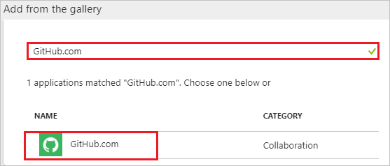
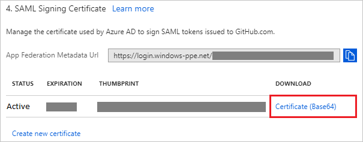
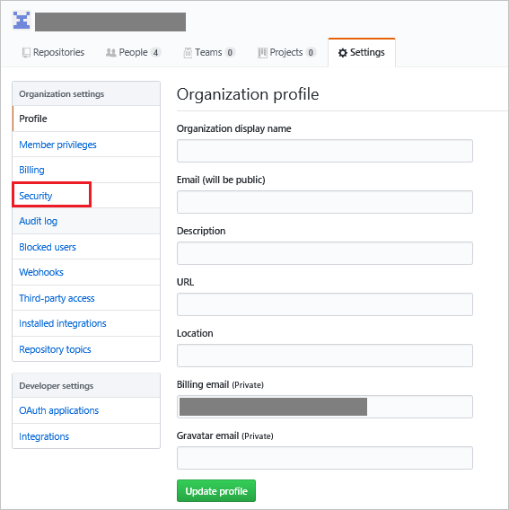
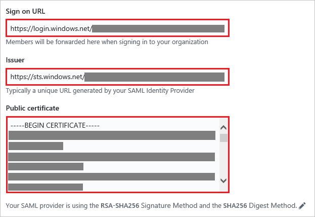
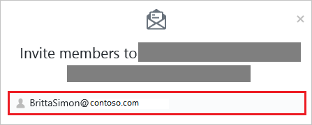
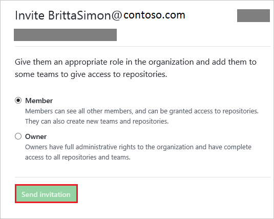

# Tutorial: Azure Active Directory integration with GitHub

In this tutorial, you learn how to integrate GitHub with Azure Active Directory (Azure AD).

Integrating GitHub with Azure AD provides you with the following benefits:

- You can control in Azure AD who has access to GitHub.
- You can enable your users to automatically get signed-on to GitHub (Single Sign-On) with their Azure AD accounts.
- You can manage your accounts in one central location - the Azure portal.

If you want to know more details about SaaS app integration with Azure AD, see [what is application access and single sign-on with Azure Active Directory](../manage-apps/what-is-single-sign-on.md).

## Prerequisites

To configure Azure AD integration with GitHub, you need the following items:

- An Azure AD subscription
- A GitHub single sign-on enabled subscription

> [!NOTE]
> To test the steps in this tutorial, we do not recommend using a production environment.

To test the steps in this tutorial, you should follow these recommendations:

- Do not use your production environment, unless it is necessary.
- If you don't have an Azure AD trial environment, you can [get a one-month trial](https://azure.microsoft.com/pricing/free-trial/).

## Scenario description
In this tutorial, you test Azure AD single sign-on in a test environment. 
The scenario outlined in this tutorial consists of two main building blocks:

1. Adding GitHub from the gallery
2. Configuring and testing Azure AD single sign-on

## Adding GitHub from the gallery
To configure the integration of GitHub into Azure AD, you need to add GitHub from the gallery to your list of managed SaaS apps.

**To add GitHub from the gallery, perform the following steps:**

1. In the **[Azure portal](https://portal.azure.com)**, on the left navigation panel, click **Azure Active Directory** icon. 

	![The Azure Active Directory button][1]

2. Navigate to **Enterprise applications**. Then go to **All applications**.

	![The Enterprise applications blade][2]
	
3. To add new application, click **New application** button on the top of dialog.

	![The New application button][3]

4. In the search box, type **GitHub**, select **GitHub** from result panel then click **Add** button to add the application.

	

## Configure and test Azure AD single sign-on

In this section, you configure and test Azure AD single sign-on with GitHub based on a test user called "Britta Simon".

For single sign-on to work, Azure AD needs to know what the counterpart user in GitHub is to a user in Azure AD. In other words, a link relationship between an Azure AD user and the related user in GitHub needs to be established.

To configure and test Azure AD single sign-on with GitHub, you need to complete the following building blocks:

1. **[Configure Azure AD Single Sign-On](#configure-azure-ad-single-sign-on)** - to enable your users to use this feature.
2. **[Create an Azure AD test user](#create-an-azure-ad-test-user)** - to test Azure AD single sign-on with Britta Simon.
3. **[Create a GitHub test user](#create-a-github-test-user)** - to have a counterpart of Britta Simon in GitHub that is linked to the Azure AD representation of user.
4. **[Assign the Azure AD test user](#assign-the-azure-ad-test-user)** - to enable Britta Simon to use Azure AD single sign-on.
5. **[Test single sign-on](#test-single-sign-on)** - to verify whether the configuration works.

### Configure Azure AD single sign-on

In this section, you enable Azure AD single sign-on in the Azure portal and configure single sign-on in your GitHub application.

**To configure Azure AD single sign-on with GitHub, perform the following steps:**

1. In the Azure portal, on the **GitHub** application integration page, click **Single sign-on**.

	![Configure single sign-on link][4]

2. On the **Single sign-on** dialog, select **Mode** as	**SAML-based Sign-on** to enable single sign-on.
 
	

3. On the **GitHub Domain and URLs** section, perform the following steps:

	

    a. In the **Sign on URL** textbox, type a URL using the following pattern: `https://github.com/orgs/<entity-id>/sso`

	b. In the **Identifier (Entity ID)** textbox, type a URL using the following pattern: `https://github.com/orgs/<entity-id>`

	> [!NOTE]
	> Please note that these are not the real values. You have to update these values with the actual Sign on URL and Identifier. Here we suggest you to use the unique value of string in the Identifier. Go to GitHub Admin section to retrieve these values.

4. On the **User Attributes** section, select **User Identifier** as user.mail.

	

5. On the **SAML Signing Certificate** section, click **Certificate (Base64)** and then save the certificate file on your computer.

	 

6. Click **Save** button.

	

7. On the **GitHub Configuration** section, click **Configure GitHub** to open **Configure sign-on** window. Copy the **Sign-Out URL, SAML Entity ID, and SAML Single Sign-On Service URL** from the **Quick Reference section.**

	 

8. In a different web browser window, log into your GitHub organization site as an administrator.

9. Navigate to **Settings** and click **Security**

	

10. Check the **Enable SAML authentication** box, revealing the Single Sign-on configuration fields. Then, use the single sign-on URL value to update the Single sign-on URL on Azure AD configuration.

	

11. Configure the following fields:

	a. In the **Sign on URL** textbox, paste **SAML Single sign-on Service URL** value which you have copied from the Azure portal.

	b. In the **Issuer** textbox, paste **SAML Entity ID** value which you have copied from the Azure portal.

	c. Open the downloaded certificate from Azure portal in notepad, paste the content into the **Public Certificate** textbox.

	

12. Click on **Test SAML configuration** to confirm that no validation failures or errors during SSO.

	

13. Click **Save**

### Create an Azure AD test user

The objective of this section is to create a test user in the Azure portal called Britta Simon.

   ![Create an Azure AD test user][100]

**To create a test user in Azure AD, perform the following steps:**

1. In the Azure portal, in the left pane, click the **Azure Active Directory** button.

    

2. To display the list of users, go to **Users and groups**, and then click **All users**.

    

3. To open the **User** dialog box, click **Add** at the top of the **All Users** dialog box.

    

4. In the **User** dialog box, perform the following steps:

    

    a. In the **Name** box, type **BrittaSimon**.

    b. In the **User name** box, type the email address of user Britta Simon.

    c. Select the **Show Password** check box, and then write down the value that's displayed in the **Password** box.

    d. Click **Create**.
 
### Create a GitHub test user

The objective of this section is to create a user called Britta Simon in GitHub. GitHub supports automatic user provisioning, which is by default enabled. You can find more details [here](github-provisioning-tutorial.md) on how to configure automatic user provisioning.

**If you need to create user manually, perform following steps:**

1. Log in to your GitHub company site as an administrator.

2. Click **People**.

    

3. Click **Invite member**.

	

4. On the **Invite member** dialog page, perform the following steps:

	a. In the **Email** textbox, type the email address of Britta Simon account.

	

    b. Click **Send Invitation**.

	

	> [!NOTE]
    > The Azure Active Directory account holder will receive an email and follow a link to confirm their account before it becomes active.

### Assign the Azure AD test user

In this section, you enable Britta Simon to use Azure single sign-on by granting access to GitHub.

![Assign the user role][200] 

**To assign Britta Simon to GitHub, perform the following steps:**

1. In the Azure portal, open the applications view, and then navigate to the directory view and go to **Enterprise applications** then click **All applications**.

	![Assign User][201]

2. In the applications list, select **GitHub**.

	  

3. In the menu on the left, click **Users and groups**.

	![The "Users and groups" link][202]

4. Click **Add** button. Then select **Users and groups** on **Add Assignment** dialog.

	![The Add Assignment pane][203]

5. On **Users and groups** dialog, select **Britta Simon** in the Users list.

6. Click **Select** button on **Users and groups** dialog.

7. Click **Assign** button on **Add Assignment** dialog.
	
### Test single sign-on

In this section, you test your Azure AD single sign-on configuration using the Access Panel.

When you click the GitHub tile in the Access Panel, you should get automatically signed-on to your GitHub application.
For more information about the Access Panel, see [Introduction to the Access Panel](../active-directory-saas-access-panel-introduction.md). 

## Additional resources

* [List of Tutorials on How to Integrate SaaS Apps with Azure Active Directory](tutorial-list.md)
* [What is application access and single sign-on with Azure Active Directory?](../manage-apps/what-is-single-sign-on.md)

<!--Image references-->

[1]: ./media/github-tutorial/tutorial_general_01.png
[2]: ./media/github-tutorial/tutorial_general_02.png
[3]: ./media/github-tutorial/tutorial_general_03.png
[4]: ./media/github-tutorial/tutorial_general_04.png

[100]: ./media/github-tutorial/tutorial_general_100.png

[200]: ./media/github-tutorial/tutorial_general_200.png
[201]: ./media/github-tutorial/tutorial_general_201.png
[202]: ./media/github-tutorial/tutorial_general_202.png
[203]: ./media/github-tutorial/tutorial_general_203.png

