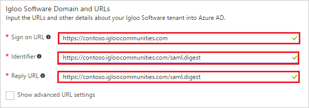
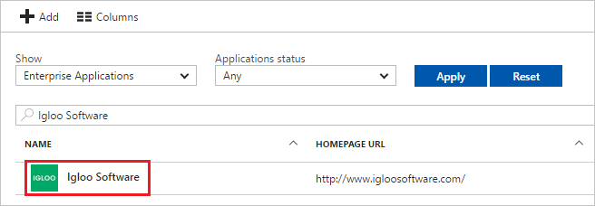

# Tutorial: Azure Active Directory integration with Igloo Software

In this tutorial, you learn how to integrate Igloo Software with Azure Active Directory (Azure AD).

Integrating Igloo Software with Azure AD provides you with the following benefits:

- You can control in Azure AD who has access to Igloo Software
- You can enable your users to automatically get signed-on to Igloo Software (Single Sign-On) with their Azure AD accounts
- You can manage your accounts in one central location - the Azure portal

If you want to know more details about SaaS app integration with Azure AD, see [what is application access and single sign-on with Azure Active Directory](../manage-apps/what-is-single-sign-on.md).

## Prerequisites

To configure Azure AD integration with Igloo Software, you need the following items:

- An Azure AD subscription
- An Igloo Software single sign-on enabled subscription

> [!NOTE]
> To test the steps in this tutorial, we do not recommend using a production environment.

To test the steps in this tutorial, you should follow these recommendations:

- Do not use your production environment, unless it is necessary.
- If you don't have an Azure AD trial environment, you can get a one-month trial [here](https://azure.microsoft.com/pricing/free-trial/).

## Scenario description
In this tutorial, you test Azure AD single sign-on in a test environment. 
The scenario outlined in this tutorial consists of two main building blocks:

1. Adding Igloo Software from the gallery
2. Configuring and testing Azure AD single sign-on

## Adding Igloo Software from the gallery
To configure the integration of Igloo Software into Azure AD, you need to add Igloo Software from the gallery to your list of managed SaaS apps.

**To add Igloo Software from the gallery, perform the following steps:**

1. In the **[Azure portal](https://portal.azure.com)**, on the left navigation panel, click **Azure Active Directory** icon. 

	![Active Directory][1]

2. Navigate to **Enterprise applications**. Then go to **All applications**.

	![Applications][2]
	
3. To add new application, click **New application** button on the top of dialog.

	![Applications][3]

4. In the search box, type **Igloo Software**.

	

5. In the results panel, select **Igloo Software**, and then click **Add** button to add the application.

	

##  Configuring and testing Azure AD single sign-on
In this section, you configure and test Azure AD single sign-on with Igloo Software based on a test user called "Britta Simon".

For single sign-on to work, Azure AD needs to know what the counterpart user in Igloo Software is to a user in Azure AD. In other words, a link relationship between an Azure AD user and the related user in Igloo Software needs to be established.

In Igloo Software, assign the value of the **user name** in Azure AD as the value of the **Username** to establish the link relationship.

To configure and test Azure AD single sign-on with Igloo Software, you need to complete the following building blocks:

1. **[Configuring Azure AD Single Sign-On](#configuring-azure-ad-single-sign-on)** - to enable your users to use this feature.
2. **[Creating an Azure AD test user](#creating-an-azure-ad-test-user)** - to test Azure AD single sign-on with Britta Simon.
3. **[Creating an Igloo Software test user](#creating-an-igloo-software-test-user)** - to have a counterpart of Britta Simon in Igloo Software that is linked to the Azure AD representation of user.
4. **[Assigning the Azure AD test user](#assigning-the-azure-ad-test-user)** - to enable Britta Simon to use Azure AD single sign-on.
5. **[Testing Single Sign-On](#testing-single-sign-on)** - to verify whether the configuration works.

### Configuring Azure AD single sign-on

In this section, you enable Azure AD single sign-on in the Azure portal and configure single sign-on in your Igloo Software application.

**To configure Azure AD single sign-on with Igloo Software, perform the following steps:**

1. In the Azure portal, on the **Igloo Software** application integration page, click **Single sign-on**.

	![Configure Single Sign-On][4]

2. On the **Single sign-on** dialog, select **Mode** as	**SAML-based Sign-on** to enable single sign-on.
 
	

3. On the **Igloo Software Domain and URLs** section, perform the following steps:

	
    
    a. In the **Sign-on URL** textbox, type a URL using the following pattern: `https://<company name>.igloocommmunities.com`

    b. In the **Identifier** textbox, type a URL using the following pattern: `https://<company name>.igloocommmunities.com/saml.digest`

	c. In the **Reply URL** textbox, type a URL using the following pattern: `https://<company name>.igloocommmunities.com/saml.digest`

	> [!NOTE] 
	> These values are not real. Update these values with the actual Identifier, Reply URL, and Sign-On URL. Contact [Igloo Software Client support team](https://www.igloosoftware.com/services/support) to get these values. 

4. On the **SAML Signing Certificate** section, click **Certificate(Base64)** and then save the certificate file on your computer.

	 

5. Click **Save** button.

	
	
6. On the **Igloo Software Configuration** section, click **Configure Igloo Software** to open **Configure sign-on** window. Copy the **Sign-Out URL and SAML Single Sign-On Service URL** from the **Quick Reference section.**

     

7. In a different web browser window, log in to your Igloo Software company site as an administrator.

8. Go to the **Control Panel**.
   
     

9. In the **Membership** tab, click **Sign In Settings**.
   
    

10. In the SAML Configuration section, click **Configure SAML Authentication**.
   
    
   
11. In the **General Configuration** section, perform the following steps:
   
    

    a. In the **Connection Name** textbox, type a custom name for your configuration.
   
    b. In the **IdP Login URL** textbox, paste the value of **SAML Single Sign-On Service URL** which you have copied from Azure portal.
   
    c. In the **IdP Logout URL** textbox, paste the value of **Sign-Out URL** which you have copied from Azure portal.
    
    d. Select **Logout Response and Request HTTP Type** as **POST**.
   
    e. Open your **base-64** encoded certificate in notepad downloaded from Azure portal, copy the content of it into your clipboard, and then paste it to the **Public Certificate** textbox.
    
12. In the **Response and Authentication Configuration**, perform the following steps:
    
    
  
      a. As **Identity Provider**, select **Microsoft ADFS**.
      
      b. As **Identifier Type**, select **Email Address**. 

      c. In the **Email Attribute** textbox, type **emailaddress**.

      d. In the **First Name Attribute** textbox, type **givenname**.

      e. In the **Last Name Attribute** textbox, type **surname**.

13. Perform the following steps to complete the configuration:
    
     

     a. As **User creation on Sign in**, select **Create a new user in your site when they sign in**.

     b. As **Sign in Settings**, select **Use SAML button on “Sign in” screen**.

     c. Click **Save**.

> [!TIP]
> You can now read a concise version of these instructions inside the [Azure portal](https://portal.azure.com), while you are setting up the app!  After adding this app from the **Active Directory > Enterprise Applications** section, simply click the **Single Sign-On** tab and access the embedded documentation through the **Configuration** section at the bottom. You can read more about the embedded documentation feature here: [Azure AD embedded documentation]( https://go.microsoft.com/fwlink/?linkid=845985)

### Creating an Azure AD test user
The objective of this section is to create a test user in the Azure portal called Britta Simon.

![Create Azure AD User][100]

**To create a test user in Azure AD, perform the following steps:**

1. In the **Azure portal**, on the left navigation pane, click **Azure Active Directory** icon.

	 

2. To display the list of users, go to **Users and groups** and click **All users**.
	
	 

3. To open the **User** dialog, click **Add** on the top of the dialog.
 
	 

4. On the **User** dialog page, perform the following steps:
 
	 

    a. In the **Name** textbox, type **BrittaSimon**.

    b. In the **User name** textbox, type the **email address** of BrittaSimon.

	c. Select **Show Password** and write down the value of the **Password**.

    d. Click **Create**.
 
### Creating an Igloo Software test user

There is no action item for you to configure user provisioning to Igloo Software.  

When an assigned user tries to log in to Igloo Software using the access panel, Igloo Software checks whether the user exists.  If there is no user account available yet, it is automatically created by Igloo Software.

### Assigning the Azure AD test user

In this section, you enable Britta Simon to use Azure single sign-on by granting access to Igloo Software.

![Assign User][200] 

**To assign Britta Simon to Igloo Software, perform the following steps:**

1. In the Azure portal, open the applications view, and then navigate to the directory view and go to **Enterprise applications** then click **All applications**.

	![Assign User][201] 

2. In the applications list, select **Igloo Software**.

	 

3. In the menu on the left, click **Users and groups**.

	![Assign User][202] 

4. Click **Add** button. Then select **Users and groups** on **Add Assignment** dialog.

	![Assign User][203]

5. On **Users and groups** dialog, select **Britta Simon** in the Users list.

6. Click **Select** button on **Users and groups** dialog.

7. Click **Assign** button on **Add Assignment** dialog.
	
### Testing single sign-on

In this section, you test your Azure AD single sign-on configuration using the Access Panel.

When you click the Igloo Software tile in the Access Panel, you should get automatically signed-on to your Igloo Software application.
For more information about the Access Panel, see [Introduction to the Access Panel](../active-directory-saas-access-panel-introduction.md). 

## Additional resources

* [List of Tutorials on How to Integrate SaaS Apps with Azure Active Directory](tutorial-list.md)
* [What is application access and single sign-on with Azure Active Directory?](../manage-apps/what-is-single-sign-on.md)

<!--Image references-->

[1]: ./media/igloo-software-tutorial/tutorial_general_01.png
[2]: ./media/igloo-software-tutorial/tutorial_general_02.png
[3]: ./media/igloo-software-tutorial/tutorial_general_03.png
[4]: ./media/igloo-software-tutorial/tutorial_general_04.png

[100]: ./media/igloo-software-tutorial/tutorial_general_100.png

[200]: ./media/igloo-software-tutorial/tutorial_general_200.png
[201]: ./media/igloo-software-tutorial/tutorial_general_201.png
[202]: ./media/igloo-software-tutorial/tutorial_general_202.png
[203]: ./media/igloo-software-tutorial/tutorial_general_203.png

