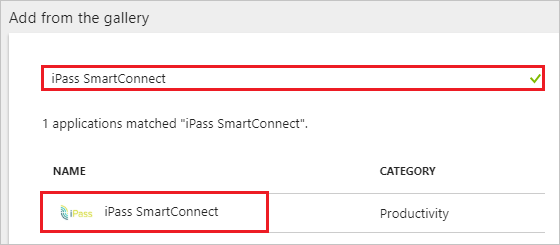
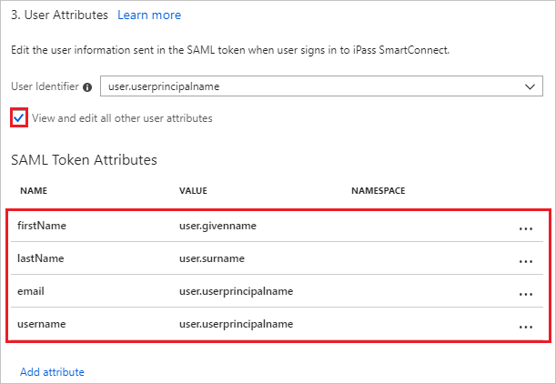
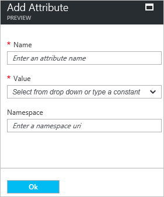
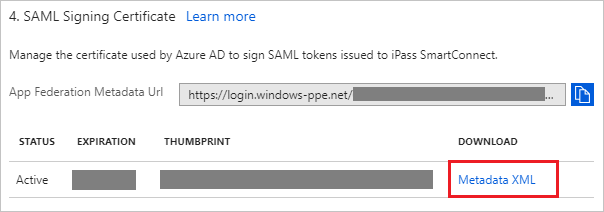
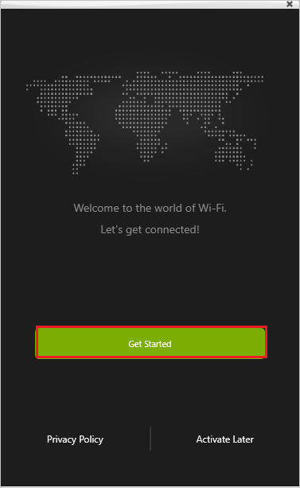
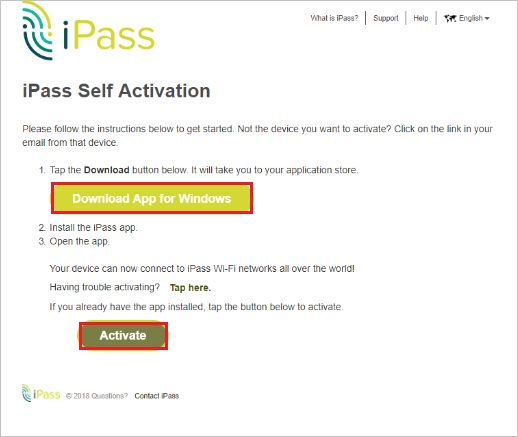

# Tutorial: Azure Active Directory integration with iPass SmartConnect

In this tutorial, you learn how to integrate iPass SmartConnect with Azure Active Directory (Azure AD).

Integrating iPass SmartConnect with Azure AD provides you with the following benefits:

- You can control in Azure AD who has access to iPass SmartConnect.
- You can enable your users to automatically get signed-on to iPass SmartConnect (Single Sign-On) with their Azure AD accounts.
- You can manage your accounts in one central location - the Azure portal.

If you want to know more details about SaaS app integration with Azure AD, see [what is application access and single sign-on with Azure Active Directory](../manage-apps/what-is-single-sign-on.md).

## Prerequisites

To configure Azure AD integration with iPass SmartConnect, you need the following items:

- An Azure AD subscription
- An iPass SmartConnect single sign-on enabled subscription

> [!NOTE]
> To test the steps in this tutorial, we do not recommend using a production environment.

To test the steps in this tutorial, you should follow these recommendations:

- Do not use your production environment, unless it is necessary.
- If you don't have an Azure AD trial environment, you can [get a one-month trial](https://azure.microsoft.com/pricing/free-trial/).

## Scenario description
In this tutorial, you test Azure AD single sign-on in a test environment. 
The scenario outlined in this tutorial consists of two main building blocks:

1. Adding iPass SmartConnect from the gallery
2. Configuring and testing Azure AD single sign-on

## Adding iPass SmartConnect from the gallery
To configure the integration of iPass SmartConnect into Azure AD, you need to add iPass SmartConnect from the gallery to your list of managed SaaS apps.

**To add iPass SmartConnect from the gallery, perform the following steps:**

1. In the **[Azure portal](https://portal.azure.com)**, on the left navigation panel, click **Azure Active Directory** icon. 

	![The Azure Active Directory button][1]

2. Navigate to **Enterprise applications**. Then go to **All applications**.

	![The Enterprise applications blade][2]

3. To add new application, click **New application** button on the top of dialog.

	![The New application button][3]

4. In the search box, type **iPass SmartConnect**, select **iPass SmartConnect** from result panel then click **Add** button to add the application.

	

## Configure and test Azure AD single sign-on

In this section, you configure and test Azure AD single sign-on with iPass SmartConnect based on a test user called "Britta Simon".

For single sign-on to work, Azure AD needs to know what the counterpart user in iPass SmartConnect is to a user in Azure AD. In other words, a link relationship between an Azure AD user and the related user in iPass SmartConnect needs to be established.

To configure and test Azure AD single sign-on with iPass SmartConnect, you need to complete the following building blocks:

1. **[Configure Azure AD Single Sign-On](#configure-azure-ad-single-sign-on)** - to enable your users to use this feature.
2. **[Create an Azure AD test user](#create-an-azure-ad-test-user)** - to test Azure AD single sign-on with Britta Simon.
3. **[Create an iPass SmartConnect test user](#create-an-ipass-smartconnect-test-user)** - to have a counterpart of Britta Simon in iPass SmartConnect that is linked to the Azure AD representation of user.
4. **[Assign the Azure AD test user](#assign-the-azure-ad-test-user)** - to enable Britta Simon to use Azure AD single sign-on.
5. **[Test single sign-on](#test-single-sign-on)** - to verify whether the configuration works.

### Configure Azure AD single sign-on

In this section, you enable Azure AD single sign-on in the Azure portal and configure single sign-on in your iPass SmartConnect application.

**To configure Azure AD single sign-on with iPass SmartConnect, perform the following steps:**

1. In the Azure portal, on the **iPass SmartConnect** application integration page, click **Single sign-on**.

	![Configure single sign-on link][4]

2. On the **Single sign-on** dialog, select **Mode** as	**SAML-based Sign-on** to enable single sign-on.

	

3. On the **iPass SmartConnect Domain and URLs** section, if you wish to configure the application in **IDP** initiated mode, no need to perform any steps.

	

4. Check Show advanced URL settings and perform the following step if you wish to configure the application in **SP** initiated mode:

	

	In the Sign-on URL textbox, type a URL: `https://om-activation.ipass.com/ClientActivation/ssolanding.go`

5. iPass SmartConnect application expects the SAML assertions in a specific format. Please configure the following claims for this application. You can manage the values of these attributes from the "**User Attributes**" section on application integration page. The following screenshot shows an example for this.

	

6. Click **View and edit all other user attributes** checkbox in the **User Attributes** section to expand the attributes. Perform the following steps on each of the displayed attributes-

	| Attribute Name | Attribute Value | Namespace Value|
	| ---------------| --------------- |----------------|
	| firstName | user.givenname |   |
	| lastName | user.surname | |
	| email | user.userprincipalname | |
	| username | user.userprincipalname | |

	a. Click **Add attribute** to open the **Add Attribute** dialog.

	

	

	b. In the **Name** textbox, type the attribute name shown for that row.

	c. From the **Value** list, type the attribute value shown for that row.

	d. Keep namespace value blank for that row.

	e. Click **Ok**.

7. On the **SAML Signing Certificate** section, click **Metadata XML** and then save the metadata file on your computer.

	

8. Click **Save** button.

	

9. To configure single sign-on on **iPass SmartConnect** side, you need to send the downloaded **Metadata XML** and your **Domain name** to [iPass SmartConnect support team](mailto:help@ipass.com). They set this setting to have the SAML SSO connection set properly on both sides.

### Create an Azure AD test user

The objective of this section is to create a test user in the Azure portal called Britta Simon.

   ![Create an Azure AD test user][100]

**To create a test user in Azure AD, perform the following steps:**

1. In the Azure portal, in the left pane, click the **Azure Active Directory** button.

    

2. To display the list of users, go to **Users and groups**, and then click **All users**.

    

3. To open the **User** dialog box, click **Add** at the top of the **All Users** dialog box.

    

4. In the **User** dialog box, perform the following steps:

    

    a. In the **Name** box, type **BrittaSimon**.

    b. In the **User name** box, type the email address of user Britta Simon.

    c. Select the **Show Password** check box, and then write down the value that's displayed in the **Password** box.

    d. Click **Create**.

### Create an iPass SmartConnect test user

In this section, you create a user called Britta Simon in iPass SmartConnect. Work with [iPass SmartConnect support team](mailto:help@ipass.com) to add the users or the domain which is needed to be whitelisted in the iPass SmartConnect platform. If the domain is added by the team, users will get automatically provisioned to the iPass SmartConnect platform. Users must be created and activated before you use single sign-on.

### Assign the Azure AD test user

In this section, you enable Britta Simon to use Azure single sign-on by granting access to iPass SmartConnect.

![Assign the user role][200]

**To assign Britta Simon to iPass SmartConnect, perform the following steps:**

1. In the Azure portal, open the applications view, and then navigate to the directory view and go to **Enterprise applications** then click **All applications**.

	![Assign User][201]

2. In the applications list, select **iPass SmartConnect**.

	  

3. In the menu on the left, click **Users and groups**.

	![The "Users and groups" link][202]

4. Click **Add** button. Then select **Users and groups** on **Add Assignment** dialog.

	![The Add Assignment pane][203]

5. On **Users and groups** dialog, select **Britta Simon** in the Users list.

6. Click **Select** button on **Users and groups** dialog.

7. Click **Assign** button on **Add Assignment** dialog.

### Test single sign-on

In this section, you test your Azure AD single sign-on configuration using the Access Panel.

**To test the application in the SP Initiated flow, perform the following steps:**

a. Download windows iPass SmartConnect client [here](https://om-activation.ipass.com/ClientActivation/ssolanding.go).

b. Install the client and launch.

c. Click on **Get Started**.

 

d. Enter Azure user name with domain. Click on **Continue**. This will be redirected to Azure login page

 

e. After successful authentication, client activation will be started. Client will get activated.

**To test the application in the IdP Initiated flow, perform the following steps:**

a. Login to [https://myapps.microsoft.com](https://myapps.microsoft.com).

b. Click on iPass SmartConnect app.

c. It launches SSA page, click on **Download App for Windows** to install iPass SmartConnect client.

d. After installation, client on the first launch will automatically starts activation after accepting terms and conditions.

e. If activation does not start, click on Activate button on SSA page to initiate activation.

f. Client will get activated.

## Additional resources

* [List of Tutorials on How to Integrate SaaS Apps with Azure Active Directory](tutorial-list.md)
* [What is application access and single sign-on with Azure Active Directory?](../manage-apps/what-is-single-sign-on.md)

<!--Image references-->

[1]: ./media/ipasssmartconnect-tutorial/tutorial_general_01.png
[2]: ./media/ipasssmartconnect-tutorial/tutorial_general_02.png
[3]: ./media/ipasssmartconnect-tutorial/tutorial_general_03.png
[4]: ./media/ipasssmartconnect-tutorial/tutorial_general_04.png

[100]: ./media/ipasssmartconnect-tutorial/tutorial_general_100.png

[200]: ./media/ipasssmartconnect-tutorial/tutorial_general_200.png
[201]: ./media/ipasssmartconnect-tutorial/tutorial_general_201.png
[202]: ./media/ipasssmartconnect-tutorial/tutorial_general_202.png
[203]: ./media/ipasssmartconnect-tutorial/tutorial_general_203.png

