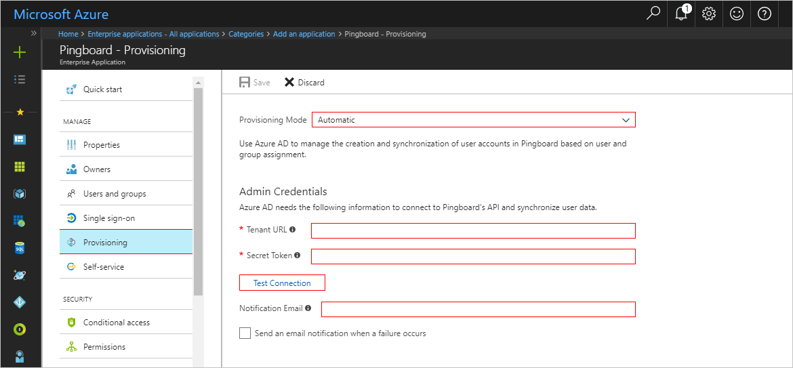

---

title: 'Tutorial: Configure Pingboard for automatic user provisioning with Azure Active Directory | Microsoft Docs'
description: Learn how to configure Azure Active Directory to automatically provision and de-provision user accounts to Pingboard.
services: active-directory
documentationcenter: ''
author: asmalser-msft
writer: asmalser-msft
manager: sakula

ms.assetid: 0b38ee73-168b-42cb-bd8b-9c5e5126d648
ms.service: active-directory
ms.component: saas-app-tutorial
ms.workload: identity
ms.tgt_pltfrm: na
ms.devlang: na
ms.topic: article
ms.date: 10/19/2017
ms.author: asmalser
ms.reviewer: asmalser

---

# Tutorial: Configure Pingboard for automatic user provisioning

The objective of this tutorial is to show you the steps you need to perform to enable automatic provisioning and de-provisioning of user accounts from Azure Active Directory (Azure AD) to Pingboard.

## Prerequisites

The scenario outlined in this tutorial assumes that you already have the following items:

*   An Azure AD tenant
*   A Pingboard tenant [Pro account](https://pingboard.com/pricing) 
*   A user account in Pingboard with admin permissions 

> [!NOTE] 
> Azure AD provisioning integration relies on the [Pingboard API](`https://your_domain.pingboard.com/scim/v2`), which is available to your account.

## Assign users to Pingboard

Azure AD uses a concept called "assignments" to determine which users should receive access to selected applications. In the context of automatic user account provisioning, only the users assigned to an application in Azure AD are synchronized. 

Before you configure and enable the provisioning service, you must decide which users in Azure AD need access to your Pingboard app. Then you can assign these users to your Pingboard app by following the instructions here:

[Assign a user to an enterprise app](../manage-apps/assign-user-or-group-access-portal.md)

### Important tips for assigning users to Pingboard

We recommend that you assign a single Azure AD user to Pingboard to test the provisioning configuration. Additional users can be assigned later.

## Configure user provisioning to Pingboard 

This section guides you through connecting your Azure AD to the Pingboard user account provisioning API. You also configure the provisioning service to create, update, and disable assigned user accounts in Pingboard based on user assignments in Azure AD.

> [!TIP]
> To enable SAML-based single sign-on for Pingboard, follow the instructions provided in the [Azure portal](https://portal.azure.com). Single sign-on can be configured independently of automatic provisioning, although these two features complement each other.

### To configure automatic user account provisioning to Pingboard in Azure AD

1. In the [Azure portal](https://portal.azure.com), browse to the **Azure Active Directory** > **Enterprise Apps** > **All applications** section.

2. If you already configured Pingboard for single sign-on, search for your instance of Pingboard by using the search field. Otherwise, select **Add** and search for **Pingboard** in the application gallery. Select **Pingboard** from the search results, and add it to your list of applications.

3. Select your instance of Pingboard, and then select the **Provisioning** tab.

4. Set **Provisioning Mode** to **Automatic**.

    
    
5. Under the **Admin Credentials** section, perform the following steps:

    a. In **Tenant URL**, enter `https://your_domain.pingboard.com/scim/v2`, and replace "your_domain" with your real domain.

    b. Sign in to [Pingboard](https://pingboard.com/) by using your admin account.

    c. Select **Add-Ons** > **Integrations** > **Azure Active Directory**.

    d. Go to the **Configure** tab, and select **Enable user provisioning from Azure**.

    e. Copy the token in **OAuth Bearer Token**, and enter it in **Secret Token**.

6. In the Azure portal, select **Test Connection** to ensure Azure AD can connect to your Pingboard app. If the connection fails, ensure that your Pingboard account has admin permissions, and try the **Test Connection** step again.

7. Enter the email address of a person or group that you want to receive provisioning error notifications in **Notification Email**. Select the check box underneath.

8. Select **Save**. 

9. Under the **Mappings** section, select **Synchronize Azure Active Directory Users to Pingboard**.

10. In the **Attribute Mappings** section, review the user attributes to be synchronized from Azure AD to Pingboard. The attributes selected as **Matching** properties are used to match the user accounts in Pingboard for update operations. Select **Save** to commit any changes. For more information, see [Customize user provisioning attribute mappings](../active-directory-saas-customizing-attribute-mappings.md).

11. To enable the Azure AD provisioning service for Pingboard, in the **Settings** section, change **Provisioning Status** to **On**.

12. Select **Save** to start the initial synchronization of users assigned to Pingboard.

The initial synchronization takes longer to perform than subsequent syncs, which occur approximately every 40 minutes as long as the service is running. Use the **Synchronization Details** section to monitor progress and follow links to provisioning activity logs. The logs describe all actions performed by the provisioning service on your Pingboard app.

For more information on how to read the Azure AD provisioning logs, see [Report on automatic user account provisioning](../active-directory-saas-provisioning-reporting.md).

## Additional resources

* [Manage user account provisioning for enterprise apps](../manage-apps/configure-automatic-user-provisioning-portal.md)
* [What is application access and single sign-on with Azure Active Directory?](../manage-apps/what-is-single-sign-on.md)
* [Configure single sign-on](pingboard-tutorial.md)
