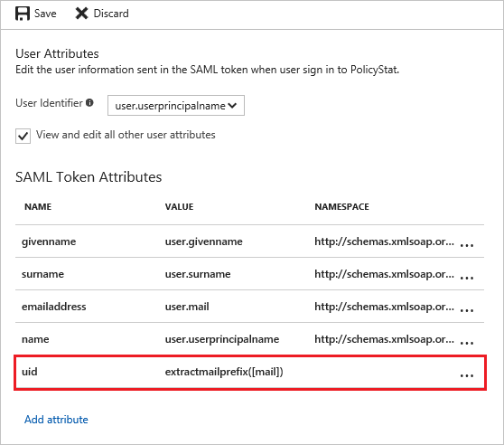
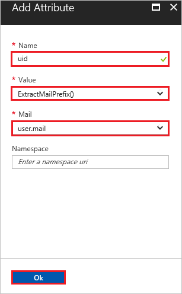
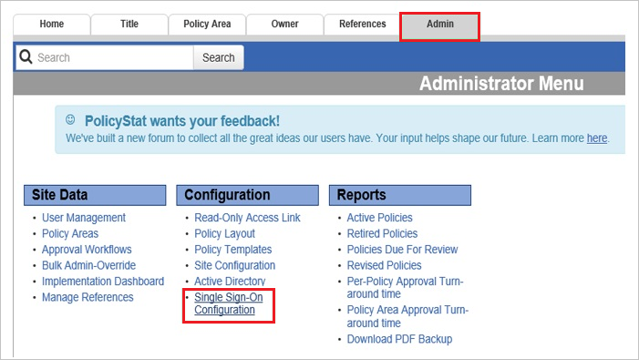
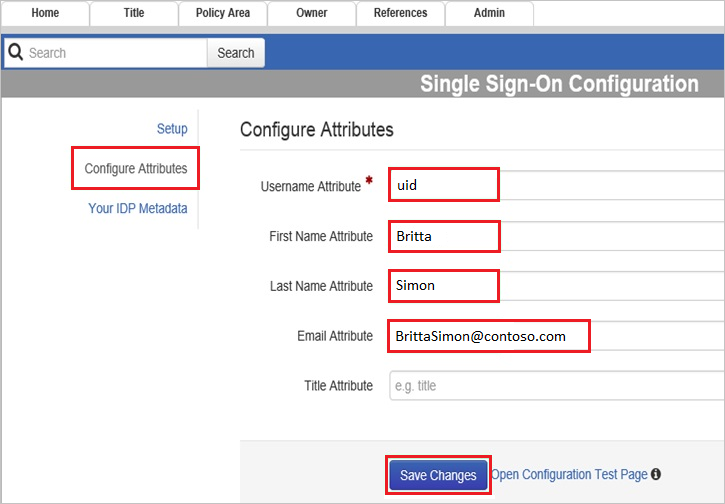
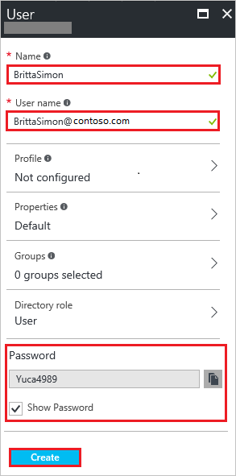
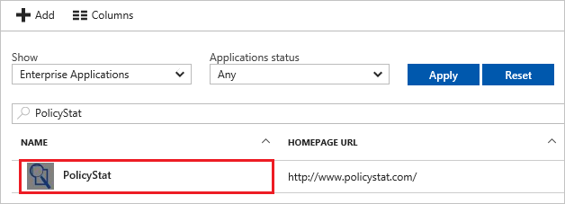

# Tutorial: Azure Active Directory integration with PolicyStat

In this tutorial, you learn how to integrate PolicyStat with Azure Active Directory (Azure AD).

Integrating PolicyStat with Azure AD provides you with the following benefits:

- You can control in Azure AD who has access to PolicyStat
- You can enable your users to automatically get signed-on to PolicyStat (Single Sign-On) with their Azure AD accounts
- You can manage your accounts in one central location - the Azure portal

If you want to know more details about SaaS app integration with Azure AD, see [what is application access and single sign-on with Azure Active Directory](../manage-apps/what-is-single-sign-on.md).

## Prerequisites

To configure Azure AD integration with PolicyStat, you need the following items:

- An Azure AD subscription
- A PolicyStat single sign-on enabled subscription

> [!NOTE]
> To test the steps in this tutorial, we do not recommend using a production environment.

To test the steps in this tutorial, you should follow these recommendations:

- Do not use your production environment, unless it is necessary.
- If you don't have an Azure AD trial environment, you can get a one-month trial [here](https://azure.microsoft.com/pricing/free-trial/).

## Scenario description
In this tutorial, you test Azure AD single sign-on in a test environment. 
The scenario outlined in this tutorial consists of two main building blocks:

1. Adding PolicyStat from the gallery
2. Configuring and testing Azure AD single sign-on

## Adding PolicyStat from the gallery
To configure the integration of PolicyStat into Azure AD, you need to add PolicyStat from the gallery to your list of managed SaaS apps.

**To add PolicyStat from the gallery, perform the following steps:**

1. In the **[Azure portal](https://portal.azure.com)**, on the left navigation panel, click **Azure Active Directory** icon. 

	![Active Directory][1]

2. Navigate to **Enterprise applications**. Then go to **All applications**.

	![Applications][2]
	
3. To add new application, click **New application** button on the top of dialog.

	![Applications][3]

4. In the search box, type **PolicyStat**.

	

5. In the results panel, select **PolicyStat**, and then click **Add** button to add the application.

	

##  Configuring and testing Azure AD single sign-on
In this section, you configure and test Azure AD single sign-on with PolicyStat based on a test user called "Britta Simon".

For single sign-on to work, Azure AD needs to know what the counterpart user in PolicyStat is to a user in Azure AD. In other words, a link relationship between an Azure AD user and the related user in PolicyStat needs to be established.

In PolicyStat, assign the value of the **user name** in Azure AD as the value of the **Username** to establish the link relationship.

To configure and test Azure AD single sign-on with PolicyStat, you need to complete the following building blocks:

1. **[Configuring Azure AD Single Sign-On](#configuring-azure-ad-single-sign-on)** - to enable your users to use this feature.
2. **[Creating an Azure AD test user](#creating-an-azure-ad-test-user)** - to test Azure AD single sign-on with Britta Simon.
3. **[Creating a PolicyStat test user](#creating-a-policystat-test-user)** - to have a counterpart of Britta Simon in PolicyStat that is linked to the Azure AD representation of user.
4. **[Assigning the Azure AD test user](#assigning-the-azure-ad-test-user)** - to enable Britta Simon to use Azure AD single sign-on.
5. **[Testing Single Sign-On](#testing-single-sign-on)** - to verify whether the configuration works.

### Configuring Azure AD single sign-on

In this section, you enable Azure AD single sign-on in the Azure portal and configure single sign-on in your PolicyStat application.

**To configure Azure AD single sign-on with PolicyStat, perform the following steps:**

1. In the Azure portal, on the **PolicyStat** application integration page, click **Single sign-on**.

	![Configure Single Sign-On][4]

2. On the **Single sign-on** dialog, select **Mode** as	**SAML-based Sign-on** to enable single sign-on.
 
	

3. On the **PolicyStat Domain and URLs** section, perform the following steps:

	

    a. In the **Sign-on URL** textbox, type a URL using the following pattern: `https://<companyname>.policystat.com`

	b. In the **Identifier** textbox, type a URL using the following pattern: `https://<companyname>.policystat.com/saml2/metadata/`

	> [!NOTE] 
	> These values are not real. Update these values with the actual Sign-On URL and Identifier. Contact [PolicyStat Client support team](http://www.policystat.com/support/) to get these values. 
 
4. On the **SAML Signing Certificate** section, click **Metadata XML** and then save the metadata file on your computer.

	 

5. The objective of this section is to outline how to enable users to authenticate to PolicyStat with their account in Azure AD using federation based on the SAML protocol.

    The PolicyStat application expects the SAML assertions in a specific format, which requires you to add custom attribute mappings to your **SAML Token Attributes** configuration.  

     The following screenshot shows an example of this.

     

6. To add the required attribute mappings, perform the following steps:

	| Attribute Name    |   Attribute Value |
	|------------------- | -------------------- |
	| uid | ExtractMailPrefix([mail]) |
	
	a. Click **Add attribute** to open the **Add Attribute** dialog.

	

	
	
    b. In the **Attribute Name** textbox, type **uid**.

    c. In the **Attribute Value** textbox, select **ExtractMailPrefix()**.    
   
    d. From the **Mail** list, select **User.mail**.
 	
	e. Click **Ok**

7. Click **Save** button.

	

8. In a different web browser window, log into your PolicyStat company site as an administrator.

9. Click the **Admin** tab, and then click **Single Sign-On Configuration** in left navigation pane.
   
    

10. In the **Setup** section, select **Enable Single Sign-on Integration**.
   
    

11. Click **Configure Attributes**, and then, in the **Configure Attributes** section, perform the following steps:
   
    
   
    a. In the **Username Attribute** textbox, type **uid**.

    b. In the **First Name Attribute** textbox, type **firstname** of user **Britta**.

    c. In the **Last Name Attribute** textbox, type **lastname** of user **Simon**.

    d. In the **Email Attribute** textbox, type **emailaddress** of user **BrittaSimon@contoso.com**.

    e. Click **Save Changes**.

12. Click **Your IDP Metadata**, and then, in the **Your IDP Metadata** section, perform the following steps:
   
    
   
    a. Open your downloaded metadata file, copy the content, and  then paste it into the **Your Identity Provider Metadata** textbox.

    b. Click **Save Changes**.

> [!TIP]
> You can now read a concise version of these instructions inside the [Azure portal](https://portal.azure.com), while you are setting up the app!  After adding this app from the **Active Directory > Enterprise Applications** section, simply click the **Single Sign-On** tab and access the embedded documentation through the **Configuration** section at the bottom. You can read more about the embedded documentation feature here: [Azure AD embedded documentation]( https://go.microsoft.com/fwlink/?linkid=845985)
> 

### Creating an Azure AD test user
The objective of this section is to create a test user in the Azure portal called Britta Simon.

![Create Azure AD User][100]

**To create a test user in Azure AD, perform the following steps:**

1. In the **Azure portal**, on the left navigation pane, click **Azure Active Directory** icon.

	 

2. To display the list of users, go to **Users and groups** and click **All users**.
	
	 

3. To open the **User** dialog, click **Add** on the top of the dialog.
 
	 

4. On the **User** dialog page, perform the following steps:
 
	 

    a. In the **Name** textbox, type **BrittaSimon**.

    b. In the **User name** textbox, type the **email address** of BrittaSimon.

	c. Select **Show Password** and write down the value of the **Password**.

    d. Click **Create**.
 
### Creating a PolicyStat test user

In order to enable Azure AD users to log into PolicyStat, they must be provisioned into PolicyStat.  

PolicyStat supports just in time user provisioning. This means, you do not need to add the users manually to PolicyStat. The users will get added automatically on their first login through SSO.

>[!NOTE]
>You can use any other PolicyStat user account creation tools or APIs provided by PolicyStat to provision Azure AD user accounts.
> 

### Assigning the Azure AD test user

In this section, you enable Britta Simon to use Azure single sign-on by granting access to PolicyStat.

![Assign User][200] 

**To assign Britta Simon to PolicyStat, perform the following steps:**

1. In the Azure portal, open the applications view, and then navigate to the directory view and go to **Enterprise applications** then click **All applications**.

	![Assign User][201] 

2. In the applications list, select **PolicyStat**.

	 

3. In the menu on the left, click **Users and groups**.

	![Assign User][202] 

4. Click **Add** button. Then select **Users and groups** on **Add Assignment** dialog.

	![Assign User][203]

5. On **Users and groups** dialog, select **Britta Simon** in the Users list.

6. Click **Select** button on **Users and groups** dialog.

7. Click **Assign** button on **Add Assignment** dialog.
	
### Testing single sign-on

In this section, you test your Azure AD single sign-on configuration using the Access Panel.

When you click the PolicyStat tile in the Access Panel, you should get automatically signed-on to your PolicyStat application.
For more information about the Access Panel, see [Introduction to the Access Panel](../active-directory-saas-access-panel-introduction.md).

## Additional resources

* [List of Tutorials on How to Integrate SaaS Apps with Azure Active Directory](tutorial-list.md)
* [What is application access and single sign-on with Azure Active Directory?](../manage-apps/what-is-single-sign-on.md)

<!--Image references-->

[1]: ./media/policystat-tutorial/tutorial_general_01.png
[2]: ./media/policystat-tutorial/tutorial_general_02.png
[3]: ./media/policystat-tutorial/tutorial_general_03.png
[4]: ./media/policystat-tutorial/tutorial_general_04.png

[100]: ./media/policystat-tutorial/tutorial_general_100.png

[200]: ./media/policystat-tutorial/tutorial_general_200.png
[201]: ./media/policystat-tutorial/tutorial_general_201.png
[202]: ./media/policystat-tutorial/tutorial_general_202.png
[203]: ./media/policystat-tutorial/tutorial_general_203.png

