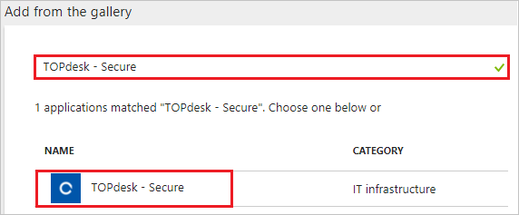
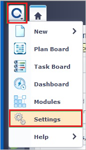
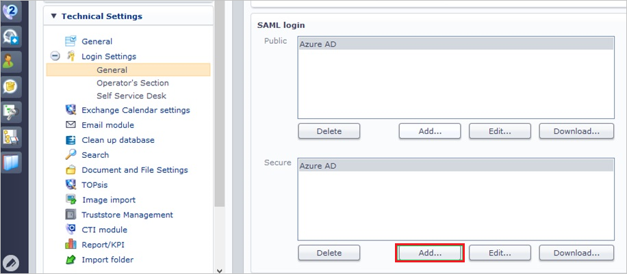
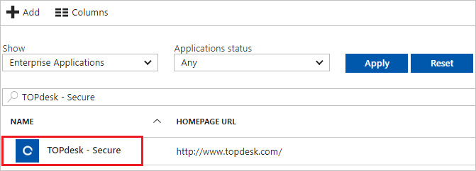

# Tutorial: Azure Active Directory integration with TOPdesk - Secure

In this tutorial, you learn how to integrate TOPdesk - Secure with Azure Active Directory (Azure AD).

Integrating TOPdesk - Secure with Azure AD provides you with the following benefits:

- You can control in Azure AD who has access to TOPdesk - Secure.
- You can enable your users to automatically get signed-on to TOPdesk - Secure (Single Sign-On) with their Azure AD accounts.
- You can manage your accounts in one central location - the Azure portal.

If you want to know more details about SaaS app integration with Azure AD, see [what is application access and single sign-on with Azure Active Directory](../manage-apps/what-is-single-sign-on.md).

## Prerequisites

To configure Azure AD integration with TOPdesk - Secure, you need the following items:

- An Azure AD subscription
- A TOPdesk - Secure single sign-on enabled subscription

> [!NOTE]
> To test the steps in this tutorial, we do not recommend using a production environment.

To test the steps in this tutorial, you should follow these recommendations:

- Do not use your production environment, unless it is necessary.
- If you don't have an Azure AD trial environment, you can [get a one-month trial](https://azure.microsoft.com/pricing/free-trial/).

## Scenario description
In this tutorial, you test Azure AD single sign-on in a test environment. 
The scenario outlined in this tutorial consists of two main building blocks:

1. Adding TOPdesk - Secure from the gallery
2. Configuring and testing Azure AD single sign-on

## Adding TOPdesk - Secure from the gallery
To configure the integration of TOPdesk - Secure into Azure AD, you need to add TOPdesk - Secure from the gallery to your list of managed SaaS apps.

**To add TOPdesk - Secure from the gallery, perform the following steps:**

1. In the **[Azure portal](https://portal.azure.com)**, on the left navigation panel, click **Azure Active Directory** icon. 

	![The Azure Active Directory button][1]

2. Navigate to **Enterprise applications**. Then go to **All applications**.

	![The Enterprise applications blade][2]
	
3. To add new application, click **New application** button on the top of dialog.

	![The New application button][3]

4. In the search box, type **TOPdesk - Secure**, select **TOPdesk - Secure** from result panel then click **Add** button to add the application.

	

## Configure and test Azure AD single sign-on

In this section, you configure and test Azure AD single sign-on with TOPdesk - Secure based on a test user called "Britta Simon".

For single sign-on to work, Azure AD needs to know what the counterpart user in TOPdesk - Secure is to a user in Azure AD. In other words, a link relationship between an Azure AD user and the related user in TOPdesk - Secure needs to be established.

In TOPdesk - Secure, assign the value of the **user name** in Azure AD as the value of the **Username** to establish the link relationship.

To configure and test Azure AD single sign-on with TOPdesk - Secure, you need to complete the following building blocks:

1. **[Configure Azure AD Single Sign-On](#configure-azure-ad-single-sign-on)** - to enable your users to use this feature.
2. **[Create an Azure AD test user](#create-an-azure-ad-test-user)** - to test Azure AD single sign-on with Britta Simon.
3. **[Create a TOPdesk - Secure test user](#create-a-topdesk---secure-test-user)** - to have a counterpart of Britta Simon in TOPdesk - Secure that is linked to the Azure AD representation of user.
4. **[Assign the Azure AD test user](#assign-the-azure-ad-test-user)** - to enable Britta Simon to use Azure AD single sign-on.
5. **[Test single sign-on](#test-single-sign-on)** - to verify whether the configuration works.

### Configure Azure AD single sign-on

In this section, you enable Azure AD single sign-on in the Azure portal and configure single sign-on in your TOPdesk - Secure application.

**To configure Azure AD single sign-on with TOPdesk - Secure, perform the following steps:**

1. In the Azure portal, on the **TOPdesk - Secure** application integration page, click **Single sign-on**.

	![Configure single sign-on link][4]

2. On the **Single sign-on** dialog, select **Mode** as	**SAML-based Sign-on** to enable single sign-on.
 
	

3. On the **TOPdesk - Secure Domain and URLs** section, perform the following steps:

	

    a. In the **Sign-on URL** textbox, type a URL using the following pattern: `https://<companyname>.topdesk.net`

	b. In the **Identifier** textbox, type a URL using the following pattern: `https://<companyname>.topdesk.net/tas/secure/login/verify`

	c. In the **Reply URL** textbox, type a URL using the following pattern: `https://<companyname>.topdesk.net/tas/public/login/saml`

	> [!NOTE] 
	> These values are not real. Update these values with the actual Sign-On URL and Identifier. Reply URL is explained later in tutorial. Contact [TOPdesk - Secure Client support team](http://www.topdesk.com/us/support) to get these values. 

4. On the **SAML Signing Certificate** section, click **Metadata XML** and then save the metadata file on your computer.

	 

5. Click **Save** button.

	

6. On the **TOPdesk - Secure Configuration** section, click **Configure TOPdesk - Secure** to open **Configure sign-on** window. Copy the **Sign-Out URL, SAML Entity ID, and SAML Single Sign-On Service URL** from the **Quick Reference section.**

	
	
7. Sign on to your **TOPdesk - Secure** company site as an administrator.

8. In the **TOPdesk** menu, click **Settings**.

	

9. Click **Login Settings**.

	

10. Expand the **Login Settings** menu, and then click **General**.

	

11. In the **Secure** section of the **SAML login** configuration section, perform the following steps:

	
   
    a. Click **Download** to download the public metadata file, and then save it locally on your computer.
   
    b. Open the metadata file, and then locate the **AssertionConsumerService** node.
    
    
   
    c. Copy the **AssertionConsumerService** value, paste this value in the Reply URL textbox in **TOPdesk - Secure Domain and URLs** section.

12. To create a certificate file, perform the following steps:
    
    
    
    a. Open the downloaded metadata file from Azure portal.

    b. Expand the **RoleDescriptor** node that has a **xsi:type** of **fed:ApplicationServiceType**.

    c. Copy the value of the **X509Certificate** node.

    d. Save the copied **X509Certificate** value locally on your computer in a file.

13. In the **Public** section, click **Add**.
    
    

14. On the **SAML configuration assistant** dialog page, perform the following steps:
    
    
    
    a. To upload your downloaded metadata file from Azure portal, under **Federation Metadata**, click **Browse**.

    b. To upload your certificate file, under **Certificate (RSA)**, click **Browse**.

    c. To upload the logo file you got from the TOPdesk support team, under **Logo icon**, click **Browse**.

    d. In the **User name attribute** textbox, type `http://schemas.xmlsoap.org/ws/2005/05/identity/claims/emailaddress`.

    e. In the **Display name** textbox, type a name for your configuration.

    f. Click **Save**.

> [!TIP]
> You can now read a concise version of these instructions inside the [Azure portal](https://portal.azure.com), while you are setting up the app!  After adding this app from the **Active Directory > Enterprise Applications** section, simply click the **Single Sign-On** tab and access the embedded documentation through the **Configuration** section at the bottom. You can read more about the embedded documentation feature here: [Azure AD embedded documentation]( https://go.microsoft.com/fwlink/?linkid=845985)
> 

### Create an Azure AD test user

The objective of this section is to create a test user in the Azure portal called Britta Simon.

   ![Create an Azure AD test user][100]

**To create a test user in Azure AD, perform the following steps:**

1. In the Azure portal, in the left pane, click the **Azure Active Directory** button.

    

2. To display the list of users, go to **Users and groups**, and then click **All users**.

    

3. To open the **User** dialog box, click **Add** at the top of the **All Users** dialog box.

    

4. In the **User** dialog box, perform the following steps:

    

    a. In the **Name** box, type **BrittaSimon**.

    b. In the **User name** box, type the email address of user Britta Simon.

    c. Select the **Show Password** check box, and then write down the value that's displayed in the **Password** box.

    d. Click **Create**.
 
### Create a TOPdesk - Secure test user

In order to enable Azure AD users to log into TOPdesk - Secure, they must be provisioned into TOPdesk - Secure.  
In the case of TOPdesk - Secure, provisioning is a manual task.

### To configure user provisioning, perform the following steps:
1. Sign on to your **TOPdesk - Secure** company site as administrator.
2. In the menu on the top, click **TOPdesk \> New \> Support Files \> Operator**.
   
    

3. On the **New Operator** dialog, perform the following steps:
   
    
   
    a. Click the **General** tab.
   
    b. In the **Surname** textbox, type Surname of the user like **Simon**.
   
    c. Select a **Site** for the account in the **Location** section.
   
    d. In the **Login Name** textbox of the **TOPdesk Login** section, type a login name for your user.
   
    e. Click **Save**.

> [!NOTE]
> You can use any other TOPdesk - Secure user account creation tools or APIs provided by TOPdesk - Secure to provision AAD user accounts.

### Assign the Azure AD test user

In this section, you enable Britta Simon to use Azure single sign-on by granting access to TOPdesk - Secure.

![Assign the user role][200] 

**To assign Britta Simon to TOPdesk - Secure, perform the following steps:**

1. In the Azure portal, open the applications view, and then navigate to the directory view and go to **Enterprise applications** then click **All applications**.

	![Assign User][201] 

2. In the applications list, select **TOPdesk - Secure**.

	  

3. In the menu on the left, click **Users and groups**.

	![The "Users and groups" link][202]

4. Click **Add** button. Then select **Users and groups** on **Add Assignment** dialog.

	![The Add Assignment pane][203]

5. On **Users and groups** dialog, select **Britta Simon** in the Users list.

6. Click **Select** button on **Users and groups** dialog.

7. Click **Assign** button on **Add Assignment** dialog.
	
### Test single sign-on

In this section, you test your Azure AD single sign-on configuration using the Access Panel.

When you click the TOPdesk - Secure tile in the Access Panel, you should get automatically signed-on to your TOPdesk - Secure application.
For more information about the Access Panel, see [Introduction to the Access Panel](../active-directory-saas-access-panel-introduction.md). 

## Additional resources

* [List of Tutorials on How to Integrate SaaS Apps with Azure Active Directory](tutorial-list.md)
* [What is application access and single sign-on with Azure Active Directory?](../manage-apps/what-is-single-sign-on.md)

<!--Image references-->

[1]: ./media/topdesk-secure-tutorial/tutorial_general_01.png
[2]: ./media/topdesk-secure-tutorial/tutorial_general_02.png
[3]: ./media/topdesk-secure-tutorial/tutorial_general_03.png
[4]: ./media/topdesk-secure-tutorial/tutorial_general_04.png

[100]: ./media/topdesk-secure-tutorial/tutorial_general_100.png

[200]: ./media/topdesk-secure-tutorial/tutorial_general_200.png
[201]: ./media/topdesk-secure-tutorial/tutorial_general_201.png
[202]: ./media/topdesk-secure-tutorial/tutorial_general_202.png
[203]: ./media/topdesk-secure-tutorial/tutorial_general_203.png

