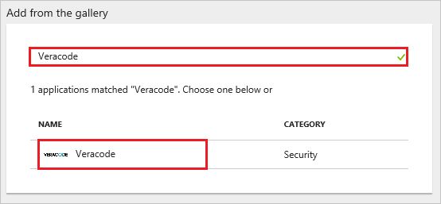
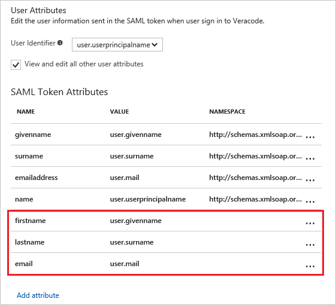
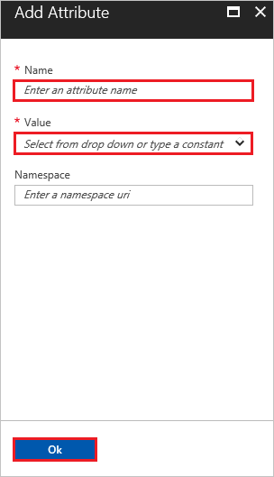
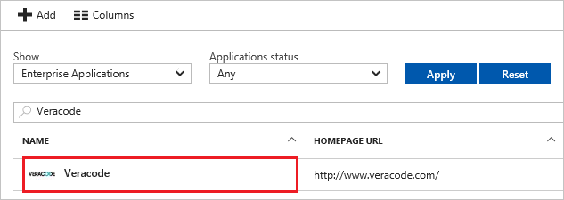

# Tutorial: Azure Active Directory integration with Veracode

In this tutorial, you learn how to integrate Veracode with Azure Active Directory (Azure AD).

Integrating Veracode with Azure AD provides you with the following benefits:

- You can control in Azure AD who has access to Veracode.
- You can enable your users to automatically get signed-on to Veracode (Single Sign-On) with their Azure AD accounts.
- You can manage your accounts in one central location - the Azure portal.

If you want to know more details about SaaS app integration with Azure AD, see [what is application access and single sign-on with Azure Active Directory](../manage-apps/what-is-single-sign-on.md).

## Prerequisites

To configure Azure AD integration with Veracode, you need the following items:

- An Azure AD subscription
- A Veracode single sign-on enabled subscription

> [!NOTE]
> To test the steps in this tutorial, we do not recommend using a production environment.

To test the steps in this tutorial, you should follow these recommendations:

- Do not use your production environment, unless it is necessary.
- If you don't have an Azure AD trial environment, you can [get a one-month trial](https://azure.microsoft.com/pricing/free-trial/).

## Scenario description
In this tutorial, you test Azure AD single sign-on in a test environment. 
The scenario outlined in this tutorial consists of two main building blocks:

1. Add Veracode from the gallery
2. Configure and test Azure AD single sign-on

## Add Veracode from the gallery
To configure the integration of Veracode into Azure AD, you need to add Veracode from the gallery to your list of managed SaaS apps.

**To add Veracode from the gallery, perform the following steps:**

1. In the **[Azure portal](https://portal.azure.com)**, on the left navigation panel, click **Azure Active Directory** icon. 

	![The Azure Active Directory button][1]

2. Navigate to **Enterprise applications**. Then go to **All applications**.

	![The Enterprise applications blade][2]
	
3. To add new application, click **New application** button on the top of dialog.

	![The New application button][3]

4. In the search box, type **Veracode**, select  **Veracode** from result panel then click **Add** button to add the application.

	

## Configure and test Azure AD single sign-on

In this section, you configure and test Azure AD single sign-on with Veracode based on a test user called "Britta Simon".

For single sign-on to work, Azure AD needs to know what the counterpart user in Veracode is to a user in Azure AD. In other words, a link relationship between an Azure AD user and the related user in Veracode needs to be established.

In Veracode, assign the value of the **user name** in Azure AD as the value of the **Username** to establish the link relationship.

To configure and test Azure AD single sign-on with Veracode, you need to complete the following building blocks:

1. **[Configure Azure AD Single Sign-On](#configure-azure-ad-single-sign-on)** - to enable your users to use this feature.
2. **[Create an Azure AD test user](#create-an-azure-ad-test-user)** - to test Azure AD single sign-on with Britta Simon.
3. **[Create a Veracode test user](#create-a-veracode-test-user)** - to have a counterpart of Britta Simon in Veracode that is linked to the Azure AD representation of user.
4. **[Assign the Azure AD test user](#assign-the-azure-ad-test-user)** - to enable Britta Simon to use Azure AD single sign-on.
5. **[Test single sign-on](#test-single-sign-on)** - to verify whether the configuration works.

### Configure Azure AD single sign-on

In this section, you enable Azure AD single sign-on in the Azure portal and configure single sign-on in your Veracode application.

**To configure Azure AD single sign-on with Veracode, perform the following steps:**

1. In the Azure portal, on the **Veracode** application integration page, click **Single sign-on**.

	![Configure single sign-on link][4]

2. On the **Single sign-on** dialog, select **Mode** as	**SAML-based Sign-on** to enable single sign-on.
 
	

3. On the **Veracode Domain and URLs** section, the user does not have to perform any steps as the app is already pre-integrated with Azure. 

	

4. On the **SAML Signing Certificate** section, click **Certificate (Base64)** and then save the certificate file on your computer.

	 

5. The objective of this section is to outline how to enable users to authenticate to Veracode with their account in Azure AD using federation based on the SAML protocol.

	Your Veracode application expects the SAML assertions in a specific format, which requires you to add custom attribute mappings to your **saml token attributes** configuration. The following screenshot shows an example for this.
	
	

6. To add the required attribute mappings, perform the following steps:

	| Attribute Name | Attribute Value |
	|--- |--- |
	| firstname |User.givenname |
	| lastname |User.surname |
	| email |User.mail |
    
    a. For each data row in the table above, click **add user attribute**.
	
	
	
	
	
	b. In the **Attribute Name** textbox, type the attribute name shown for that row.
	
	c. In the **Attribute Value** textbox, select the attribute value shown for that row.
	
	d. Click **Ok**.

7. Click **Save** button.

	

8. On the **Veracode Configuration** section, click **Configure Veracode** to open **Configure sign-on** window. Copy the **SAML Entity ID** from the **Quick Reference section.**

	 

9. In a different web browser window, log into your Veracode company site as an administrator.

10. In the menu on the top, click **Settings**, and then click **Admin**.
   
    

11. Click the **SAML** tab.

12. In the **Organization SAML Settings** section, perform the following steps:
   
    
   
    a.  In  **Issuer** textbox, paste the value of  **SAML Entity ID** which you have copied from Azure portal.
	
    b. To upload your downloaded certificate from Azure portal, click **Choose File**.
   
    c. Select **Enable Self Registration**.

13. In the **Self Registration Settings** section, perform the following steps, and then click **Save**:
   
    
   
    a. As **New User Activation**, select **No Activation Required**.
   
    b. As **User Data Updates**, select **Preference Veracode User Data**.
   
    c. For **SAML Attribute Details**, select the following:
      * **User Roles**
      * **Policy Administrator**
      * **Reviewer**
      * **Security Lead**
      * **Executive**
      * **Submitter**
      * **Creator**
      * **All Scan Types**
      * **Team Memberships**
      * **Default Team**

> [!TIP]
> You can now read a concise version of these instructions inside the [Azure portal](https://portal.azure.com), while you are setting up the app!  After adding this app from the **Active Directory > Enterprise Applications** section, simply click the **Single Sign-On** tab and access the embedded documentation through the **Configuration** section at the bottom. You can read more about the embedded documentation feature here: [Azure AD embedded documentation]( https://go.microsoft.com/fwlink/?linkid=845985)
> 

### Create an Azure AD test user

The objective of this section is to create a test user in the Azure portal called Britta Simon.

   ![Create an Azure AD test user][100]

**To create a test user in Azure AD, perform the following steps:**

1. In the Azure portal, in the left pane, click the **Azure Active Directory** button.

    

2. To display the list of users, go to **Users and groups**, and then click **All users**.

    

3. To open the **User** dialog box, click **Add** at the top of the **All Users** dialog box.

    

4. In the **User** dialog box, perform the following steps:

    

    a. In the **Name** box, type **BrittaSimon**.

    b. In the **User name** box, type the email address of user Britta Simon.

    c. Select the **Show Password** check box, and then write down the value that's displayed in the **Password** box.

    d. Click **Create**.
 
### Create a Veracode test user
In order to enable Azure AD users to log into Veracode, they must be provisioned into Veracode. In the case of Veracode, provisioning is an automated task. There is no action item for you. Users are automatically created if necessary during the first single sign-on attempt.

> [!NOTE]
> You can use any other Veracode user account creation tools or APIs provided by Veracode to provision Azure AD user accounts.
> 

### Assign the Azure AD test user

In this section, you enable Britta Simon to use Azure single sign-on by granting access to Veracode.

![Assign the user role][200] 

**To assign Britta Simon to Veracode, perform the following steps:**

1. In the Azure portal, open the applications view, and then navigate to the directory view and go to **Enterprise applications** then click **All applications**.

	![Assign User][201] 

2. In the applications list, select **Veracode**.

	  

3. In the menu on the left, click **Users and groups**.

	![The "Users and groups" link][202]

4. Click **Add** button. Then select **Users and groups** on **Add Assignment** dialog.

	![The Add Assignment pane][203]

5. On **Users and groups** dialog, select **Britta Simon** in the Users list.

6. Click **Select** button on **Users and groups** dialog.

7. Click **Assign** button on **Add Assignment** dialog.
	
### Test single sign-on

In this section, you test your Azure AD single sign-on configuration using the Access Panel.

When you click the Veracode tile in the Access Panel, you should get automatically signed-on to your Veracode application.
For more information about the Access Panel, see [Introduction to the Access Panel](../active-directory-saas-access-panel-introduction.md). 

## Additional resources

* [List of Tutorials on How to Integrate SaaS Apps with Azure Active Directory](tutorial-list.md)
* [What is application access and single sign-on with Azure Active Directory?](../manage-apps/what-is-single-sign-on.md)

<!--Image references-->

[1]: ./media/veracode-tutorial/tutorial_general_01.png
[2]: ./media/veracode-tutorial/tutorial_general_02.png
[3]: ./media/veracode-tutorial/tutorial_general_03.png
[4]: ./media/veracode-tutorial/tutorial_general_04.png

[100]: ./media/veracode-tutorial/tutorial_general_100.png

[200]: ./media/veracode-tutorial/tutorial_general_200.png
[201]: ./media/veracode-tutorial/tutorial_general_201.png
[202]: ./media/veracode-tutorial/tutorial_general_202.png
[203]: ./media/veracode-tutorial/tutorial_general_203.png

