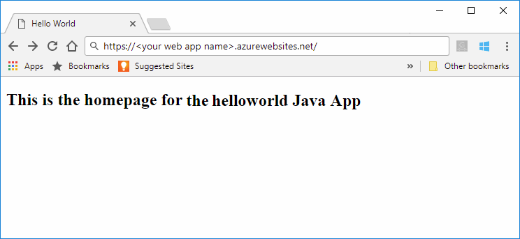
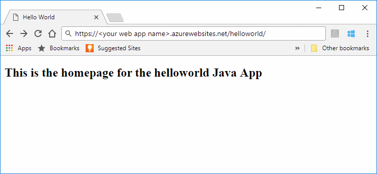

# Quickstart: Create a Java web app in App Service on Linux

App Service on Linux currently provides a preview feature to support Java web apps. Please review the [Supplemental Terms of Use for Microsoft Azure Previews](https://azure.microsoft.com/support/legal/preview-supplemental-terms/) for more information on previews. 

[App Service on Linux](app-service-linux-intro.md) provides a highly scalable, self-patching, web hosting service using the Linux operating system. This quickstart shows how to use the [Azure CLI](https://docs.microsoft.com/cli/azure/get-started-with-azure-cli) with the [Maven Plugin for Azure Web Apps (Preview)](https://github.com/Microsoft/azure-maven-plugins/tree/develop/azure-webapp-maven-plugin) to deploy a Java web app with a built-in Linux image.



[Deploying Java web apps to a Linux container in the cloud using the Azure Toolkit for IntelliJ](https://docs.microsoft.com/java/azure/intellij/azure-toolkit-for-intellij-hello-world-web-app-linux) is an alternative approach to deploy your Java app to your own container.

[!INCLUDE [quickstarts-free-trial-note](../../../includes/quickstarts-free-trial-note.md)]


## Prerequisites

To complete this quickstart: 

* [Azure CLI 2.0 or later](https://docs.microsoft.com/cli/azure/install-azure-cli?view=azure-cli-latest) installed locally.
* [Apache Maven](http://maven.apache.org/).


## Create a Java app

Execute the following command using Maven to create a new *helloworld* web app:  

    mvn archetype:generate -DgroupId=example.demo -DartifactId=helloworld -DarchetypeArtifactId=maven-archetype-webapp

Change to the new *helloworld* project directory and build all modules using the following command:

    mvn verify

This command will verify and create all modules including the *helloworld.war* file in the *helloworld/target* subdirectory.


## Deploying the Java app to App Service on Linux

There are multiple deployment options for deploying your Java web apps to App Service on Linux. These options include:

* [Deploying via Maven Plugin for Azure Web Apps](https://github.com/Microsoft/azure-maven-plugins/tree/develop/azure-webapp-maven-plugin)
* [Deploying via ZIP or WAR](https://docs.microsoft.com/azure/app-service/app-service-deploy-zip)
* [Deploying via FTP](https://docs.microsoft.com/azure/app-service/app-service-deploy-ftp)

In this quickstart, you will use the Maven plugin for Azure web apps. It has advantages in that it is easy to use from Maven, and creates the necessary Azure resources for you (resource group, app service plan, and web app).

### Deploy with Maven

To deploy from Maven, add the following plugin definition inside the `<build>` element of the *pom.xml* file:

```xml
    <plugins>
      <plugin>
        <groupId>com.microsoft.azure</groupId> 
        <artifactId>azure-webapp-maven-plugin</artifactId> 
        <version>1.1.0</version>
        <configuration> 
          <resourceGroup>YOUR_RESOURCE_GROUP</resourceGroup> 
          <appName>YOUR_WEB_APP</appName> 
          <linuxRuntime>tomcat 9.0-jre8</linuxRuntime>
          <deploymentType>ftp</deploymentType> 
          <resources> 
              <resource> 
                  <directory>${project.basedir}/target</directory> 
                  <targetPath>webapps</targetPath> 
                  <includes> 
                      <include>*.war</include> 
                  </includes> 
                  <excludes> 
                      <exclude>*.xml</exclude> 
                  </excludes> 
              </resource> 
          </resources> 
        </configuration>
      </plugin>
    </plugins>
```    

Update the following placeholders in the plugin configuration:

| Placeholder | Description |
| ----------- | ----------- |
| `YOUR_RESOURCE_GROUP` | Name for the new resource group in which to create your web app. By putting all the resources for an app in a group, you can manage them together. For example, deleting the resource group would delete all resources associated with the app. Update this value with a unique new resource group name, for example, *TestResources*. You will use this resource group name to clean up all Azure resources in a later section. |
| `YOUR_WEB_APP` | The app name will be part the host name for the web app when deployed to Azure (YOUR_WEB_APP.azurewebsites.net). Update this value with a unique name for the new Azure web app, which will host your Java app, for example *contoso*. |

The `linuxRuntime` element of the configuration controls what built-in Linux image is used with your application.

Execute the following command and follow all directions to authenticate with the Azure CLI:

    az login

Deploy your Java app to the web app using the following command:

    mvn clean package azure-webapp:deploy


Once deployment has completed, browse to the deployed application using the following URL in your web browser.

```bash
http://<app_name>.azurewebsites.net/helloworld
```

The Java sample code is running in a web app with built-in image.



**Congratulations!** You've deployed your first Java app to App Service on Linux.


[!INCLUDE [cli-samples-clean-up](../../../includes/cli-samples-clean-up.md)]


## Next steps

In this quickstart, you used Maven to create a Java web app, then you deployed the Java web app to App Service on Linux. To learn more about using Java with Azure, follow the link below.

> [!div class="nextstepaction"]
> [Azure for Java Developers](https://docs.microsoft.com/java/azure/)

