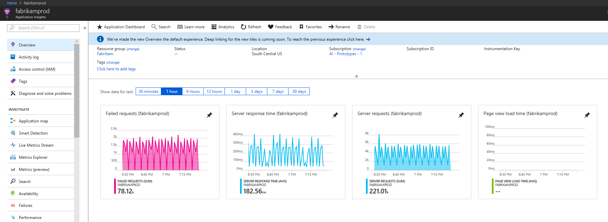

# Start monitoring your ASP.NET Web Application

With Azure Application Insights, you can easily monitor your web application for availability,
performance, and usage.  You can also quickly identify and diagnose errors in your application without waiting for a user to report them.  With the information that you collect from Application Insights about the performance and effectiveness of your
app, you can make informed choices to maintain and improve your application.

This quickstart shows how to add Application Insights to an existing ASP.NET web application and start
analyzing live statistics, which is just one of the various methods you can use to analyze your application. If you do not have a ASP.NET web application, you can create one following the
[Create a ASP.NET Web App quickstart](../app-service/app-service-web-get-started-dotnet.md).

## Prerequisites
To complete this quickstart:

- Install [Visual Studio 2017](https://www.visualstudio.com/downloads/) with the following workloads:
	- ASP.NET and web development
	- Azure development

If you don't have an Azure subscription, create a [free](https://azure.microsoft.com/free/) account before you begin.

## Enable Application Insights

1. Open your project in Visual Studio 2017.
2. Select **Configure Application Insights** from the Project menu. Visual Studio adds the Application Insights SDK to your application.

    > [!IMPORTANT]
    > The process to add Application Insights varies by ASP.NET template type. If you are using the **Empty** or **Azure Mobile App** template select **Project** > **Add Application Insights Telemetry**. For all other ASP.NET templates consult the instructions in the step above. 

3. Click **Start Free**, select your preferred billing plan, and click **Register**.

    

4. Run your application by either selecting **Start Debugging** from the **Debug** menu or by pressing the
  F5 key.

## Confirm app configuration

Application Insights gathers telemetry data for your application regardless of where it's running. Use the following steps to start viewing this data.

1. Open Application Insights by clicking **Project** -> **Application Insights** -> **Search Debug Session Telemetry**.  You see the telemetry from your current session.  

2. Click on the first request in the list (GET Home/Index in this example) to see the request details. Notice that the status code and response time are both included along with other valuable information about the request.  

## Start monitoring in the Azure portal

You can now open Application Insights in the Azure portal to view various details about your running application.

1. Right-click on **Connected Services Application Insights** folder in Solution Explorer and click **Open Application Insights Portal**.  You see some information about your application and a variety of options.

	

2. Click on **Application map** to get a visual layout of the dependency relationships between your application components.  Each component shows KPIs such as load, performance, failures, and alerts.

	

3. Click on the **App Analytics** icon  on one of the application components.  This opens **Application Insights Analytics**, which provides a rich query language for analyzing all data collected by Application Insights.  In this case, a query is generated for you that renders the request count as a chart.  You can write your own queries to analyze other data.

	

4. Return to the **Overview** page and click on **Live Stream**.  This shows live statistics about your application as it's running.  This includes such information as the number of incoming requests, the duration of those requests, and any failures that occur.  You can also inspect critical performance metrics such as processor and memory.

	

If you are ready to host your application in Azure, you can publish it now. Follow the steps described
in [Create an ASP.NET Web App Quickstart](../app-service/app-service-web-get-started-dotnet.md#update-the-app-and-redeploy).

## Next steps
In this quick start, you’ve enabled your application for monitoring by Azure Application Insights.  Continue to the tutorials to learn how to use it to monitor statistics and detect issues in your application.

> [!div class="nextstepaction"]
> [Azure Application Insights tutorials](app-insights-tutorial-runtime-exceptions.md)