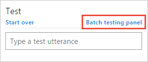
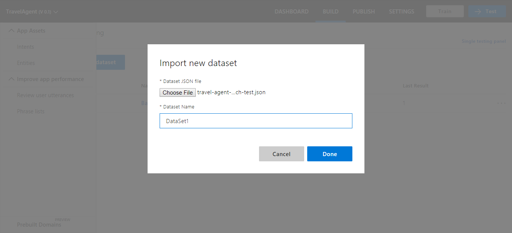
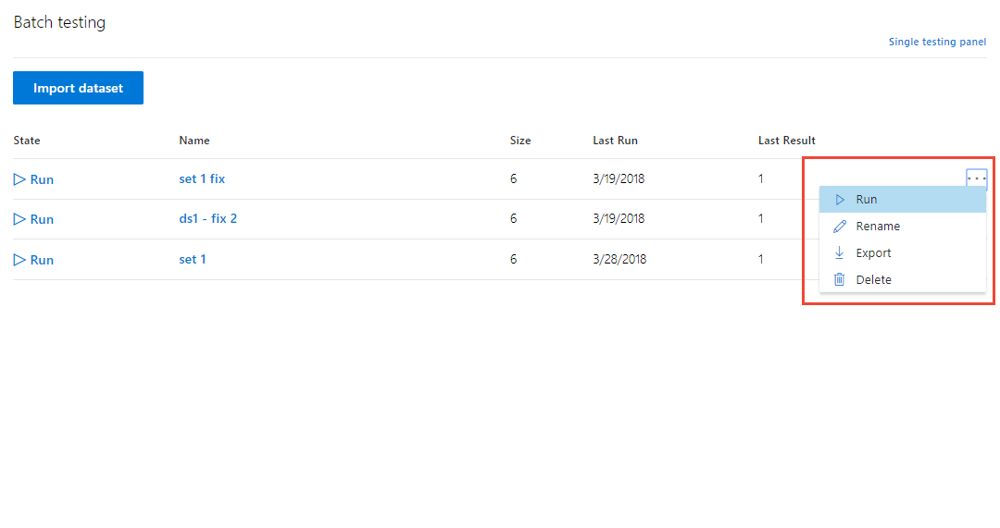
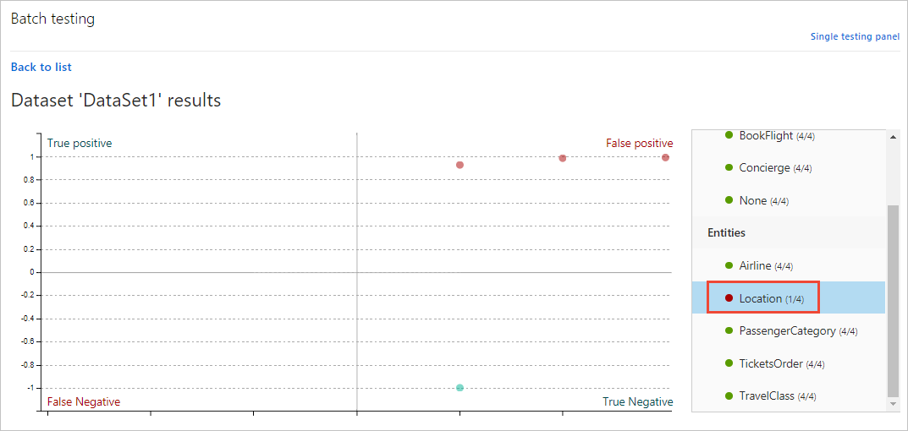
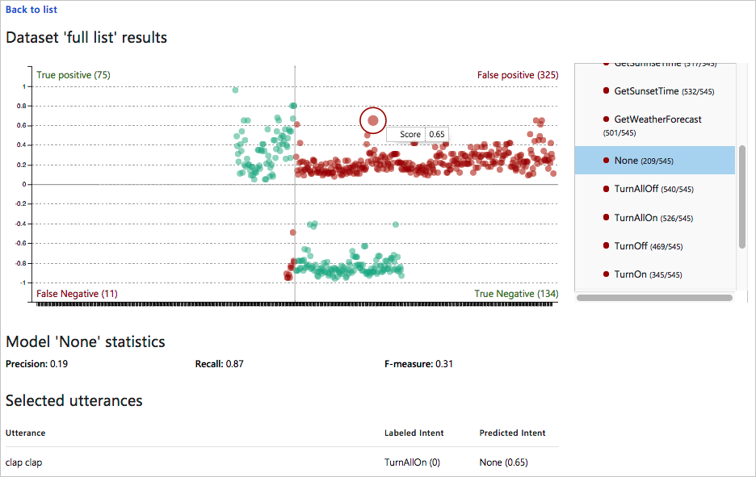
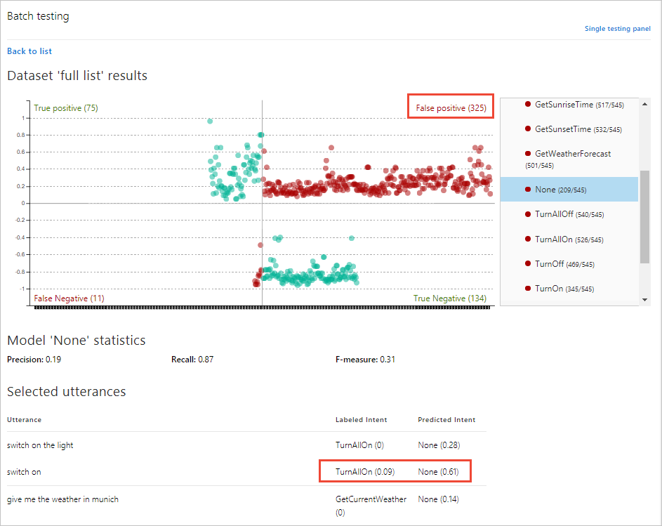

# Batch testing
 Batch testing is a comprehensive test on your current trained model to measure its performance in LUIS. 

## Import a dataset file for batch testing

1. Select **Test** in the top bar, and then select **Batch testing panel**.

    

2. Select **Import dataset**. The **Import new dataset** dialog box appears. Select **Choose File** and locate a JSON file with the correct [JSON format](luis-concept-batch-test.md#batch-file-format) that contains *no more than 1,000* utterances to test.

    

    Import errors are reported in a red notification bar at the top of the browser. When an import has errors, no dataset is created. For more information, see [Common errors](luis-concept-batch-test.md#common-errors-importing-a-batch).

3. In the **Dataset Name** field, enter a name for your dataset file. The dataset file includes an **array of utterances** including the *labeled intent* and *entities*. Review the [example batch file](luis-concept-batch-test.md#batch-file-format) for syntax. 

4. Select **Done**. The dataset file is added.

## Run, rename, export, or delete dataset
To run, rename, export, or delete the dataset, use the ellipsis (***...***) button at the end of the dataset row.

## Run a batch test on your trained app

To run the test, select the dataset name. When the test completes, this row displays the test result of the dataset.

The downloadable dataset is the same file that was uploaded for batch testing.

|State|Meaning|
|--|--|
||All utterances are successful.|
||At least one utterance intent did not match the prediction.|
||Test is ready to run.|

## View batch test results 
To review the batch test results, select **See results**.

<!--
 Select the **See results** link that appears after you run the test. A scatter graph known as an error matrix displays. The data points represent the utterances in the dataset. 

Green points indicate correct prediction, and red ones indicate incorrect prediction.

The filtering panel on the right side of the screen displays a list of all intents and entities in the app, with a green point for intents/entities that were predicted correctly in all dataset utterances, and a red point for those items with errors. Also, for each intent/entity, you can see the number of correct predictions out of the total utterances.

-->

  
## Filter chart results

To filter the chart by a specific intent or entity, select the intent or entity in the right-side filtering panel. The data points and their distribution update in the graph according to your selection. 
 
 

<!--
## Investigate false sections
Data points on the **[False Positive][false-positive]** and **[False Negative][false-negative]** sections indicate errors, which should be investigated. If all data points are on the **[True Positive][true-positive]** and **[True Negative][true-negative]** sections, then your application's performance is perfect on this dataset.

The graph indicates [F-measure][f-measure], [recall][recall], and [precision][precision].  
-->
## View single-point utterance data
In the chart, hover over a data point to see the certainty score of its prediction. Select a data point to retrieve its corresponding utterance in the utterances list at the bottom of the page. 

## View section data
In the four-section chart, select the section name, such as **False Positive** at the top-right of the chart. Below the chart, all utterances in that section display below the chart in a list. 

In this preceding image, the utterance `switch on` is labeled with the TurnAllOn intent, but received the prediction of None intent. This is an indication that the TurnAllOn intent needs more example utterances in order to make the expected prediction. 

The two sections of the chart in red indicate utterances that did not match the expected prediction. These indicate utterances which LUIS needs more training. 

The two sections of the chart in green did match the expected prediction.

## Next steps

If testing indicates that your LUIS app doesn't recognize the correct intents and entities, you can work to improve your LUIS app's performance by labeling more utterances or adding features. 

* [Label suggested utterances with LUIS](Label-Suggested-Utterances.md) 
* [Use features to improve your LUIS app's performance](luis-how-to-add-features.md) 
* [Understand batch testing with this tutorial](luis-tutorial-batch-testing.md)
* [Learn batch testing concepts](luis-concept-batch-test.md).

[true-positive]: https://docs.microsoft.com/azure/cognitive-services/luis/luis-glossary#true-positive
[true-negative]: https://docs.microsoft.com/azure/cognitive-services/luis/luis-glossary#true-negative
[false-positive]: https://docs.microsoft.com/azure/cognitive-services/luis/luis-glossary#false-positive
[false-negative]: https://docs.microsoft.com/azure/cognitive-services/luis/luis-glossary#false-negative
[f-measure]: https://docs.microsoft.com/azure/cognitive-services/luis/luis-glossary#f-measure
[recall]: https://docs.microsoft.com/azure/cognitive-services/luis/luis-glossary#recall
[precision]: https://docs.microsoft.com/azure/cognitive-services/luis/luis-glossary#precision

