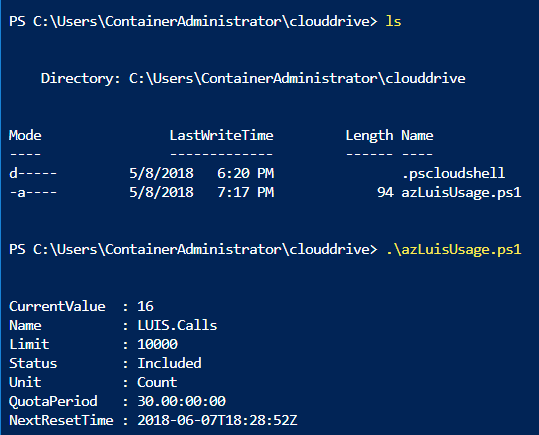
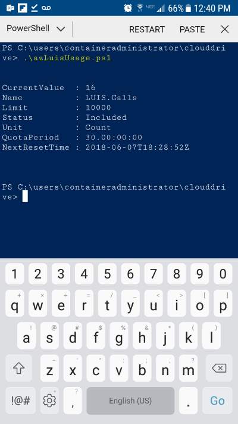

# Manage LUIS service from Azure Cloud Shell
The Azure portal allows you to use PowerShell cmdlets to work with LUIS resources. 

These cmdlets allow you to [create](https://docs.microsoft.com/powershell/module/azurerm.cognitiveservices/new-azurermcognitiveservicesaccount?view=azurermps-6.0.0) a LUIS subscription, get information about the subscription, including [usage](https://docs.microsoft.com/powershell/module/azurerm.cognitiveservices/get-azurermcognitiveservicesaccountusage?view=azurermps-6.0.0), and [remove](https://docs.microsoft.com/powershell/module/azurerm.cognitiveservices/remove-azurermcognitiveservicesaccount?view=azurermps-6.0.0) the subscription. 

## Cloud shell storage account and authentication
In order to use PowerShell in the Azure portal [cloud shell](https://docs.microsoft.com/azure/cloud-shell/quickstart-powershell), you need to have an Azure storage account. If you don't have a [storage account](https://docs.microsoft.com/azure/cloud-shell/persisting-shell-storage#set-up-a-clouddrive-file-share), you will be prompted to create one. The storage account allows you to save PowerShell scripts in the cloud shell.  

You also need to authenticate to Azure in the cloud shell to access any resources. 

Once you have a storage account and are authenticated, you can run PowerShell cmdlets.

## Open Cloud Shell
When you use the Azure portal cloud shell, you are always on the most current PowerShell version. 

Use the **Launch Cloud Shell**  button to open the Cloud Shell or open a browser with [https://shell.azure.com](https://shell.azure.com). 

<a style="cursor:pointer" onclick='javascript:window.open("https://shell.azure.com", "_blank", "toolbar=no,scrollbars=yes,resizable=yes,menubar=no,location=no,status=no")'><image src="https://shell.azure.com/images/launchcloudshell.png" /></a>

## LUIS endpoint usage information

The PowerShell 6.x cmdlet, `Get-AzureRmCognitiveServicesAccountUsage`, provides usage information for Microsoft Cognitive Services including LUIS. [Get-AzureRmCognitiveServicesAccountUsage](https://docs.microsoft.com/powershell/module/azurerm.cognitiveservices/get-azurermcognitiveservicesaccountusage?view=azurermps-6.0.0) requires the resource group and resource name of the service. 

The command syntax is:

```
Get-AzureRmCognitiveServicesAccountUsage -ResourceGroupName my-resource-group -Name my-luis-service-name
```

In the following example, the resource group name is `luis-westus-rg` and the LUIS service subscription name is `luis-westus-1`. Both these names are chosen when the LUIS service is created. 

The cmdlet returns usage information of 16 of 10,000 endpoint hits used in a 30 day period with the period ending on June 7 :

```
CurrentValue  : 16
Name          : LUIS.Calls
Limit         : 10000
Status        : Included
Unit          : Count
QuotaPeriod   : 30.00:00:00
NextResetTime : 2018-06-07T18:28:52Z
```

Save the command as a PowerShell file, *.ps1, in the Azure storage account associated with the cloud shell and execute at any time. 



Once the script is saved on the cloud drive, you can run the PowerShell script from the Azure phone app's cloud shell. 

