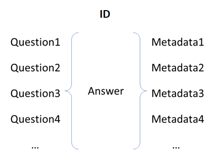
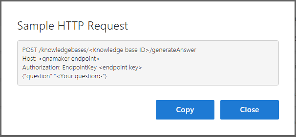
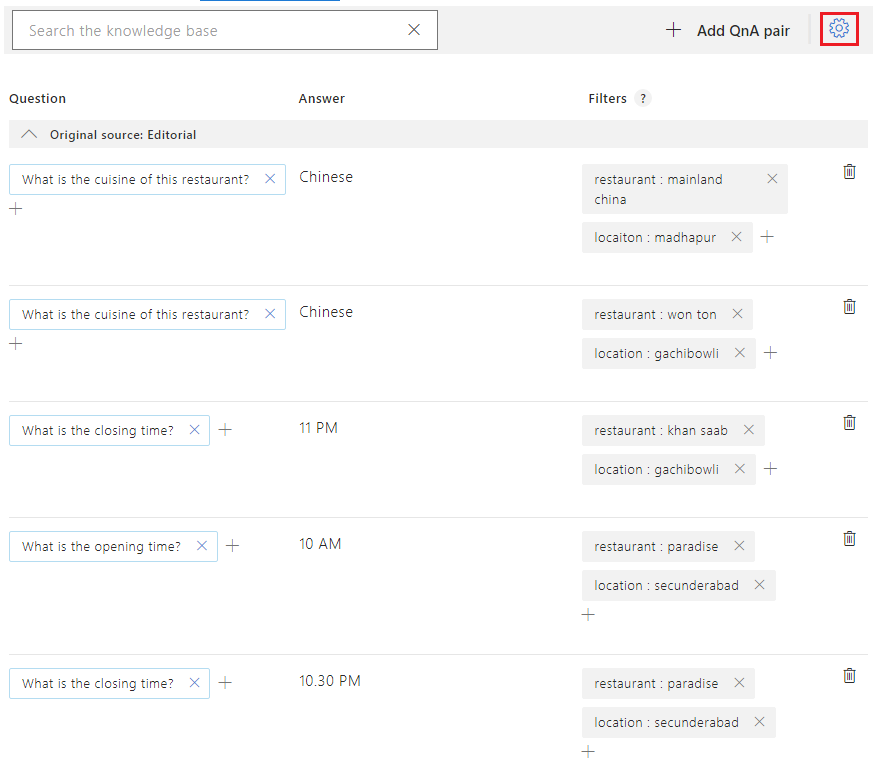

# Using metadata and the GenerateAnswer API

QnA Maker lets you add metadata, in the form of key/value pairs, to your question/answer sets. This information can be used in various ways such as filtering results to user queries, boosting certain results, and storing additional information that can be used in follow-up conversations. For more information, see [Knowledge base](../Concepts/knowledge-base.md).

## QnA Entity

First it's important to understand how QnA Maker stores the question/answer data. The following illustration shows a QnA entity:



Each QnA entity has a unique and persistent ID. The ID can be used to make updates to a particular QnA entity.

## GenerateAnswer API

You use the GenerateAnswer API in your Bot or application to query your knowledge base with a user question to get the best match from the question/answer sets.

### GenerateAnswer endpoint

Once you publish your knowledge base, either from the [QnA Maker portal](https://www.qnamaker.ai), or using the [API](https://westus.dev.cognitive.microsoft.com/docs/services/5a93fcf85b4ccd136866eb37/operations/5ac266295b4ccd1554da75ff), you can get the details of your GenerateAnswer endpoint.

To get your endpoint details:
1. Log in to [https://www.qnamaker.ai](https://www.qnamaker.ai).
2. In **My knowledge bases**, click on **View Code** for your knowledge base.

3. Get your GenerateAnswer endpoint details.



You can also get your endpoint details from the **Settings** tab of your knowledge base.

### GenerateAnswer request

You call GenerateAnswer with an HTTP POST request. For sample code that shows how to call GenerateAnswer, see the [quickstarts](../quickstarts/csharp.md).

- **Request URL**: https://{QnA Maker endpoint}/knowledgebases/{knowledge base ID}/generateAnswer

- **Request parameters**: 
    - **Knowledge base ID** (string): The GUID for your knowledge base.
    - **QnAMaker endpoint** (string): The hostname of the endpoint deployed in your Azure subscription.
- **Request headers**
    - **Content-Type** (string): The media type of the body sent to the API.
    - **Authorization** (string): Your endpoint key (EndpointKey xxxxxxxx-xxxx-xxxx-xxxx-xxxxxxxxxxxx).
- **Request body**
    - **question** (string): A user question to be queried against your knowledge base.
    - **top** (optional, integer): The number of ranked results to include in the output. The default value is 1.
    - **userId** (optional, string): A unique ID to identify the user. This ID will be recorded in the chat logs.
    - **strictFilters** (optional, string): If specified, tells QnA Maker to return only answers that have the specified metadata. For more information, see below.
    ```json
    {
        "question": "qna maker and luis",
        "top": 6,
        "strictFilters": [
        {
            "name": "category",
            "value": "api"
        }],
        "userId": "sd53lsY="
    }
    ```

### GenerateAnswer Response

- **Response 200** - A successful call returns the result of the question. The response contains the following fields:
    - **answers** - A list of answers for the user query, sorted in decreasing order of ranking score.
        - **score**: A ranking score between 0 and 100.
        - **questions**: The questions provided by the user.
        - **source**: The name of the source from which the answer was extracted or saved in the knowledge base.
        - **metadata**: The metadata associated with the answer.
            - name: Metadata name. (string, max Length: 100, required)
            - value: Metadata value. (string, max Length: 100, required)
        - **Id**: A unique ID assigned to the answer.
    ```json
    {
        "answers": [
            {
                "score": 28.54820341616869,
                "Id": 20,
                "answer": "There is no direct integration of LUIS with QnA Maker. But, in your bot code, you can use LUIS and QnA Maker together. [View a sample bot](https://github.com/Microsoft/BotBuilder-CognitiveServices/tree/master/Node/samples/QnAMaker/QnAWithLUIS)",
                "source": "Custom Editorial",
                "questions": [
                    "How can I integrate LUIS with QnA Maker?"
                ],
                "metadata": [
                    {
                        "name": "category",
                        "value": "api"
                    }
                ]
            }
        ]
    }
    ```

## Metadata example

Consider the below FAQ data for restaurants in Hyderabad. Add metadata to your knowledge base by clicking on the gear icon.



### Filter results with strictFilters

Consider the user question "When does this hotel close?" where the intent is implied for the restaurant "Paradise."

Since results are required only for the restaurant "Paradise", you can set a filter in the GenerateAnswer call on the metadata "Restaurant Name", as follows.

```json
{
    "question": "When does this hotel close?",
    "top": 1,
    "strictFilters": [
      {
        "name": "restaurant",
        "value": "paradise"
      }]
}
```

### Keep context
The response to the GenerateAnswer contains the corresponding metadata information of the matched question/answer set, as follows.

```json
{
    "answers": [
        {
            "questions": [
                "What is the closing time?"
            ],
            "answer": "10.30 PM",
            "score": 100,
            "id": 1,
            "source": "Editorial",
            "metadata": [
                {
                    "name": "restaurant",
                    "value": "paradise"
                },
                {
                    "name": "location",
                    "value": "secunderabad"
                }
            ]
        }
    ]
}
```

This information can be used to record the context of the previous conversation for use in later conversations. 

## Next steps

> [!div class="nextstepaction"]
> [Create a knowledge base](./create-knowledge-base.md)
