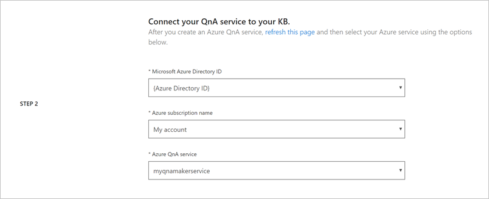
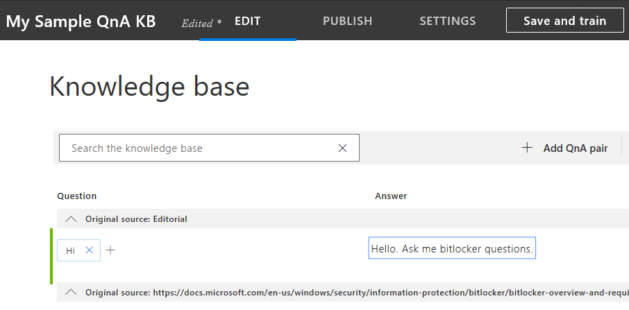
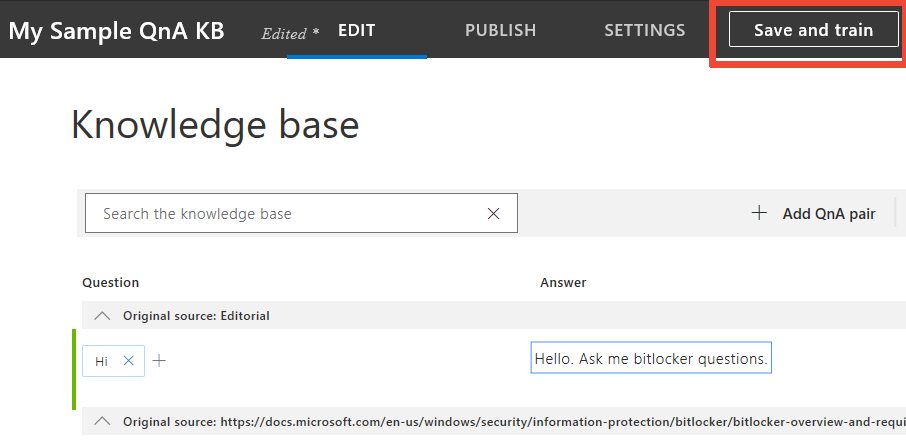
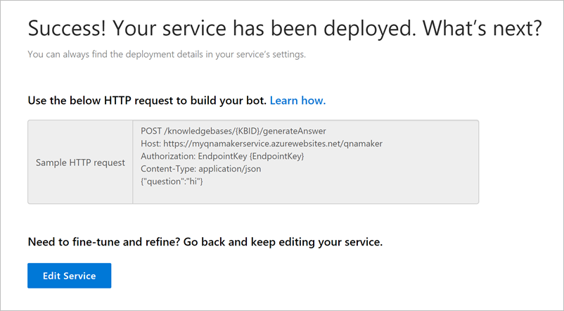

# Create-Train-Publish your knowledge base

A QnA Maker knowledge base can be created from your own content such as FAQs or product manuals. The QnA Maker knowledge base below will be created from a simple FAQ webpage and is able to answer questions on BitLocker key recovery.

## Prerequisite

> [!div class="checklist"]
> * If you don't have an Azure subscription, create a [free account](https://azure.microsoft.com/free/?WT.mc_id=A261C142F) before you begin.

## Create a QnA Maker Knowledge Base

1. Log in to QnAMaker.ai with your Azure credentials.

2. On the QnA Maker website, select **Create a knowledge base**.

    

3. In the create page, STEP 1, select **Create a QnA service**. You will be directed to [Azure portal](https://ms.portal.azure.com/#create/Microsoft.CognitiveServicesQnAMaker) where you need to set up a QnA Maker service in your subscription. If the Azure portal times out, choose **Try again** on the site. Once connected, you should see your Azure dashboard.

4. Once you've successfully created a new QnA Maker service in Azure, return to qnamaker.ai/create and select your QnA Service from the drop-downs in STEP 2. Be sure to refresh the page if you created a new QnA service.

    

5. In STEP 3, name your KB "My Sample QnA KB".

6. To add content to your KB, select three types of data sources. Add the 
[BitLocker Recovery FAQ](https://docs.microsoft.com/en-us/windows/security/information-protection/bitlocker/bitlocker-overview-and-requirements-faq) URL in the URL box for STEP 4: Populate your KB.

    

7. In STEP 5, choose **Create your KB**.

8. When the KB is being created, you will see the popup window. It takes a few minutes for the extraction process to read the HTML page and identify questions and answers.

9. Once the KB is successfully created, it opens the 'Knowledge Base' page where you can edit the contents of the knowledge base.

10. Choose **Add QnA Pair** in the top right to add a new row in the Editorial section of the Knowledge Base. Enter 'Hi' into the 'Question' field and 'Hello. Ask me bitlocker questions.' into the 'Answer' field of the new row you created:

    

11. Select **Save and train** in the top right to save the edits you just made and to train the QnA Maker model. Edits won't be kept unless they're saved.
   
    

12. Select **Test** in the top right to test that the changes made have taken effect. Type 'hi there' in the box and press enter. You should see the answer you created as a response.

13. Select **Inspect** to examine the response in more details. The test window is used to test your changes to the KB before they are published.

    

14. Dismiss the Test pop-out by selecting 'Test' again.

15. Choose **Publish** in the top menu next to 'Edit', then confirm by selecting **Publish** on the page.

16. The QnA Maker service has now been successfully published. The endpoint can be used in your application or bot code.

    

## Next steps

> [!div class="nextstepaction"]
> [Create a knowledge base](../How-To/create-knowledge-base.md)
