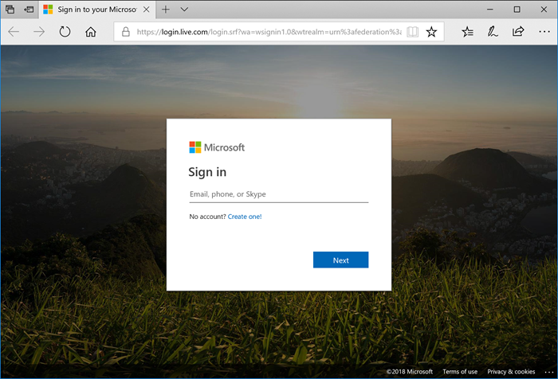
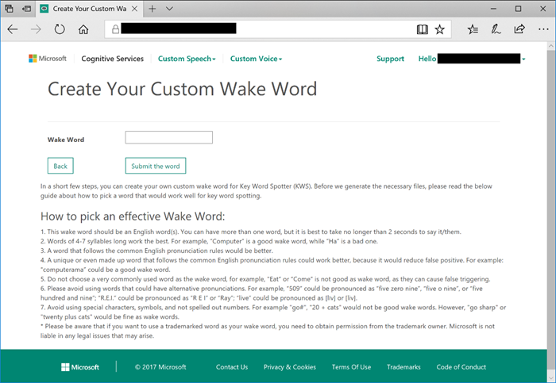

# Create a custom wake word using Speech service

Your device is always listening for a wake word (or phrase). For example, "Hey Cortana" is a wake word for the Cortana assistant. When the user says the wake word, the device starts sending all subsequent audio to the cloud until the user stops speaking. Customizing your wake word is an effective way to differentiate your device and strengthen your branding.

In this article, you learn how to create a custom wake word for your device.

## Choosing an effective wake word

Consider the following guidelines when choosing a wake word.

* Your wake word should be an English word or a phrase. It should take no longer than two seconds to say.

* Words of 4–7 syllables work best. For example, "Hey, Computer" is a good wake word, while just "Hey" is a poor one.

* Wake words should follow common English pronunciation rules.

* A unique or even made-up word that follows common English pronunciation rules could reduce false positives. For example, "computerama" could be a good wake word.

* Do not choose a common word. For example, "eat" and "go" are words that people say frequently in ordinary conversation. They could be false triggers for your device.

* Avoid using a wake word that could have alternative pronunciations. Users would have to know the "right" pronunciation to get their device to respond. For example, "509" could be pronounced as "five zero nine", "five oh nine", or "five hundred and nine." "R.E.I." could be pronounced as "R E I" or "Ray." "Live" could be pronounced as [līv] or [liv].

* Do not use special characters, symbols, or digits. For example, "Go#" and "20 + cats" would not be good wake words. However, "go sharp" or "twenty plus cats" could work. You can still use the symbols in your branding, and use marketing and documentation to reinforce the proper pronunciation.

> [!NOTE]
> If you choose a trademarked word as your wake word, be sure that you own that trademark, or else have permission from the trademark owner to use it. Microsoft is not liable for any legal issues that may arise from your choice of wake word.

## Creating your wake word

Before you can use a custom wake word with your device, you must create it using the Microsoft Custom Wake Word Generation service. After you provide a wake word, the service produces a file that you then deploy onto your dev kit to enable your wake word on your device.

1. Go to the [Custom Speech Service portal](https://cris.ai/).

2. Create a new account with the email address on which you received the invitation for Azure Active Directory. 

    
 
3.	Once logged in, fill out the form, then click **Start the journey.**

    
 
4. The **Custom Wake Word** page is not available to the public, so there is no link that takes you there. Click or paste in this link instead: https://cris.ai/customkws.

    
 
6. Type in the wake word of your choice, then **Submit** it.

    
 
7. It may take a few minutes for the files to be generated. You should see a spinning circle on your browser's tab. After a moment, an information bar appears asking you to download a `.zip` file.

    

8. Save the `.zip` file to your computer. You need this file to deploy the custom wake word to the development kit, following the instructions in [Get started with the Speech Devices SDK](speech-devices-sdk-qsg.md).

9. You may now **Sign out.**

## Next steps

To get started, get a [free Azure account](https://azure.microsoft.com/free/) and sign up for the Speech Devices SDK.

> [!div class="nextstepaction"]
> [Sign up for the Speech Devices SDK](get-speech-devices-sdk.md)

