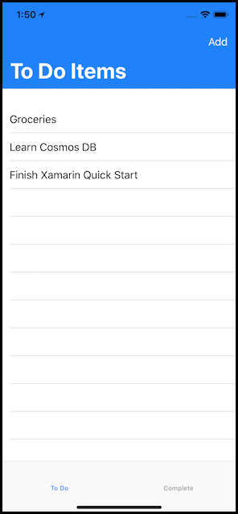
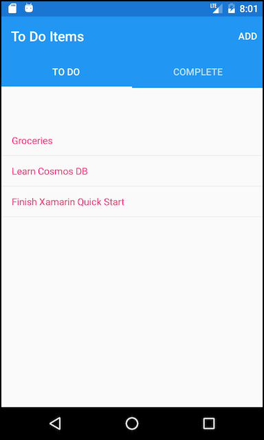
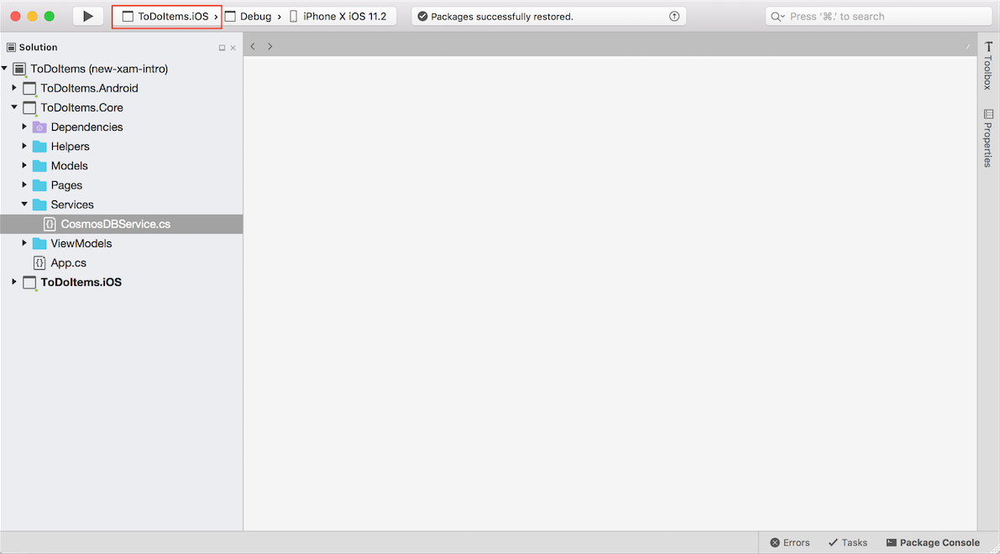
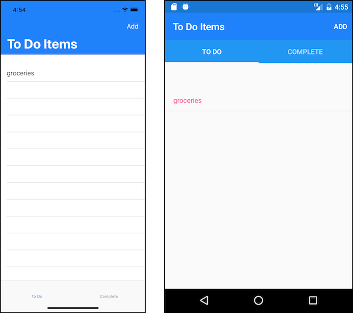
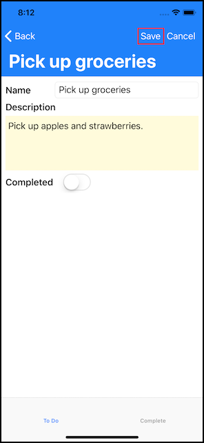
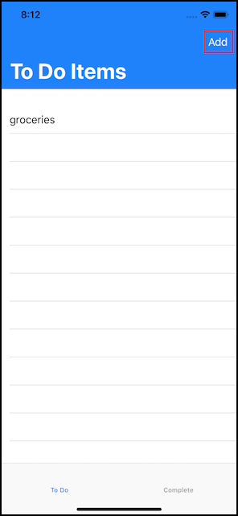

# Azure Cosmos DB: Build a todo app with Xamarin

Azure Cosmos DB is Microsoft’s globally distributed multi-model database service. You can quickly create and query document, key/value, and graph databases, all of which benefit from the global distribution and horizontal scale capabilities at the core of Azure Cosmos DB.

> [!NOTE]
> Sample code for an entire canonical sample Xamarin app showcasing multiple Azure offerings, including CosmosDB, can be found on GitHub [here](https://github.com/xamarinhq/app-geocontacts). This app demonstrates viewing geographically dispersed contacts, and allowing those contacts to update their location.

This quickstart demonstrates how to create an Azure Cosmos DB SQL API account, document database, and collection using the Azure portal. You'll then build and deploy a todo list web app built on the [SQL .NET API](sql-api-sdk-dotnet.md) and [Xamarin](https://docs.microsoft.com/xamarin/#pivot=platforms&panel=Cross-Platform) utilizing [Xamarin.Forms](https://docs.microsoft.com/xamarin/#pivot=platforms&panel=XamarinForms) and the [MVVM architectural pattern](https://docs.microsoft.com/xamarin/xamarin-forms/xaml/xaml-basics/data-bindings-to-mvvm).



## Prerequisites

If you are developing on Windows and don’t already have Visual Studio 2017 installed, you can download and use the **free** [Visual Studio 2017 Community Edition](https://www.visualstudio.com/downloads/). Make sure that you enable **Azure development** and **Mobile Development with .NET** workloads during the Visual Studio setup.

If you are using a Mac, you can download the **free** [Visual Studio for Mac](https://www.visualstudio.com/vs/mac/).

[!INCLUDE [quickstarts-free-trial-note](../../includes/quickstarts-free-trial-note.md)]
[!INCLUDE [cosmos-db-emulator-docdb-api](../../includes/cosmos-db-emulator-docdb-api.md)]

## Create a database account

[!INCLUDE [cosmos-db-create-dbaccount](../../includes/cosmos-db-create-dbaccount.md)]

## Add a collection

[!INCLUDE [cosmos-db-create-collection](../../includes/cosmos-db-create-collection.md)]

## Add sample data

[!INCLUDE [cosmos-db-create-sql-api-add-sample-data](../../includes/cosmos-db-create-sql-api-add-sample-data.md)]

## Query your data

[!INCLUDE [cosmos-db-create-sql-api-query-data](../../includes/cosmos-db-create-sql-api-query-data.md)]

## Clone the sample application

Now let's clone the Xamarin SQL API app from github, review the code, obtain the API keys, and run it. You'll see how easy it is to work with data programmatically.

1. Open a command prompt, create a new folder named git-samples, then close the command prompt.

    ```bash
    md "C:\git-samples"
    ```

2. Open a git terminal window, such as git bash, and use the `cd` command to change to the new folder to install the sample app.

    ```bash
    cd "C:\git-samples"
    ```

3. Run the following command to clone the sample repository. This command creates a copy of the sample app on your computer.

    ```bash
    git clone https://github.com/Azure-Samples/azure-cosmos-db-sql-xamarin-getting-started.git
    ```

4. Then open the ToDoItems.sln file from the samples/xamarin/ToDoItems folder in Visual Studio.

## Obtain your API keys

Go back to the Azure portal to get your API key information and copy it into the app.

1. In the [Azure portal](http://portal.azure.com/), in your Azure Cosmos DB SQL API account, in the left navigation click **Keys**, and then click **Read-write Keys**. You'll use the copy buttons on the right side of the screen to copy the URI and Primary Key into the APIKeys.cs file in the next step.

    

2. In either Visual Studio 2017 or Visual Studio for Mac, open the APIKeys.cs file in the azure-documentdb-dotnet/samples/xamarin/ToDoItems/ToDoItems.Core/Helpers folder.

3. Copy your URI value from the portal (using the copy button) and make it the value of the `CosmosEndpointUrl` variable in APIKeys.cs.

    `public static readonly string CosmosEndpointUrl = "{Azure Cosmos DB account URL}";`

4. Then copy your PRIMARY KEY value from the portal and make it the value of the `Cosmos Auth Key` in APIKeys.cs.

    `public static readonly string CosmosAuthKey = "{Azure Cosmos DB secret}";`

[!INCLUDE [cosmos-db-auth-key-info](../../includes/cosmos-db-auth-key-info.md)]

## Review the code

This solution demonstrates how to create a ToDo app using the Azure Cosmos DB SQL API and Xamarin.Forms. The app has two tabs, the first tab contains a list view showing todo items that are not yet complete. The second tab displays todo items that have been completed. In addition to viewing not completed todo items in the first tab, you can also add new todo items, edit existing ones, and mark items as completed.



The code in the ToDoItems solution contains:

* ToDoItems.Core: This is a .NET Standard project holding a Xamarin.Forms project and shared application logic code that maintains todo items within Azure Cosmos DB.
* ToDoItems.Android: This project contains the Android app.
* ToDoItems.iOS: This project contains the iOS app.

Now let's take a quick review of how the app communicates with Azure Cosmos DB.

* The [Microsoft.Azure.DocumentDb.Core](https://www.nuget.org/packages/Microsoft.Azure.DocumentDB.Core/) NuGet package is required to be added to all projects.
* The `ToDoItem` class in the azure-documentdb-dotnet/samples/xamarin/ToDoItems/ToDoItems.Core/Models folder models the documents in the **Items** collection created above. Note that property naming is case-sensitive.
* The `CosmosDBService` class in the azure-documentdb-dotnet/samples/xamarin/ToDoItems/ToDoItems.Core/Services folder encapsulates the communication to Azure Cosmos DB.
* Within the `CosmosDBService` class there is a `DocumentClient` type variable. The `DocumentClient` is used to configure and execute requests against the Azure Cosmos DB account, and is instantiated on line 31:

    ```csharp
    docClient = new DocumentClient(new Uri(APIKeys.CosmosEndpointUrl), APIKeys.CosmosAuthKey);
    ```

* When querying a collection for documents, the `DocumentClient.CreateDocumentQuery<T>` method is used, as seen here in the `CosmosDBService.GetToDoItems` function:

    ```csharp
    public async static Task<List<ToDoItem>> GetToDoItems()
    {
        var todos = new List<ToDoItem>();

        var todoQuery = docClient.CreateDocumentQuery<ToDoItem>(
                                UriFactory.CreateDocumentCollectionUri(databaseName, collectionName),
                                .Where(todo => todo.Completed == false)
                                .AsDocumentQuery();

        while (todoQuery.HasMoreResults)
        {
            var queryResults = await todoQuery.ExecuteNextAsync<ToDoItem>();

            todos.AddRange(queryResults);
        }

        return todos;
    }
    ```

    The `CreateDocumentQuery<T>` takes a URI that points to the collection created in the previous section. And you are also able to specify LINQ operators such as a `Where` clause. In this case only todo items that are not completed are returned.

    The `CreateDocumentQuery<T>` function is executed synchronously, and returns an `IQueryable<T>`. However, the `AsDocumentQuery` method converts the `IQueryable<T>` to an `IDocumentQuery<T>` object which can be executed asynchronously. Thus not blocking the UI thread for mobile applications.

    The `IDocumentQuery<T>.ExecuteNextAsync<T>` function retrieves the page of results from Azure Cosmos DB, which `HasMoreResults` checking to see if additional results remain to be returned.

> [!TIP]
> Several functions that operate on Azure Cosmos DB collections and documents take an URI as a parameter which specifies the address of the collection or document. This URI is constructed using the `URIFactory` class. URIs for databases, collections, and documents can all be created with this class.

* The `ComsmosDBService.InsertToDoItem` function on line 107 demonstrates how to insert a new document:

    ```csharp
    public async static Task InsertToDoItem(ToDoItem item)
    {
        ...
        await docClient.CreateDocumentAsync(UriFactory.CreateDocumentCollectionUri(databaseName, collectionName), item);
        ...
    }
    ```

    The document collection URI is specified as well as the item to be inserted.

* The `CosmosDBService.UpdateToDoItem` function on line 124 demonstrates how to replace an existing document with a new one:

    ```csharp
    public async static Task UpdateToDoItem(ToDoItem item)
    {
        ...
        var docUri = UriFactory.CreateDocumentUri(databaseName, collectionName, item.Id);

        await docClient.ReplaceDocumentAsync(docUri, item);
    }
    ```

    Here a new URI is needed to uniquely identify the document to replace and is obtained by using `UriFactory.CreateDocumentUri` and passing it the database and collection names and the id of the document.

    The `DocumentClient.ReplaceDocumentAsync` replaces the document identified by the URI with the one specified as a parameter.

* Deleting an item is demonstrated with the `CosmosDBService.DeleteToDoItem` function on line 115:

    ```csharp
    public async static Task DeleteToDoItem(ToDoItem item)
    {
        ...
        var docUri = UriFactory.CreateDocumentUri(databaseName, collectionName, item.Id);

        await docClient.DeleteDocumentAsync(docUri);
    }
    ```

    Again note the unique doument URI being created and passed to the `DocumentClient.DeleteDocumentAsync` function.

## Run the app

You've now updated your app with all the info it needs to communicate with Azure Cosmos DB.

The following steps will demonstrate how to run the app using the Visual Studio for Mac debugger.

> [!NOTE]
> Usage of the Android version app is exactly the same, any differences will be called out in the steps below. If you wish to debug with Visual Studio on Windows, documentation todo so can be found for [iOS here](https://docs.microsoft.com/xamarin/ios/deploy-test/debugging-in-xamarin-ios?tabs=vswin) and [Android here](https://docs.microsoft.com/xamarin/android/deploy-test/debugging/).

1. First select the platform you wish to target by clicking on the dropdown highlighted and selecting either ToDoItems.iOS for iOS or ToDoItems.Android for Android.

    

2. To start debugging the app, either press cmd+Enter or click the play button.

    

3. When the iOS simulator or Android emulator finishes launching, the app will display 2 tabs at the bottom of the screen for iOS and the top of the screen for Android. The first shows todo items which are not completed, the second shows todo items which are completed.

    

4. To complete a todo item on iOS, slide it to the left > tap on the **Complete** button. To complete a todo item on Android, long press the item > then tap on the complete button.

    

5. To edit a todo item > tap on the item > a new screen appears letting you enter new values. Tapping the save button will persist the changes to Azure Cosmos DB.

    

6. To add a todo item > tap on the **Add** button on the upper right of the home screen > a new, blank, edit page will appear.

    

## Review SLAs in the Azure portal

[!INCLUDE [cosmosdb-tutorial-review-slas](../../includes/cosmos-db-tutorial-review-slas.md)]

## Clean up resources

[!INCLUDE [cosmosdb-delete-resource-group](../../includes/cosmos-db-delete-resource-group.md)]

## Next steps

In this quickstart, you've learned how to create an Azure Cosmos DB account, create a collection using the Data Explorer, and build and deploy a Xamarin app. You can now import additional data to your Azure Cosmos DB account.

> [!div class="nextstepaction"]
> [Import data into Azure Cosmos DB](import-data.md)
