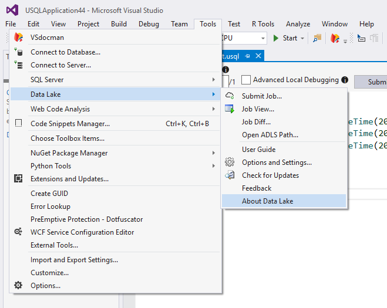

# Develop U-SQL scripts by using Data Lake Tools for Visual Studio
[!INCLUDE [get-started-selector](../../includes/data-lake-analytics-selector-get-started.md)]

Learn how to use Visual Studio to create Azure Data Lake Analytics accounts, define jobs in [U-SQL](data-lake-analytics-u-sql-get-started.md), and submit jobs to the Data Lake Analytics service. For more
information about Data Lake Analytics, see [Azure Data Lake Analytics overview](data-lake-analytics-overview.md).

>[!IMPORTANT]
> Microsoft recommends you upgrade to Azure Data Lake Tools for Visual Studio version 2.3.3000.4 or later. The previous versions are no longer available for download and are now deprecated. 
>
>**What do I need to do?**
>
>1.	Check if you are using an earlier version than 2.3.3000.4 of Azure Data Lake Tools for Visual Studio. 
>   
>   
> 
>2.	If your version is an earlier version of 2.3.3000.4, update your Azure Data Lake Tools for Visual Studio by visiting the download center: 
>    - [For Visual Studio 2017](https://marketplace.visualstudio.com/items?itemName=ADLTools.AzureDataLakeandStreamAnalyticsTools)
>    - [For Visual Studio 2013 and 2015](https://www.microsoft.com/en-us/download/details.aspx?id=49504)


## Prerequisites

* **Visual Studio**: All editions except Express are supported.
    * Visual Studio 2017
    * Visual Studio 2015
    * Visual Studio 2013
* **Microsoft Azure SDK for .NET** version 2.7.1 or later.  Install it by using the [Web platform installer](http://www.microsoft.com/web/downloads/platform.aspx).
* A **Data Lake Analytics** account. To create an account, see [Get Started with Azure Data Lake Analytics using Azure portal](data-lake-analytics-get-started-portal.md).

## Install Azure Data Lake Tools for Visual Studio

This tutorial requires that Data Lake Tools for Visual Studio is installed. Follow the [installation instructions](data-lake-analytics-data-lake-tools-install.md).

## Connect to an Azure Data Lake Analytics account

1. Open Visual Studio.
2. Open Server Explorer by selecting **View** > **Server Explorer**.
3. Right-click **Azure**. Then select **Connect to Microsoft Azure Subscription** and follow the instructions.
4. In Server Explorer, select **Azure** > **Data Lake Analytics**. You see a list of your Data Lake Analytics accounts.


## Write your first U-SQL script

The following text is a simple U-SQL script. It defines a small dataset and writes that dataset to the default Data Lake Store as a file called `/data.csv`.

```
@a  = 
    SELECT * FROM 
        (VALUES
            ("Contoso", 1500.0),
            ("Woodgrove", 2700.0)
        ) AS 
              D( customer, amount );
OUTPUT @a
    TO "/data.csv"
    USING Outputters.Csv();
```

### Submit a Data Lake Analytics job

1. Select **File** > **New** > **Project**.

2. Select the **U-SQL Project** type, and then click **OK**. Visual Studio creates a solution with a **Script.usql** file.

3. Paste the previous script into the **Script.usql** window.

4. In the upper-left corner of the **Script.usql** window, specify the Data Lake Analytics account.

    

5. In the upper-left corner of the **Script.usql** window, select **Submit**.
6. Verify the **Analytics Account**, and then select **Submit**. Submission results are available in the Data Lake Tools for Visual Studio Results after the submission is complete.

    
7. To see the latest job status and refresh the screen, click **Refresh**. When the job succeeds, it shows the **Job Graph**, **MetaData Operations**, **State History**, and **Diagnostics**:

    

   * **Job Summary** shows the summary of the job.   
   * **Job Details** shows more specific information about the job, including the script, resources, and vertices.
   * **Job Graph** visualizes the progress of the job.
   * **MetaData Operations** shows all the actions that were taken on the U-SQL catalog.
   * **Data** shows all the inputs and outputs.
   * **Diagnostics** provides an advanced analysis for job execution and performance optimization.

### To check job state

1. In Server Explorer, select **Azure** > **Data Lake Analytics**. 
2. Expand the Data Lake Analytics account name.
3. Double-click **Jobs**.
4. Select the job that you previously submitted.

### To see the output of a job

1. In Server Explorer, browse to the job you submitted.
2. Click the **Data** tab.
3. In the **Job Outputs** tab, select the `"/data.csv"` file.

## Next steps

* [Run U-SQL scripts on your own workstation for testing and debugging](data-lake-analytics-data-lake-tools-local-run.md)
* [Debug C# code in U-SQL jobs using Azure Data Lake Tools for Visual Studio Code](data-lake-tools-for-vscode-local-run-and-debug.md)
* [Use the Azure Data Lake Tools for Visual Studio Code](data-lake-analytics-data-lake-tools-for-vscode.md)
