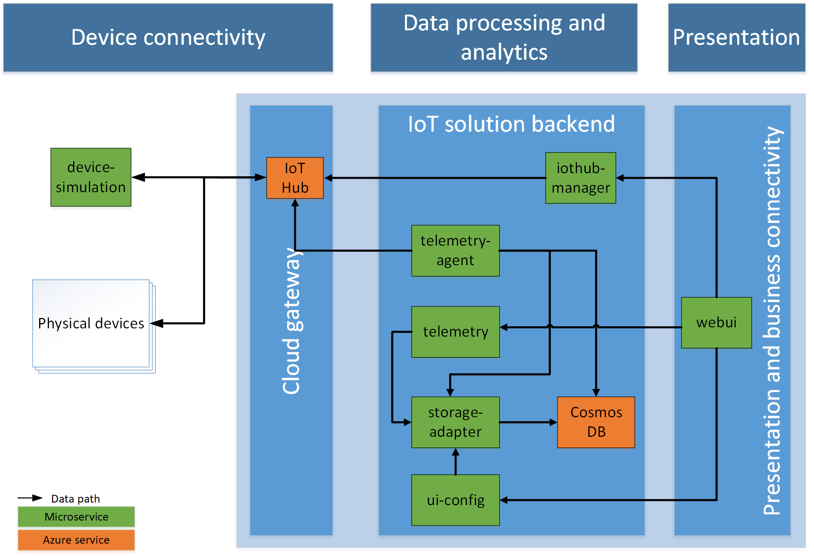

# Remote Monitoring solution accelerator overview

The Remote Monitoring [solution accelerator](../iot-accelerators/iot-accelerators-what-are-solution-accelerators.md) implements an end-to-end monitoring solution for multiple machines in remote locations. The solution combines key Azure services to provide a generic implementation of the business scenario. You can use the solution as a starting point for your own implementation and [customize](../iot-accelerators/iot-accelerators-remote-monitoring-customize.md) it to meet your own specific business requirements.

This article walks you through some of the key elements of the Remote Monitoring solution to enable you to understand how it works. This knowledge helps you to:

* Troubleshoot issues in the solution.
* Plan how to customize to the solution to meet your own specific requirements.
* Design your own IoT solution that uses Azure services.

## Logical architecture

The following diagram outlines the logical components of the Remote Monitoring solution accelerator overlaid on the [IoT architecture](../iot-accelerators/iot-accelerators-what-is-azure-iot.md):

## Why microservices?

Cloud architecture has evolved since Microsoft released the first solution accelerators. [Microservices](https://azure.microsoft.com/blog/microservices-an-application-revolution-powered-by-the-cloud/) have emerged as a proven practice to achieve scale and flexibility without sacrificing development speed. Several Microsoft services use this architectural pattern internally with great reliability and scalability results. The updated solution accelerators put these learnings into practice so you can also benefit from them.

> [!TIP]
> To learn more about microservice architectures, see [.NET Application Architecture](https://www.microsoft.com/net/learn/architecture) and [Microservices: An application revolution powered by the cloud](https://azure.microsoft.com/blog/microservices-an-application-revolution-powered-by-the-cloud/).

## Device connectivity

The solution includes the following components in the device connectivity part of the logical architecture:

### Simulated devices

The solution includes a microservice that enables you to manage a pool of simulated devices to test the end-to-end flow in the solution. The simulated devices:

* Generate device-to-cloud telemetry.
* Respond to cloud-to-device method calls from IoT Hub.

The microservice provides a RESTful endpoint for you to create, start, and stop simulations. Each simulation consists of a set of virtual devices of different types, that send telemetry and respond to method calls.

You can provision simulated devices from the dashboard in the solution portal.

### Physical devices

You can connect physical devices to the solution. You can implement the behavior of your simulated devices using the Azure IoT device SDKs.

You can provision physical devices from the dashboard in the solution portal.

### IoT Hub and the IoT manager microservice

The [IoT hub](../iot-hub/index.yml) ingests data sent from the devices into the cloud and makes it available to the `telemetry-agent` microservice.

The IoT hub in the solution also:

* Maintains an identity registry that stores the IDs and authentication keys of all the devices permitted to connect to the portal. You can enable and disable devices through the identity registry.
* Invokes methods on your devices on behalf of the solution portal.
* Maintains device twins for all registered devices. A device twin stores the property values reported by a device. A device twin also stores desired properties, set in the solution portal, for the device to retrieve when it next connects.
* Schedules jobs to set properties for multiple devices or invoke methods on multiple devices.

The solution includes the `iot-manager` microservice to handle interactions with your IoT hub such as:

* Creating and managing IoT devices.
* Managing device twins.
* Invoking methods on devices.
* Managing IoT credentials.

This service also runs IoT Hub queries to retrieve devices belonging to user-defined groups.

The microservice provides a RESTful endpoint to manage devices and device twins, invoke methods, and run IoT Hub queries.

## Data processing and analytics

The solution includes the following components in the data processing and analytics part of the logical architecture:

### Device telemetry

The solution includes two microservices to handle device telemetry.

The [telemetry-agent](https://github.com/Azure/telemetry-agent-dotnet) microservice:

* Stores telemetry in Azure Cosmos DB.
* Analyzes the telemetry stream from devices.
* Generates alarms according to defined rules.

The alarms are stored in Azure Cosmos DB.

The [telemetry-agent](https://github.com/Azure/telemetry-agent-dotnet) microservice enables the solution portal to read the telemetry sent from the devices. The solution portal also uses this service to:

* Define monitoring rules such as the thresholds that trigger alarms
* Retrieve the list of past alarms.

Use the RESTful endpoint provided by this microservice to manage telemetry, rules, and alarms.

### Storage

The [storage-adapter](https://github.com/Azure/pcs-storage-adapter-dotnet) microservice is an adapter in front of the main storage service used for the solution accelerator. It provides simple collection and key-value storage.

The standard deployment of the solution accelerator uses Azure Cosmos DB as its main storage service.

The Azure Cosmos DB database stores data in the solution accelerator. The **storage-adapter** microservice acts as an adapter for the other microservices in the solution to access storage services.

## Presentation

The solution includes the following components in the presentation part of the logical architecture:

The [web user interface is a React Javascript application](https://github.com/Azure/pcs-remote-monitoring-webui). The application:

* Uses Javascript React only and runs entirely in the browser.
* Is styled with CSS.
* Interacts with public facing microservices through AJAX calls.

The user interface presents all the solution accelerator functionality, and interacts with other services such as:

* The [authentication](https://github.com/Azure/pcs-auth-dotnet) microservice to protect user data.
* The [iothub-manager](https://github.com/Azure/iothub-manager-dotnet) microservice to list and manage the IoT devices.

The [ui-config](https://github.com/Azure/pcs-config-dotnet) microservice enables the user interface to store and retrieve configuration settings.

## Next steps

If you want to explore the source code and developer documentation, start with one the two main GitHub repositories:

* [Solution accelerator for Remote Monitoring with Azure IoT (.NET)](https://github.com/Azure/azure-iot-pcs-remote-monitoring-dotnet/wiki/).
* [Solution accelerator for Remote Monitoring with Azure IoT (Java)](https://github.com/Azure/azure-iot-pcs-remote-monitoring-java).

Detailed solution architecture diagrams:
* [Solution accelerator for Remote Monitoring architecture](https://github.com/Azure/azure-iot-pcs-remote-monitoring-dotnet/wiki/Architecture).

For more conceptual information about the Remote Monitoring solution accelerator, see [Customize the solution accelerator](../iot-accelerators/iot-accelerators-remote-monitoring-customize.md).
