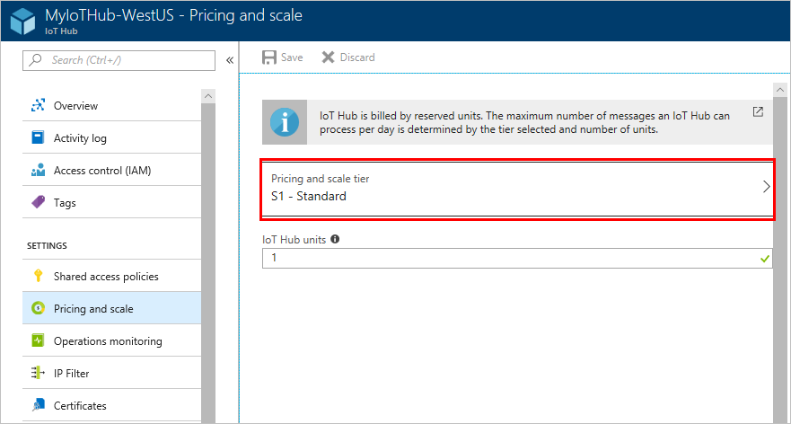

# How to upgrade your IoT hub

As your IoT solution grows, Azure IoT Hub is ready to help you scale up. Azure IoT Hub offers two tiers, basic (B) and standard (S), to accommodate customers that want to use different features. Within each tier are three sizes (1, 2, and 3) that determine the number of messages that can be sent each day. 

When you have more devices and need more capabilities, there are three ways to adjust your IoT hub to suit your needs:

* Add units within the IoT hub. For example, each additional unit in a B1 IoT hub allows for an additional 400,000 messages per day. 
* Change the size of the IoT hub. For example, migrate from the B1 tier to the B2 tier to increase the amount of messages that each unit can support per day.
* Upgrade to a higher tier. For example, upgrade from the B1 tier to the S1 tier for the same messaging capacity but with the advanced features that come in the standard tier.

These changes can all occur without interrupting existing operations.

If you want to downgrade your IoT hub, you can remove units and reduce the size of the IoT hub. However, you cannot downgrade to a lower tier. For example, you can move from the S2 tier to the S1 tier, but not from the S2 tier to the B1 tier. 

These examples are meant to help you understand how to adjust your IoT hub as your solution changes. For specific information about each tier's capabilities you should always refer to [Azure IoT Hub pricing](https://azure.microsoft.com/pricing/details/iot-hub/). 

## Upgrade your existing IoT hub 

1. Sign in to the [Azure portal](https://portal.azure.com/) and navigate to your IoT hub. 
2. Select **Pricing and scale**. 

   

3. To change the tier for your hub, select **Pricing and scale tier**. Choose the new tier, then click **select**.

   

4. To change the number of units in your hub, enter a new value under **IoT Hub units**. 
5. Select **Save** to save your changes. 

Your IoT hub is now adjusted, and your configurations are unchanged. 

## Next steps

Get more details about [How to choose the right IoT Hub tier](iot-hub-scaling.md). 

