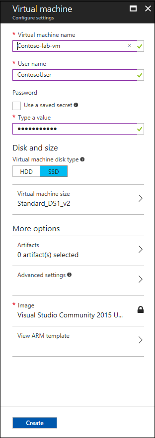

# Create your first VM in a lab in Azure DevTest Labs

When you initially access DevTest Labs and want to create your first VM, you will likely do so using a pre-loaded [base marketplace image](devtest-lab-configure-marketplace-images.md). Later on, you'll also be able to choose from a [custom image and a formula](devtest-lab-add-vm.md) when creating more VMs. 

This tutorial walks you through using the Azure portal to add your first VM to a lab in DevTest Labs.

## Steps to add your first VM to a lab in Azure DevTest Labs
1. Sign in to the [Azure portal](http://go.microsoft.com/fwlink/p/?LinkID=525040).
1. Select **All Services**, and then select **DevTest Labs** from the list.
1. From the list of labs, select the lab in which you want to create the VM.  
1. On the lab's **Overview** blade, select **+ Add**.  

    

1. On the **Choose a base** blade, select a marketplace image for the VM.
1. On the **Virtual machine** blade, enter a name for the new virtual machine in the **Virtual machine name** text box.

    

1. Enter a **User Name** that is granted administrator privileges on the virtual machine.  
1. Enter a password in the text field labeled **Type a value**.
1. The **Virtual machine disk type** determines which storage disk type is allowed for the virtual machines in the lab.
1. Select **Virtual machine size** and select one of the predefined items that specify the processor cores, RAM size, and the hard drive size of the VM to create.
1. Select **Artifacts** and - from the list of artifacts - select and configure the artifacts that you want to add to the base image.
    **Note:** If you're new to DevTest Labs or configuring artifacts, refer to the [Add an existing artifact to a VM](./devtest-lab-add-vm.md#add-an-existing-artifact-to-a-vm) section, and then return here when finished.
1. Select **Create** to add the specified VM to the lab.

   The lab blade displays the status of the VM's creation - first as **Creating**, then as **Running** after the VM has been started.

## Next steps
* Once the VM has been created, you can connect to the VM by selecting **Connect** on the VM's blade.
* Check out [Add a VM to a lab](devtest-lab-add-vm.md) for more complete info about adding subsequent VMs in your lab.
* Explore the [DevTest Labs Azure Resource Manager QuickStart template gallery](https://github.com/Azure/azure-devtestlab/tree/master/ARMTemplates).
