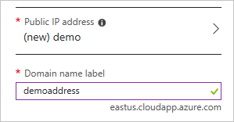

# Microsoft.Network.PublicIpAddressCombo UI element
A group of controls for selecting a new or existing public IP address.

## UI sample


- If the user selects 'None' for public IP address, the domain name label text box is hidden.
- If the user selects an existing public IP address, the domain name label text box is disabled. Its value is the domain name label of the selected IP address.
- The domain name suffix (for example, westus.cloudapp.azure.com) updates automatically based on the selected location.

## Schema
```json
{
  "name": "element1",
  "type": "Microsoft.Network.PublicIpAddressCombo",
  "label": {
    "publicIpAddress": "Public IP address",
    "domainNameLabel": "Domain name label"
  },
  "toolTip": {
    "publicIpAddress": "",
    "domainNameLabel": ""
  },
  "defaultValue": {
    "publicIpAddressName": "ip01",
    "domainNameLabel": "mydomain"
  },
  "constraints": {
    "required": {
      "domainNameLabel": true
    }
  },
  "options": {
    "hideNone": false,
    "hideDomainNameLabel": false,
    "hideExisting": false,
    "zone": 3
  },
  "visible": true
}
```

## Remarks
- If `constraints.required.domainNameLabel` is set to **true**, the user must provide a domain name label when creating a new public IP address. Existing public IP addresses without a label aren't available for selection.
- If `options.hideNone` is set to **true**, then the option to select **None** for the public IP address is hidden. The default value is **false**.
- If `options.hideDomainNameLabel` is set to **true**, then the text box for domain name label is hidden. The default value is **false**.
- If `options.hideExisting` is true, then the user isn't able to choose an existing public IP address. The default value is **false**.
- For `zone`, only public IP addresses for the specified zone or zone resilient public IP addresses are available.

## Sample output
If the user selects no public IP address, the control returns the following output:

```json
{
  "newOrExistingOrNone": "none"
}
```

If the user selects a new or existing IP address, the control returns the following output:

```json
{
  "name": "ip01",
  "resourceGroup": "rg01",
  "domainNameLabel": "mydomain",
  "publicIPAllocationMethod": "Dynamic",
  "newOrExistingOrNone": "new"
}
```

- When `options.hideNone` is specified as **true**, `newOrExistingOrNone` will only have a value of **new** or **existing**.
- When `options.hideDomainNameLabel` is specified as **true**, `domainNameLabel` is undeclared.

## Next steps
* For an introduction to creating UI definitions, see [Getting started with CreateUiDefinition](create-uidefinition-overview.md).
* For a description of common properties in UI elements, see [CreateUiDefinition elements](create-uidefinition-elements.md).
