# Contoso migration: Refactor an on-premises app to an Azure Web App and Azure SQL database

This article demonstrates how Contoso refactors their SmartHotel app in Azure. They migrate the app frontend VM to an Azure Web App, and the app database to an Azure SQL database.

This document is one in a series of articles that show how the fictitious company Contoso migrates their on-premises resources to the Microsoft Azure cloud. The series includes background information, and scenarios that illustrate setting up a migration infrastructure, assessing on-premises resources for migration, and running different types of migrations. Scenarios grow in complexity, and we'll add additional articles over time.

**Article** | **Details** | **Status**
--- | --- | ---
[Article 1: Overview](contoso-migration-overview.md) | Provides an overview of Contoso's migration strategy, the article series, and the sample apps we use. | Available
[Article 2: Deploy an Azure infrastructure](contoso-migration-infrastructure.md) | Describes how Contoso prepares its on-premises and Azure infrastructure for migration. The same infrastructure is used for all migration articles. | Available
[Article 3: Assess on-premises resources](contoso-migration-assessment.md)  | Shows how Contoso runs an assessment of an on-premises two-tier SmartHotel app running on VMware. Contoso assesses app VMs with the [Azure Migrate](migrate-overview.md) service, and the app SQL Server database with the [Database Migration Assistant](https://docs.microsoft.com/sql/dma/dma-overview?view=sql-server-2017). | Available
[Article 4: Rehost an app to Azure VMs and a SQL Managed Instance](contoso-migration-rehost-vm-sql-managed-instance.md) | Demonstrates how Contoso runs a lift-and-shift migration to Azure for the SmartHotel app. Contoso migrates the app frontend VM using [Azure Site Recovery](https://docs.microsoft.com/azure/site-recovery/site-recovery-overview), and the app database to a SQL Managed Instance, using the [Azure Database Migration Service](https://docs.microsoft.com/azure/dms/dms-overview). | Available
[Article 5: Rehost an app to Azure VMs](contoso-migration-rehost-vm.md) | Shows how Contoso migrate the SmartHotel app VMs using Site Recovery only. | Available
[Article 6: Rehost an app to Azure VMs and SQL Server Always On Availability Group](contoso-migration-rehost-vm-sql-ag.md) | Shows how Contoso migrates the SmartHotel app. Contoso uses Site Recovery to migrate the app VMs, and the Database Migration service to migrate the app database to a SQL Server cluster protected by an AlwaysOn availability group. | Available
[Article 7: Rehost a Linux app to Azure VMs](contoso-migration-rehost-linux-vm.md) | Shows how Contoso does a lift-and-shift migration of the Linux osTicket app to Azure VMs, using Site Recovery | Available
[Article 8: Rehost a Linux app to Azure VMs and Azure MySQL Server](contoso-migration-rehost-linux-vm-mysql.md) | Demonstrates how Contoso migrates the Linux osTicket app to Azure VMs using Site Recovery, and migrates the app database to an Azure MySQL Server instance using MySQL Workbench. | Available
Article 9: Refactor an app to an Azure Web App and Azure SQL database | Demonstrates how Contoso migrates the SmartHotel app to an Azure Web App, and migrates the app database to Azure SQL Server instance | This article
[Article 10: Refactor a Linux app to Azure Web Apps and Azure MySQL](contoso-migration-refactor-linux-app-service-mysql.md) | Shows how Contoso migrates the Linux osTicket app to Azure Web Apps in multiple sites, integrated with GitHub for continuous delivery. They migrate the app database to an Azure MySQL instance. | Available

In this article, Contoso migrates the two-tier Windows. NET SmartHotel app running on VMware VMs to Azure. If you'd like to use this app, it's provided as open source and you can download it from [GitHub](https://github.com/Microsoft/SmartHotel360).

## Business drivers

The IT leadership team has worked closely with their business partners to understand what they want to achieve with this migration:

- **Address business growth**: Contoso is growing, and there is pressure on their on-premises systems and infrastructure.
- **Increase efficiency**: Contoso needs to remove unnecessary procedures, and streamline processes for developers and users.  The business needs IT to be fast and not waste time or money, thus delivering faster on customer requirements.
- **Increase agility**:  Contoso IT needs to be more responsive to the needs of the business. It must be able to react faster than the changes in the marketplace, to enable the success in a global economy.  It mustn't get in the way, or become a business blocker.
- **Scale**: As the business grows successfully, Contoso IT must provide systems that are able to grow at the same pace.
- **Costs**: Contoso wants to minimize licensing costs.

## Migration goals

The Contoso cloud team has pinned down goals for this migration. These goals were used to determine the best migration method.

**Requirements** | **Details**
--- | --- 
**App** | The app in Azure will remain as critical as it is today.   It should have the same performance capabilities as it currently does in VMWare.   They don't want to invest in the app. For now, they simply want to move it safely to the cloud.   They want to stop supporting Windows Server 2008 R2, on which the app currently runs.   They want to move away from SQL Server 2008 R2 to a modern PaaS Database platform, which will minimize the need for management.   Contoso want to leverage their investment in SQL Server licensing and Software Assurance where possible.   In addition, Contoso want to mitigate the single point of failure on the web tier.
**Limitations** | The app consists of an ASP.NET app and a WCF service running on the same VM. They want to split this across two web apps using the Azure App Service. 
**Azure** | They want to move the app to Azure, but they don't want to run it on VMs. They want to leverage Azure PaaS services for both the web and data tiers. 

## Solution design

After pinning down their goals and requirements, Contoso designs and review a deployment solution, and identifies the migration process, including the Azure services that they'll use for the migration.

### Current app

- The SmartHotel on-premises app is tiered across two VMs (WEBVM and SQLVM).
- The VMs are located on VMware ESXi host **contosohost1.contoso.com** (version 6.5)
- The VMware environment is managed by vCenter Server 6.5 (**vcenter.contoso.com**), running on a VM.
- Contoso has an on-premises datacenter (contoso-datacenter), with an on-premises domain controller (**contosodc1**).
- The on-premises VMs in the Contoso datacenter will be decommissioned after the migration is done.

### Proposed solution

- For the database tier of the app, Contoso compared Azure SQL Database with SQL Server using [this article](https://docs.microsoft.com/azure/sql-database/sql-database-features). They decided to go with Azure SQL Database for a few reasons:
    - Azure SQL Database is a relational-database managed service. It delivers predictable performance at multiple service levels, with near-zero administration. Advantages include dynamic scalability with no downtime, built-in intelligent optimization, and global scalability and availability.
    - They can leverage the lightweight Data Migration Assistant (DMA) to assess and migrate the on-premises database to Azure SQL.
    - With Software Assurance, they can exchange their existing licenses for discounted rates on a SQL Database, using the Azure Hybrid Benefit for SQL Server. This could provide savings of up to 30%.
    - SQL Database provides a number of security features including always encrypted, dynamic data masking, and row-level security/threat detection.
- For the app web tier, they've decided to use Azure App Service. This PaaS service enables that to deploy the app with just a few configuration changes. They'll use Visual Studio to make the change, and deploy two web apps. One for the website, and one for the WCF service.
  
### Solution review
Contoso evaluates their proposed design by putting together a pros and cons list.

**Consideration** | **Details**
--- | ---
**Pros** | The SmartHotel app code won't need to be altered for migration to Azure.   They can leverage their investment in Software Assurance using the Azure Hybrid Benefit for both SQL Server and Windows Server.   After the migration they'll no longer need to support Windows Server 2008 R2. [Learn more](https://support.microsoft.com/lifecycle).   They can configure the web tier of the app with multiple instances, so that it's no longer a single point of failure.   They'll no longer be dependent on the aging SQL Server 2008 R2.   SQL Database supports Contoso's technical requirements. They assessed the on-premises database using the Database Migration Assistant and found that it's compatible.   SQL Database has built-in fault tolerance that Contoso don't need to set up. This ensures that the data tier is no longer a single point of failover.
**Cons** | Azure App Services only supports one app deployment for each Web App. This means that two Web Apps must be provisioned (one for the website and one for the WCF service).   If they use the Data Migration Assistant instead of Data Migration Service to migrate their database, Contoso won’t have the infrastructure ready for migrating databases at scale. They'll need to build another region to ensure failover if the primary region is unavailable.

## Proposed architecture

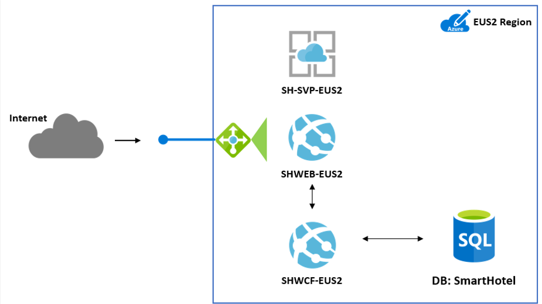 

### Migration process

1. Contoso provision an Azure SQL instance, and migrate the SmartHotel database to it.
2. They provision and configure Web Apps, and deploy the SmartHotel app to them.

    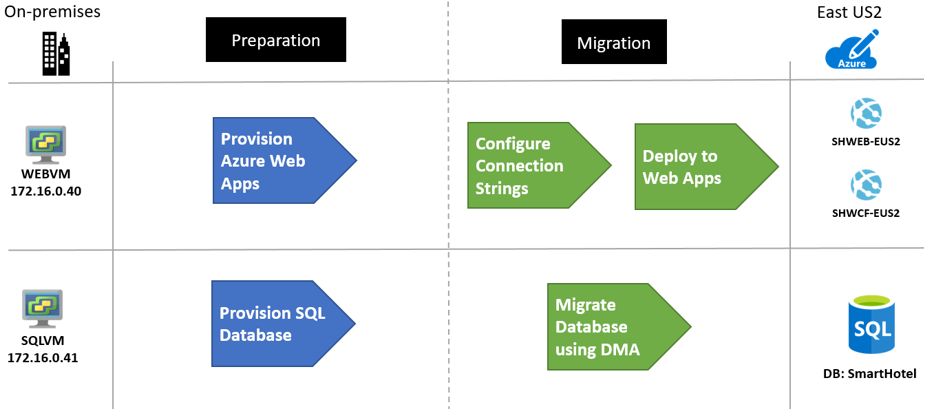 

### Azure services

**Service** | **Description** | **Cost**
--- | --- | ---
[Database Migration Assistant (DMA)](https://docs.microsoft.com/sql/dma/dma-overview?view=ssdt-18vs2017) | They'll use DMA to assess and detect compatibility issues that might impact their database functionality in Azure. DMA assesses feature parity between SQL sources and targets, and recommends performance and reliability improvements. | It's a downloadable tool free of charge.
[Azure SQL Database](https://azure.microsoft.com/services/sql-database/) | An intelligent, fully managed relational cloud database service. | Cost based on features, throughput, and size. [Learn more](https://azure.microsoft.com/pricing/details/sql-database/managed/).
[Azure App Services - Web Apps](https://docs.microsoft.com/azure/app-service/app-service-web-overview) | Create powerful cloud apps using a fully managed platform | Cost based on size, location, and usage duration. [Learn more](https://azure.microsoft.com/pricing/details/app-service/windows/).

## Prerequisites

Here's what you (and Contoso) need to run this scenario:

**Requirements** | **Details**
--- | ---
**Azure subscription** | You should have already created a subscription when  you performed the assessment in the first article in this series. If you don't have an Azure subscription, create a [free account](https://azure.microsoft.com/pricing/free-trial/).   If you create a free account, you're the administrator of your subscription and can perform all actions.   If you use an existing subscription and you're not the administrator, you need to work with the admin to assign you Owner or Contributor permissions.
**Azure infrastructure** | [Learn how](contoso-migration-infrastructure.md) Contoso set up an Azure infrastructure.

## Scenario steps

Here's how Contoso will run the migration:

> [!div class="checklist"]
> * **Step 1: Provision a SQL Database instance in Azure**: Contoso provisions a SQL instance in Azure. After the app website is migrate to Azure, the WCF service web app will point to this instance.
> * **Step 2: Migrate the database with DMA**: They migrate the app database with the Database Migration Assistant.
> * **Step 3: Provision Web Apps**: They provision the two web apps.
> * **Step 4: Configure connection strings**: They configure connection strings so that the web tier web app, the WCF service web app, and the SQL instance can communicate.
> * **Step 5: Publish web apps**: As a final step, Contoso publishes the apps to Azure.

## Step 1: Provision an Azure SQL Database

1. They select to create a SQL Database in Azure. 

    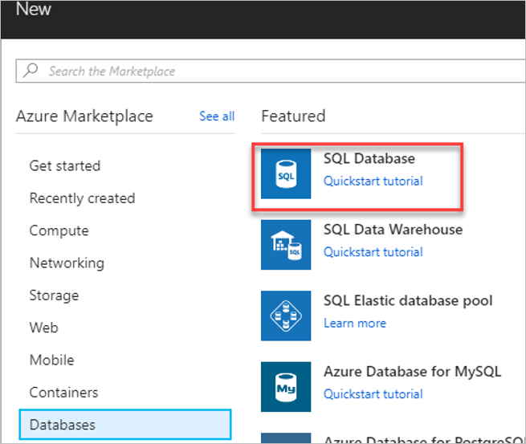

2. They specify a database  name to match the database running on the on-premises VM (**SmartHotel.Registration**). They place the database in the ContosoRG resource group. This is the resource group they use for production resources in Azure.

    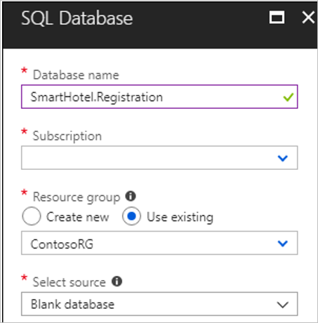

3. They set up a new SQL Server instance (**sql-smarthotel-eus2**) in the primary region.

    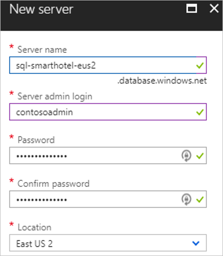

4. They set the pricing tier to match their server and database needs. And they select to save money with Azure Hybrid Benefit because they already have a SQL Server license.
5. For sizing they use v-Core-based purchasing, and set the limits for their expected requirements.

    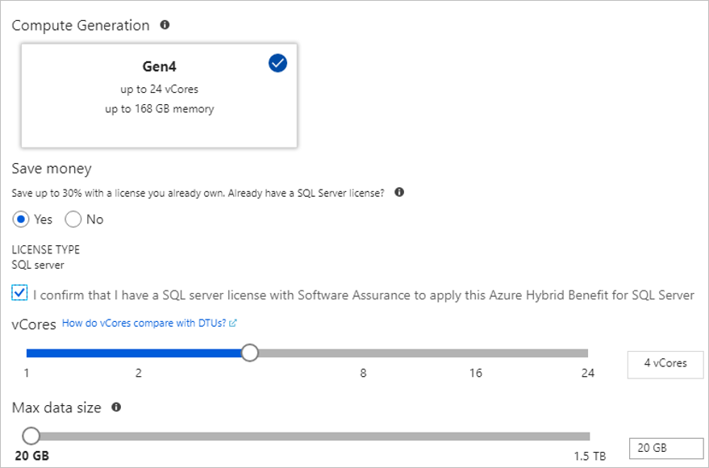

6. Then they create the database instance.

    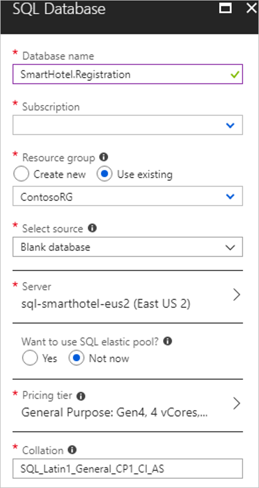

7. After the instance is created, they open the database, and note details they need when they use the Database Migration Assistance for migration.

    

**Need more help?**

- [Get help](https://docs.microsoft.com/azure/sql-database/sql-database-get-started-portal) provisioning a SQL Database.
- [Learn about](https://docs.microsoft.com/azure/sql-database/sql-database-vcore-resource-limits-elastic-pools) v-Core resource limits.

## Step 2: Migrate the database with DMA

Contoso will migrate the SmartHotel database using DMA.

### Install DMA

1. They download the tool from the [Microsoft Download Center](https://www.microsoft.com/download/details.aspx?id=53595) to the on-premises SQL Server VM (**SQLVM**).
2. They run setup (DownloadMigrationAssistant.msi) on the VM.
3. On the **Finish** page, they select **Launch Microsoft Data Migration Assistant** before finishing the wizard.

### Migrate the database with DMA

1. In the DMA create a new project (**SmartHotelDB**) and select **Migration** 
2. They select the source server type as **SQL Server**, and the target as **Azure SQL Database**. 

    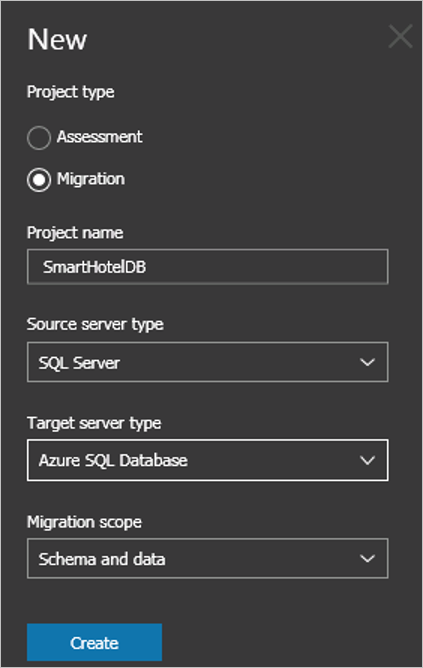

3. In the migration details, they add **SQLVM** as the source server, and the **SmartHotel.Registration** database. 

     

4. They receive an error which seems to be associated with authentication. However after investigating, the issue is the period (.) in the database name. As a workaround, they decided to provision a new SQL database using the name **SmartHotel-Registration**, to resolve the issue. When they run DMA again, they're able to select **SmartHotel-Registration**, and continue with the wizard.

    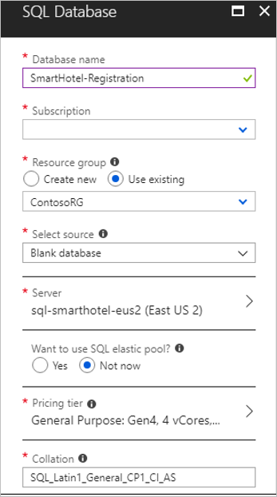

5. In **Select Objects**, they select the database tables, and generate a SQL script.

    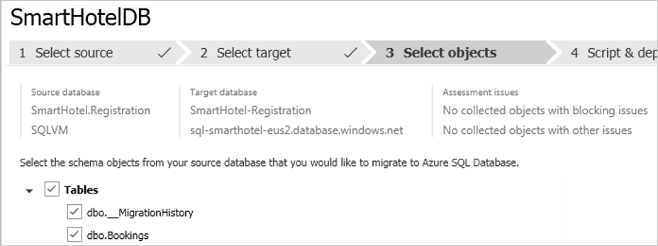

6. After DMS creates the script, they click **Deploy schema**.

    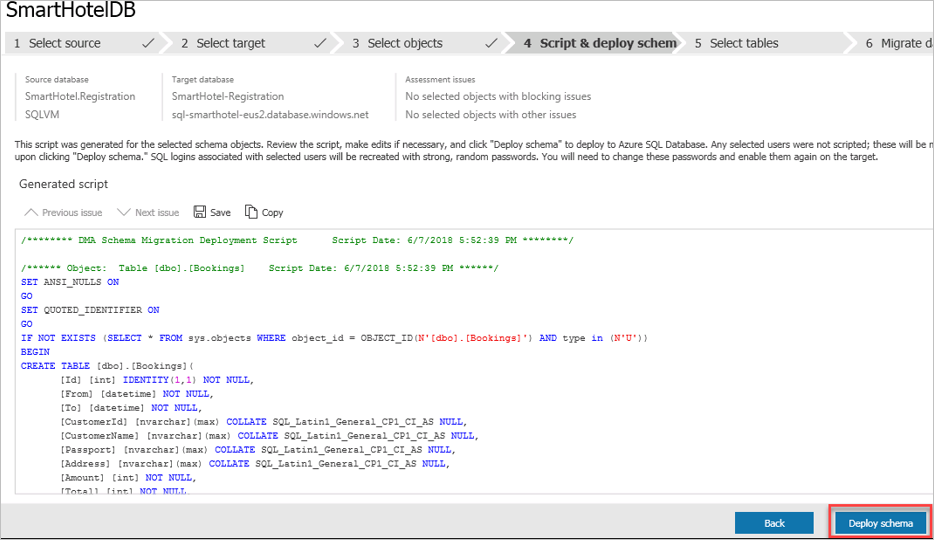

7. DMA confirms that the deployment succeeded.

    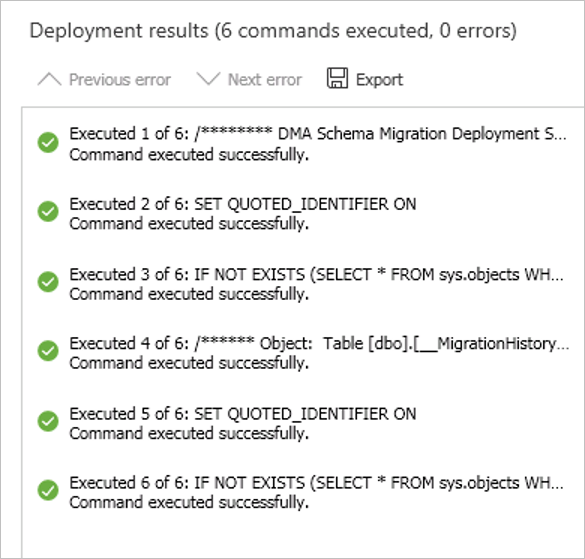

8. Now they start the migration.

    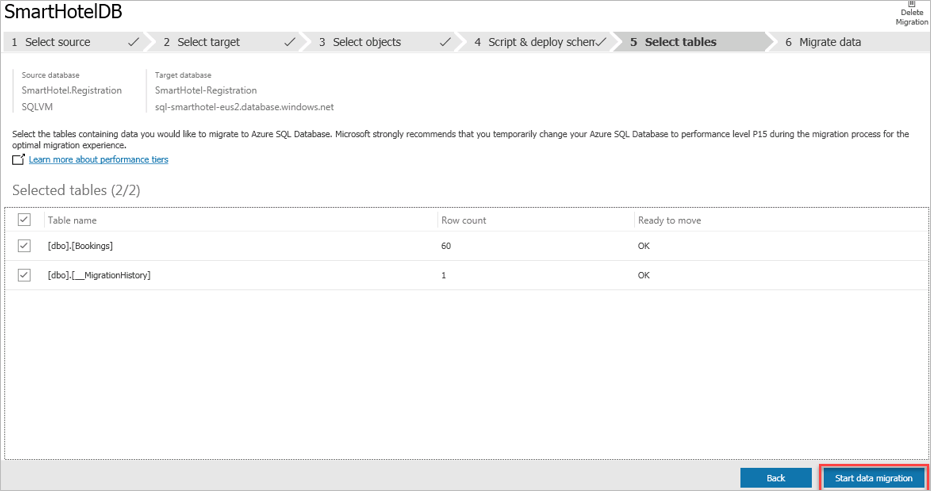

9. After the migration finishes, Contoso can verify that the database is running on the Azure SQL instance.

    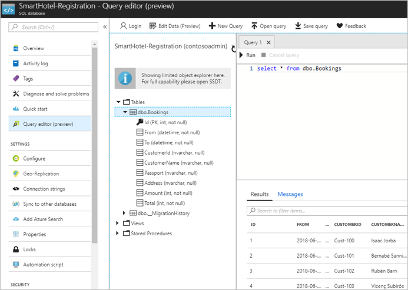

10. They delete the extra SQL database **SmartHotel.Registration** in the Azure portal.

    

## Step 3: Provision Web Apps

With the database migrated, Contoso can now provision the two web apps.

1. They select **Web App** in the portal.

    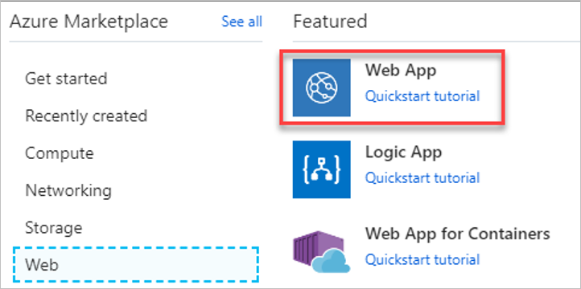

2. They provide an app name (**SHWEB-EUS2**), run it on Windows, and place it un the production resources group **ContosoRG**. They create a new app service and plan.

    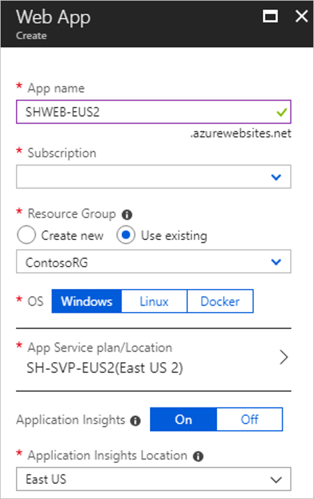

3. After the web app is provisioned, they repeat the process to create a web app for the WCF service (**SHWCF-EUS2**)

    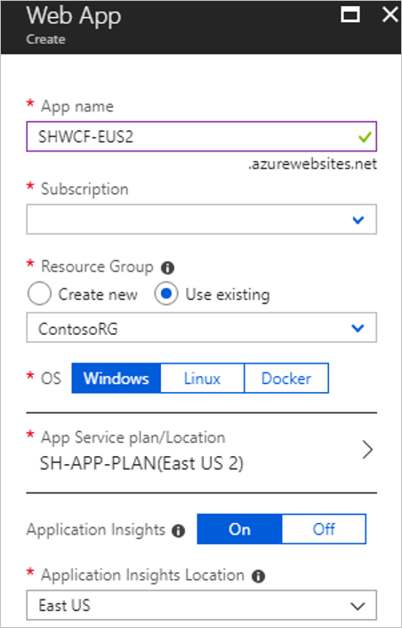

4. After they're done, they browse to the address of the apps to check they've been created successfully.

## Step 4: Configure connection strings

Contoso needs to make sure the web apps and database can all communicate. To do this, they configure connection strings in the code and in the web apps.

1. In the web app for the WCF service (**SHWCF-EUS2**) > **Settings** > **Application settings**, they add a new connection string named **DefaultConnection**.
2. The connection string is pulled from the **SmartHotel-Registration** database, and should be updated with the correct credentials.

    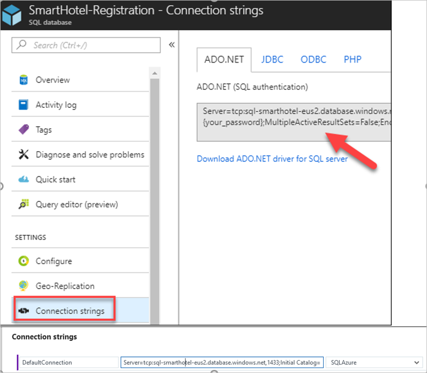

3. Using Visual Studio, Contoso opens the solution file from the **SmartHotel360-internal-booking-apps** folder. The **connectionStrings** section of the web.config file for the WCF service SmartHotel.Registration.Wcf should be updated with the connection string.

     

4. The **client** section of the web.config file for the SmartHotel.Registration.Web should be changed to point to the new location of the WCF service. This is the URL of the WCF web app hosting the service endpoint.

    

## Step 5: Publish web apps

As a final step, Contoso publishes the web apps to Azure.

1. In Visual Studio, they right-click the SmartHotel.REgistration.Wcf project > **Publish**.

    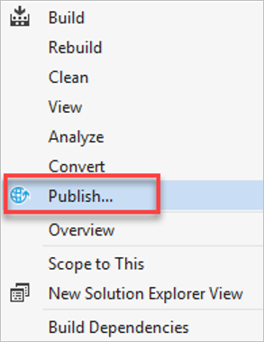

2. They start publishing.

    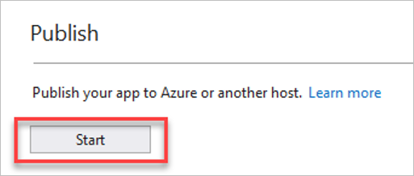

3. They select an existing App Service because they've already created the web app.

    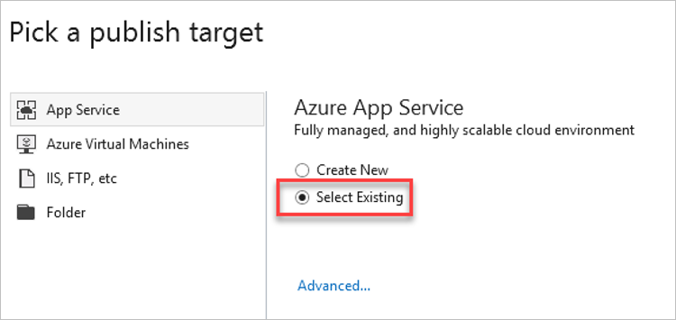

4. After they select the WCF app, Visual Studio deploys it.

    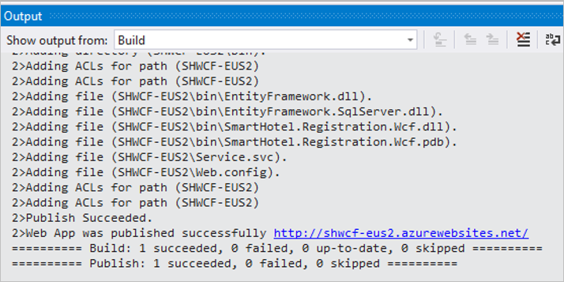

5. They then repeat the process to publish the web app - SmartHotel.Registration.Web.

    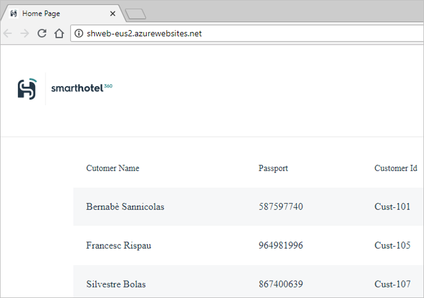

At this point, the application is successfully migrated to Azure.

## Clean up after migration

After migration, Contoso needs to complete these cleanup steps:  

- Remove the on-premises VMs from the vCenter inventory.
- Remove the VMs from local backup jobs.
- Update internal documentation to show the new locations for the SmartHotel app. Show the database as running in Azure SQL database, and the front end as running in two web apps.
- Review any resources that interact with the decommissioned VMs, and update any relevant settings or documentation to reflect the new configuration.

## Review the deployment

With the migrated resources in Azure, Contoso needs to fully operationalize and secure their new infrastructure.

### Security

- Contoso need to ensure that their new **SmartHotel-Registration** database is secure. [Learn more](https://docs.microsoft.com/azure/sql-database/sql-database-security-overview).
- In particular, they should update the web apps to use SSL with certificates.

### Backups

- Contoso needs to review backup requirements for the Azure SQL Database. [Learn more](https://docs.microsoft.com/azure/sql-database/sql-database-automated-backups).
- They should consider implementing failover groups to provide regional failover for the database. [Learn more](https://docs.microsoft.com/azure/sql-database/sql-database-geo-replication-overview).
- Contoso need to consider deploying the Web App in the main East US 2 and Central US region for resilience. They could configure Traffic Manager to ensure failover in case of regional outages.

### Licensing and cost optimization

- After all resources are deployed, Contoso should assign Azure tags based on their [infrastructure planning](contoso-migration-infrastructure.md#set-up-tagging).
- All licensing is built into the cost of the PaaS services that Contoso is consuming. This will be deducted from the EA.
1. Contoso will enable Azure Cost Management licensed by Cloudyn, a Microsoft subsidiary. It's a multi-cloud cost management solution that helps you to utilize and manage Azure and other cloud resources.  [Learn more](https://docs.microsoft.com/azure/cost-management/overview) about Azure Cost Management. 

## Conclusion

In this article, Contoso refactored the SmartHotel app in Azure by migrating the app frontend VM to two Azure Web Apps. They migrated the app database to an Azure SQL database.

