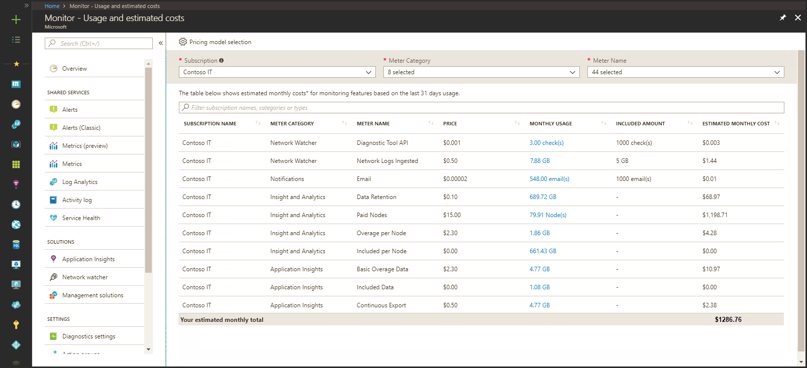
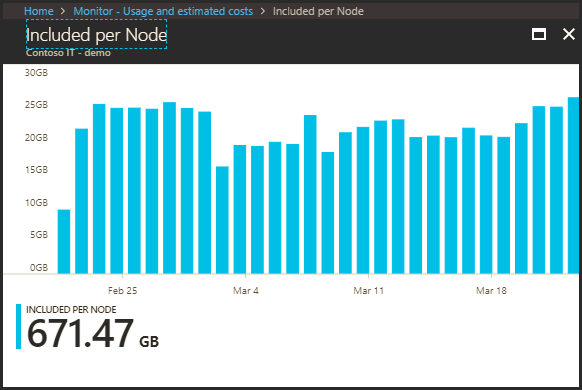
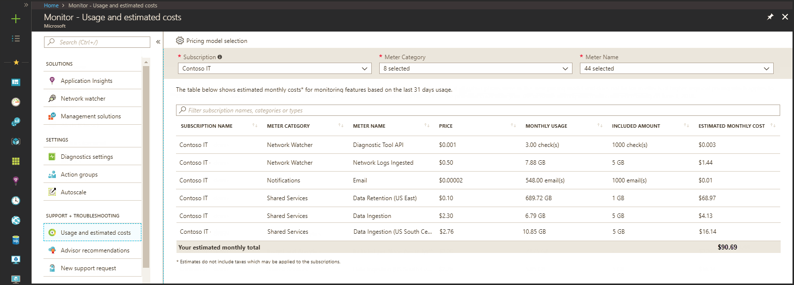
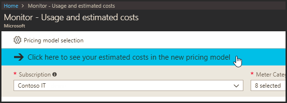
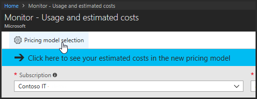
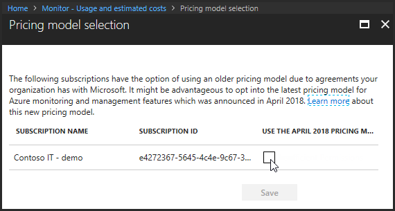

# Monitoring usage and estimated costs

In the Monitor hub of the Azure portal, the **Usage and estimated costs** page explains the usage of core monitoring features such as [alerting, metrics, notifications](https://azure.microsoft.com/pricing/details/monitor/), [Azure Log Analytics](https://azure.microsoft.com/pricing/details/log-analytics/), and [Azure Application Insights](https://azure.microsoft.com/pricing/details/application-insights/). For customers on the pricing plans available before April 2018, this also includes Log Analytics usage purchased through the Insights and Analytics offer.

On this page, users can view their resource usage for the past 31 days, aggregated per subscription. Drill-ins show usage trends over the 31-day period. A lot of data needs to come together for this estimate, so please be patient as the page loads.

This example shows monitoring usage and an estimate of the resulting costs:



Select the link in the monthly usage column to open a chart that shows usage trends over the last 31-day period:



Here’s another similar usage and cost summary. This example shows a subscription in the new April 2018 consumption-based pricing model. Note the lack of any node-based billing. Data ingestion and retention for Log Analytics and Application Insights are now reported on a new common meter.



## New pricing model

In April 2018, a [new monitoring pricing model was released](https://azure.microsoft.com/blog/introducing-a-new-way-to-purchase-azure-monitoring-services/).  This features cloud-friendly, consumption-based pricing. You only pay for what you use, without node-based commitments. Details of the new pricing model are available for [alerting, metrics, notifications](https://azure.microsoft.com/pricing/details/monitor/), [Log Analytics](https://azure.microsoft.com/pricing/details/log-analytics/) and [Application Insights](https://azure.microsoft.com/pricing/details/application-insights/). 

For customers onboarding to Log Analytics or Application Insights after April 2, 2018, the new pricing model is the only option. For customers who already use these services, moving to the new pricing model is optional.

## Assessing the impact of the new pricing model
The new pricing model will have different impacts on each customer based on their monitoring usage patterns. For customers who were using Log Analytics or Application Insights before April 2, 2018, the **Usage and estimated cost** page in Azure Monitor estimates any change in costs if they move to the new pricing model. It provides the way to move a subscription into the new model. For most customers, the new pricing model will be advantageous. For customers with especially high data usage patterns or in higher-cost regions, this may not be the case.

To see an estimate of your costs for the subscriptions that you chose on the **Usage and estimated costs** page, select the blue banner near the top of the page. It’s best to do this one subscription at a time, because that's the level at which the new pricing model can be adopted.



The new page shows a similar version of the prior page with a green banner:


The page also shows a different set of meters that correspond to the new pricing model. This list is an example:

- Insight and Analytics\Overage per Node
- Insight and Analytics\Included per Node
- Application Insights\Basic Overage Data
- Application Insights\Included Data

The new pricing model doesn't have node-based included data allocations. Therefore, these data ingestion meters are combined into a new common data ingestion meter called **Shared Services\Data Ingestion**. 

There's another change to data ingested into Log Analytics or Application Insights in regions with higher costs. Data for these high-cost regions will be shown with the new regional meters. An example is **Data Ingestion (US West Central)**.

> [!NOTE]
> The per subscription estimated costs do not factor into the account-level per node entitlements of the Operations Management Suite (OMS) subscription. Consult your account representative for a more in-depth discussion of the new pricing model in this case.

## New pricing model and Operations Management Suite subscription entitlements

Customers who purchased Microsoft Operations Management Suite E1 and E2 are eligible for per-node data ingestion entitlements for [Log Analytics](https://www.microsoft.com/cloud-platform/operations-management-suite) and [Application Insights](https://docs.microsoft.com/azure/application-insights/app-insights-pricing#the-price-plans). To receive these entitlements for Log Analytics workspaces or Application Insights resources in a given subscription: 

- The subscription's pricing model must remain in the pre-April 2018 model.
- Log Analytics workspaces should use the "Per-node (OMS)" pricing tier.
- Application Insights resources should use the "Enterprise" pricing plan.

Depending on the number of nodes of the suite that your organization purchased, moving some subscriptions to the new pricing model could be advantageous, but this requires careful consideration. In general, it is advisable simply to stay in the pre-April 2018 model as described above.

> [!WARNING]
> If your organization has purchased the Microsoft Operations Management Suite E1 and E2, it is usually best to keep your subscriptions in the pre-April 2018 pricing model. 
>

## Changes when you're moving to the new pricing model

The new pricing model simplifies Log Analytics and Application Insights pricing options to only a single tier (or plan). Moving a subscription into the new pricing model will:

- Change the pricing tier for each Log Analytics to a new Per-GB tier (called “pergb2018” in Azure Resource Manager)
- Any Application Insights resources in the Enterprise plan is changed to the Basic plan.

The cost estimation shows the effects of these changes.

> [!WARNING]
> Here an important note if you use Azure Resource Manager or PowerShell to deploy [Log Analytics](https://docs.microsoft.com/azure/log-analytics/log-analytics-template-workspace-configuration) or [Application Insights](https://docs.microsoft.com/azure/application-insights/app-insights-powershell) in a subscription you have moved to the new pricing model. If you specify a pricing tier/plan other than the “pergb2018” for Log Analytics or “Basic” for Application Insights, rather than failing the deployment due to specifying an invalid pricing tier/plan, it will succeed **but it will use only the valid pricing tier/plan** (This does not apply to the Log Analytics Free tier where an invalid pricing tier message is generated).
>

## Moving to the new pricing model

If you’ve decided to adopt the new pricing model for a subscription, select the **Pricing model selection** option at the top of the **Usage and estimated costs** page:



The **Pricing model selection** page will open. It shows a list of each of the subscriptions that you viewed on the prior page:



To move a subscription to the new pricing model, just select the box and then select **Save**. You can move back to the older pricing model in the same way. Keep in mind that subscription owner or contributor permissions are required to change the pricing model.

## Automate moving to the new pricing model

The scripts below require the Azure PowerShell Module. To check if you have the latest version see [Install Azure PowerShell module](https://docs.microsoft.com/powershell/azure/install-azurerm-ps?view=azurermps-6.1.0).

Once you have the latest version of Azure PowerShell, you would first need to run ``Connect-AzureRmAccount``.

``` PowerShell
# To check if your subscription is eligible to adjust pricing models.
$ResourceID ="/subscriptions/<Subscription-ID-Here>/providers/microsoft.insights"
Invoke-AzureRmResourceAction `
 -ResourceId $ResourceID `
 -ApiVersion "2017-10-01" `
 -Action listmigrationdate `
 -Force
```

A result of True under isGrandFatherableSubscription indicates that this subscription's pricing model can be moved between pricing models. The lack of a value under optedInDate means this subscription is currently set to the old pricing model.

```
isGrandFatherableSubscription optedInDate
----------------------------- -----------
                         True            
```

To migrate this subscription to the new pricing model run:

```PowerShell
$ResourceID ="/subscriptions/<Subscription-ID-Here>/providers/microsoft.insights"
Invoke-AzureRmResourceAction `
 -ResourceId $ResourceID `
 -ApiVersion "2017-10-01" `
 -Action migratetonewpricingmodel `
 -Force
```

To confirm that the change was successful rerun:

```PowerShell
$ResourceID ="/subscriptions/<Subscription-ID-Here>/providers/microsoft.insights"
Invoke-AzureRmResourceAction `
 -ResourceId $ResourceID `
 -ApiVersion "2017-10-01" `
 -Action listmigrationdate `
 -Force
```

If the migration was successful, your result should now look like:

```
isGrandFatherableSubscription optedInDate                      
----------------------------- -----------                      
                         True 2018-05-31T13:52:43.3592081+00:00
```

The optInDate now contains a timestamp of when this subscription opted in to the new pricing model.

If you need to revert back to the old pricing model, you would run:

```PowerShell
 $ResourceID ="/subscriptions/<Subscription-ID-Here>/providers/microsoft.insights"
Invoke-AzureRmResourceAction `
 -ResourceId $ResourceID `
 -ApiVersion "2017-10-01" `
 -Action rollbacktolegacypricingmodel `
 -Force
```

If you then rerun the previous script that has ``-Action listmigrationdate``, you should now see an empty optedInDate value indicating your subscription has been returned to the legacy pricing model.

If you have multiple subscriptions, that you wish to migrate which are hosted under the same tenant you could create your own variant using pieces of the following scripts:

```PowerShell
#Query tenant and create an array comprised of all of your tenants subscription ids
$TenantId = <Your-tenant-id>
$Tenant =Get-AzureRMSubscription -TenantId $TenantId
$Subscriptions = $Tenant.Id
```

To check to see if all the subscriptions in your tenant are eligible for the new pricing model, you can run:

```PowerShell
Foreach ($id in $Subscriptions)
{
$ResourceID ="/subscriptions/$id/providers/microsoft.insights"
Invoke-AzureRmResourceAction `
 -ResourceId $ResourceID `
 -ApiVersion "2017-10-01" `
 -Action listmigrationdate `
 -Force
}
```

The script could be refined further by creating a script that generates three arrays. One array will consist of all subscription id's that have ```isGrandFatherableSubscription``` set to True and optedInDate does not currently have a value. A second array of any subscriptions currently on the new pricing model. And a third array populated only with subscription ids in your tenant that are not eligible for the new pricing model:

```PowerShell
[System.Collections.ArrayList]$Eligible= @{}
[System.Collections.ArrayList]$NewPricingEnabled = @{}
[System.Collections.ArrayList]$NotEligible = @{}

Foreach ($id in $Subscriptions)
{
$ResourceID ="/subscriptions/$id/providers/microsoft.insights"
$Result= Invoke-AzureRmResourceAction `
 -ResourceId $ResourceID `
 -ApiVersion "2017-10-01" `
 -Action listmigrationdate `
 -Force

     if ($Result.isGrandFatherableSubscription -eq $True -and [bool]$Result.optedInDate -eq $False)
     {
     $Eligible.Add($id)
     }

     elseif ($Result.isGrandFatherableSubscription -eq $True -and [bool]$Result.optedInDate -eq $True)
     {
     $NewPricingEnabled.Add($id)
     }

     elseif ($Result.isGrandFatherableSubscription -eq $False)
     {
     $NotEligible.add($id)
     }
}
```

> [!NOTE]
> Depending on the number of subscriptions the above script may take some time to run. Due to the use of the .add() method the PowerShell window will echo incrementing values as items are added to each array.

Now that you have your subscriptions divided into the three arrays you should carefully review your results. You may want to make a backup copy of the contents of the arrays so that you can easily revert your changes should you need to in the future. If you decided, you wanted to convert all the eligible subscriptions that are currently on the old pricing model to the new pricing model this task could now be accomplished with:

```PowerShell
Foreach ($id in $Eligible)
{
$ResourceID ="/subscriptions/$id/providers/microsoft.insights"
Invoke-AzureRmResourceAction `
 -ResourceId $ResourceID `
 -ApiVersion "2017-10-01" `
 -Action migratetonewpricingmodel `
 -Force
}

```