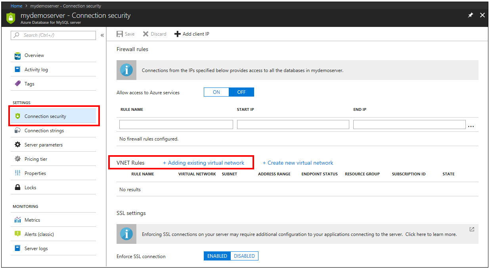
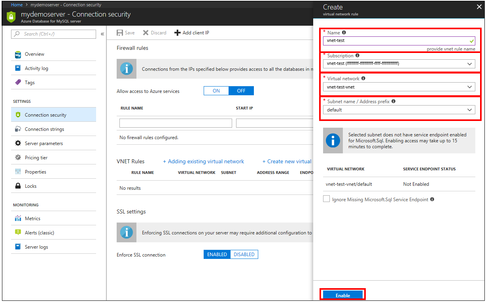
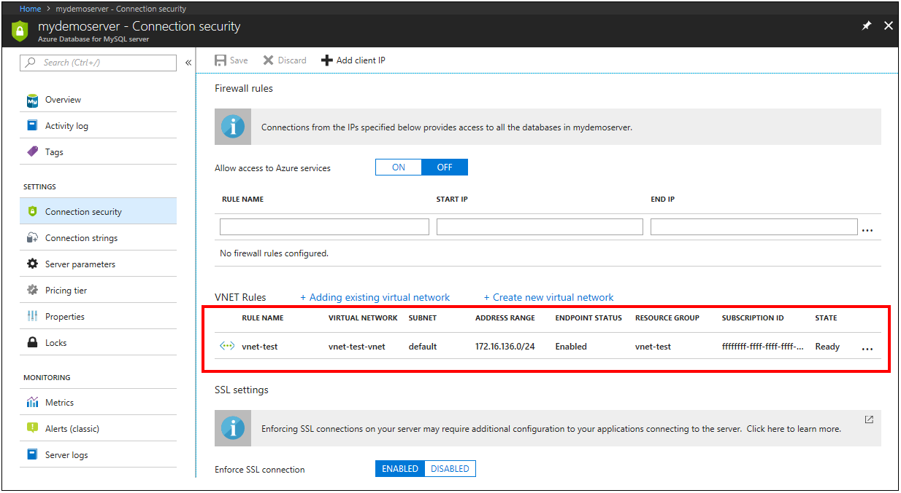

# Create and manage Azure Database for MySQL VNet service endpoints and VNet rules by using the Azure portal
Virtual Network (VNet) services endpoints and rules extend the private address space of a Virtual Network to your Azure Database for MySQL server. For an overview of Azure Database for MySQL VNet service endpoints, including limitations, see [Azure Database for MySQL Server VNet service endpoints](concepts-data-access-and-security-vnet.md). VNet service endpoints are available in public preview in all supported regions for Azure Database for MySQL.

> [!NOTE]
> Support for VNet service endpoints is only for General Purpose and Memory Optimized servers.

## Create a VNet rule and enable service endpoints in the Azure portal

1. On the MySQL server page, under the Settings heading, click **Connection Security** to open the Connection Security pane for Azure Database for MySQL. Next, click on **+ Adding existing virtual network**. If you do not have an existing VNet you can click **+ Create new virtual network** to create one. See [Quickstart: Create a virtual network using the Azure portal](../virtual-network/quick-create-portal.md)

   

2. Enter a VNet rule name, select the subscription, Virtual network and Subnet name and then click **Enable**. This automatically enables VNet service endpoints on the subnet using the **Microsoft.SQL** service tag.

   

   > [!IMPORTANT]
   > It is highly recommended to read this article about service endpoint configurations and considerations before configuring service endpoints. **Virtual Network service endpoint:** A [Virtual Network service endpoint](../virtual-network/virtual-network-service-endpoints-overview.md) is a subnet whose property values include one or more formal Azure service type names. VNet services endpoints use the service type name **Microsoft.Sql**, which refers to the Azure service named SQL Database. This service tag also applies to the Azure SQL Database, Azure Database for PostgreSQL and MySQL services. It is important to note when applying the **Microsoft.Sql** service tag to a VNet service endpoint it configures service endpoint traffic for all Azure Database services, including Azure SQL Database, Azure Database for PostgreSQL and Azure Database for MySQL servers on the subnet. 
   > 

3. Once enabled, click **OK** and you will see that VNet service endpoints are enabled along with a VNet rule.

   

## Next steps
- Similarly, you can script to [Enable VNet service endpoints and create a VNET rule for Azure Database for MySQL using Azure CLI](howto-manage-vnet-using-cli.md).
- For help in connecting to an Azure Database for MySQL server, see [Connection libraries for Azure Database for MySQL](./concepts-connection-libraries.md)
