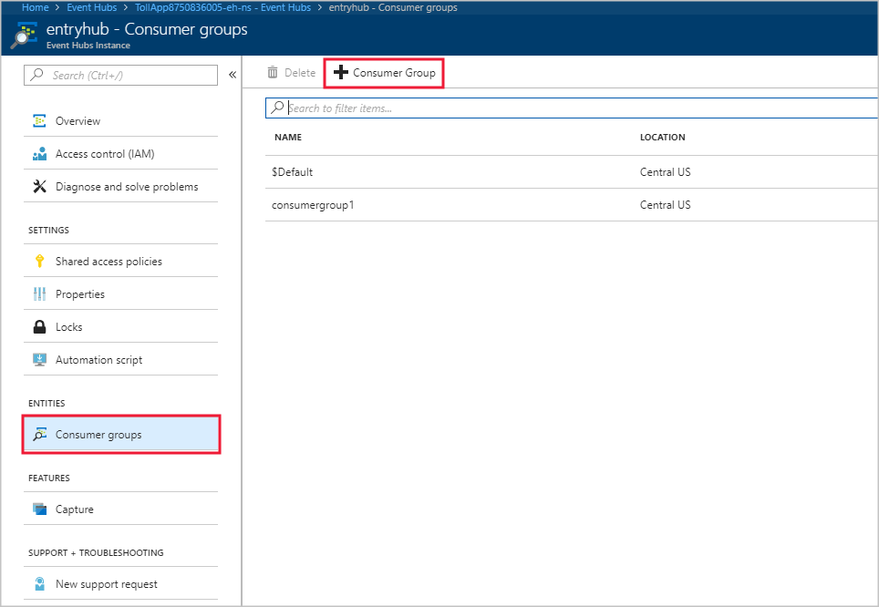

# Troubleshoot Event Hub receivers in Azure Stream Analytics

You can use Azure Event Hubs in Azure Stream Analytics to ingest or output data from a job. A best practice for using Event Hubs is to use multiple consumer groups, to ensure job scalability. One reason is that the number of readers in the Stream Analytics job for a specific input affects the number of readers in a single consumer group. The precise number of receivers is based on internal implementation details for the scale-out topology logic. The number of receivers is not exposed externally. The number of readers can change either at the job start time or during job upgrades.

The error shown when number of receivers exceeds the maximum is:
`The streaming job failed: Stream Analytics job has validation errors: Job will exceed the maximum amount of Event Hub Receivers.`

> [!NOTE]
> When the number of readers changes during a job upgrade, transient warnings are written to audit logs. Stream Analytics jobs automatically recover from these transient issues.

## Add a consumer group in Event Hubs
To add a new consumer group in your Event Hubs instance, follow these steps:

1. Sign in to the Azure portal.

2. Locate your Event Hubs.

3. Select **Event Hubs** under the **Entities** heading.

4. Select the Event Hub by name.

5. On the **Event Hubs Instance** page, under the **Entities** heading, select **Consumer groups**. A consumer group with name **$Default** is listed.

6. Select **+ Consumer Group** to add a new consumer group. 

   

7. When you created the input in the Stream Analytics job to point to the Event Hub, you specified the consumer group there. $Default is used when none is specified. Once you create a new consumer group, edit the Event Hub input in the Stream Analytics job and specify the name of the new consumer group.


## Number of readers per partition exceeds Event Hubs limit of five

If your streaming query syntax references the same input Event Hub resource multiple times, the job engine can use multiple readers per query from that same consumer group. When there are too many references to the same consumer group, the job can exceed the limit of five and thrown an error. In those circumstances, you can further divide by using multiple inputs across multiple consumer groups using the solution described in the following section. 

Scenarios in which the number of readers per partition exceeds the Event Hubs limit of five include the following:

* Multiple SELECT statements: If you use multiple SELECT statements that refer to **same** event hub input, each SELECT statement causes a new receiver to be created.
* UNION: When you use a UNION, it's possible to have multiple inputs that refer to the **same** event hub and consumer group.
* SELF JOIN: When you use a SELF JOIN operation, it's possible to refer to the **same** event hub multiple times.

## Solution

The following best practices can help mitigate scenarios in which the number of readers per partition exceeds the Event Hubs limit of five.

### Split your query into multiple steps by using a WITH clause

The WITH clause specifies a temporary named result set that can be referenced by a FROM clause in the query. You define the WITH clause in the execution scope of a single SELECT statement.

For example, instead of this query:

```
SELECT foo 
INTO output1
FROM inputEventHub

SELECT bar
INTO output2
FROM inputEventHub 
…
```

Use this query:

```
WITH data AS (
   SELECT * FROM inputEventHub
)

SELECT foo
INTO output1
FROM data

SELECT bar
INTO output2
FROM data
…
```

### Ensure that inputs bind to different consumer groups

For queries in which three or more inputs are connected to the same Event Hubs consumer group, create separate consumer groups. This requires the creation of additional Stream Analytics inputs.


## Next steps
* [Scale Stream Analytics jobs](stream-analytics-scale-jobs.md)
* [Stream Analytics query language reference](https://msdn.microsoft.com/library/azure/dn834998.aspx)
