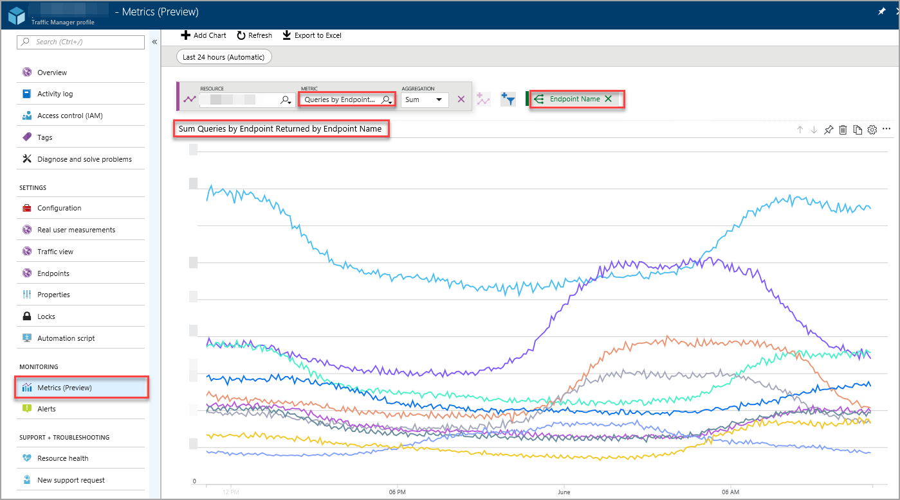

# Traffic Manager metrics and alerts

Traffic Manager provides you with DNS-based load balancing which includes multiple routing methods and endpoint monitoring options. This article describes the metrics and associated alerts that are available to customers. 

## Metrics available in Traffic Manager 

Traffic Manager provides the following metrics on a per profile basis which can be consumed by customers to understand their usage of Traffic manager and the status of their endpoints under that profile.  

### Queries by endpoint returned
Use [this metric](../monitoring-and-diagnostics/monitoring-supported-metrics.md) to view the number of queries that were processed by a Traffic Manager profile over a specified period. You can also view the same information at an endpoint level granularity that helps you understand how many times an endpoint was returned in the query responses from Traffic Manager.

In the example below, Figure 1 displays all the query responses that were returned by the Traffic Manager profile. 

  

*Figure 1: Aggregate view with all queries*
  
Figure 2 displays the same information, however, it is split by endpoints. As a result, you can see the volume of query responses in which a specific endpoint was returned.

*Figure 2: Split view with query volume shown per endpoint returned*

## Endpoint status by endpoint
Use [this metric](../monitoring-and-diagnostics/monitoring-supported-metrics.md) to understand the health status of the endpoints in the profile. It takes two values:
 - use **1** , if the endpoint is up.
 - use **0** if the endpoint is down.

This metric can be shown either as an aggregate value representing the status of all the metrics (Figure 3), or, it can be split (see Figure 4) to show the status of specific endpoints. In the case of the former, if the aggregation level is selected as **Avg**, the value of the this metric is the arithmetic average of the status of all endpoints. For example, if a profile has two endpoints and only one is healthy, this metric will have a value of **0.50** as shown in Figure 3. 

*Figure 3: Composite view of endpoint status metric – “Avg” aggregation selected*

*Figure 4: Split view of endpoint status metrics*

You can consume these metrics through [Azure Monitor service](../monitoring-and-diagnostics/monitoring-supported-metrics.md)’s portal, [REST API](https://docs.microsoft.com/rest/api/monitor/), [Azure CLI](https://docs.microsoft.com/cli/azure/monitor), and [Azure PowerShell](https://docs.microsoft.com/powershell/module/azurerm.insights), or through the metrics section of Traffic Manager’s portal experience.

## Alerts on Traffic Manager metrics
In addition to processing and displaying metrics from Traffic Manager, Azure Monitor enables customers to configure and receive alerts associated with these metrics. You can choose what conditions need to be met in these metrics for an alert to occur, how often those conditions need to be monitored, and how the alerts should be sent to you. For more information, see [Azure Monitor alerts documentation](../monitoring-and-diagnostics/monitor-alerts-unified-usage.md).

## Next steps
- Learn more about [Azure Monitor service](../monitoring-and-diagnostics/monitoring-supported-metrics.md)
- Learn how to [create a new chart using Azure Monitor](../monitoring-and-diagnostics/monitoring-metric-charts.md#how-do-i-create-a-new-chart)