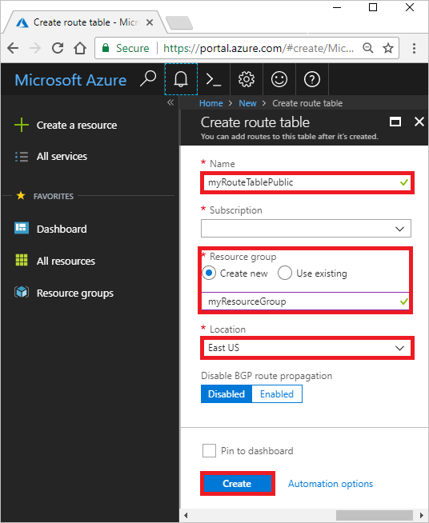
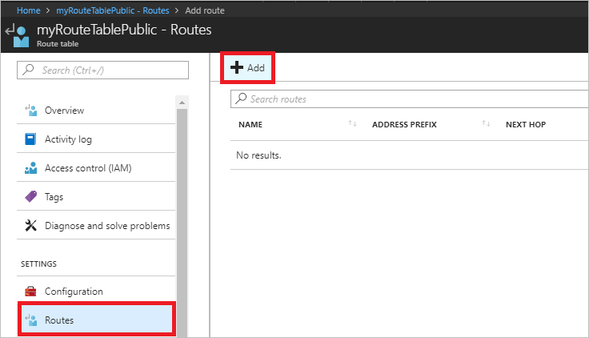
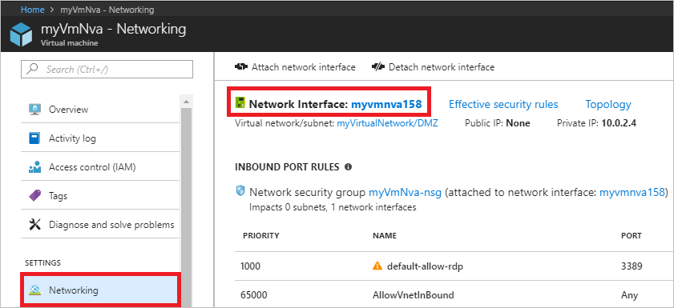
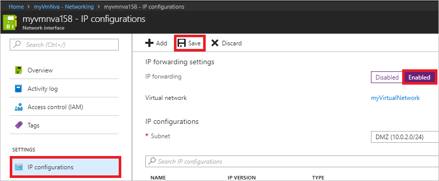
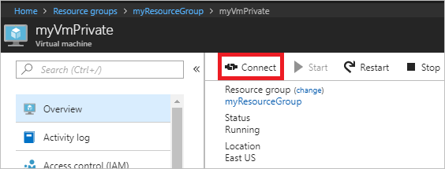

# Tutorial: Route network traffic with a route table using the Azure portal

Azure automatically routes traffic between all subnets within a virtual network, by default. You can create your own routes to override Azure's default routing. The ability to create custom routes is helpful if, for example, you want to route traffic between subnets through a network virtual appliance (NVA). In this tutorial, you learn how to:

> [!div class="checklist"]
> * Create a route table
> * Create a route
> * Create a virtual network with multiple subnets
> * Associate a route table to a subnet
> * Create an NVA that routes traffic
> * Deploy virtual machines (VM) into different subnets
> * Route traffic from one subnet to another through an NVA

If you prefer, you can complete this tutorial using the [Azure CLI](tutorial-create-route-table-cli.md) or [Azure PowerShell](tutorial-create-route-table-powershell.md).

If you don't have an Azure subscription, create a [free account](https://azure.microsoft.com/free/?WT.mc_id=A261C142F) before you begin.

## Log in to Azure 

Log in to the Azure portal at http://portal.azure.com.

## Create a route table

1. Select **+ Create a resource** on the upper, left corner of the Azure portal.
2. Select **Networking**, and then select **Route table**.
3. Enter, or select, the following information, accept the default for the remaining setting, and then select **Create**:

    |Setting|Value|
    |---|---|
    |Name|myRouteTablePublic|
    |Subscription| Select your subscription.|
    |Resource group | Select **Create new** and enter *myResourceGroup*.|
    |Location|East US|
 
     

## Create a route

1. In the *Search resources, services, and docs* box at the top of the portal, begin typing *myRouteTablePublic*. When **myRouteTablePublic** appears in the search results, select it.
2. Under **SETTINGS**, select **Routes** and then select **+ Add**, as shown in the following picture:

     
 
3. Under **Add route**, enter, or select, the following information, accept the default for the remaining settings, and then select **Create**:

    |Setting|Value|
    |---|---|
    |Route name|ToPrivateSubnet|
    |Address prefix| 10.0.1.0/24|
    |Next hop type | Select **Virtual appliance**.|
    |Next hop address| 10.0.2.4|

## Associate a route table to a subnet

Before you can associate a route table to a subnet, you have to create a virtual network and subnet, then you can associate the route table to a subnet:

1. Select **+ Create a resource** on the upper, left corner of the Azure portal.
2. Select **Networking**, and then select **Virtual network**.
3. Under **Create virtual network**, Enter, or select, the following information, accept the default for the remaining settings, and then select **Create**:

    |Setting|Value|
    |---|---|
    |Name|myVirtualNetwork|
    |Address space| 10.0.0.0/16|
    |Subscription | Select your subscription.|
    |Resource group|Select **Use existing** and then select **myResourceGroup**.|
    |Location|Select *East US*|
    |Subnet name|Public|
    |Address range|10.0.0.0/24|
    
4. In the **Search resources, services, and docs** box at the top of the portal, begin typing *myVirtualNetwork*. When **myVirtualNetwork** appears in the search results, select it.
5. Under **SETTINGS**, select **Subnets** and then select **+ Subnet**, as shown in the following picture:

     

6. Select or enter the following information, then select **OK**:

    |Setting|Value|
    |---|---|
    |Name|Private|
    |Address space| 10.0.1.0/24|

7. Complete steps 5 and 6 again, providing the following information:

    |Setting|Value|
    |---|---|
    |Name|DMZ|
    |Address space| 10.0.2.0/24|

8. The **myVirtualNetwork - Subnets** box is displayed after completing the previous step. Under **SETTINGS**, select **Subnets** and then select **Public**.
9. As shown in the following picture, select **Route table**, select **MyRouteTablePublic**, and then select **Save**:

     

## Create an NVA

An NVA is a VM that performs a network function, such as routing, firewalling, or WAN optimization.

1. Select **+ Create a resource** on the upper, left corner of the Azure portal.
2. Select **Compute**, and then select **Windows Server 2016 Datacenter**. You can select a different operating system, but the remaining steps assume you selected **Windows Server 2016 Datacenter**. 
3. Select or enter the following information for **Basics**, then select **OK**:

    |Setting|Value|
    |---|---|
    |Name|myVmNva|
    |User name|Enter a user name of your choosing.|
    |Password|Enter a password of your choosing. The password must be at least 12 characters long and meet the [defined complexity requirements](../virtual-machines/windows/faq.md?toc=%2fazure%2fvirtual-network%2ftoc.json#what-are-the-password-requirements-when-creating-a-vm).|
    |Resource group| Select **Use existing** and then select *myResourceGroup*.|
    |Location|Select **East US**.|
4. Select a VM size under **Choose a size**.
5. Select or enter the following information for **Settings**, then select **OK**:

    |Setting|Value|
    |---|---|
    |Virtual network|myVirtualNetwork - If it's not selected, select **Virtual network**, then select **myVirtualNetwork** under **Choose virtual network**.|
    |Subnet|Select **Subnet** and then select **DMZ** under **Choose subnet**. |
    |Public IP address| Select **Public IP address** and select **None** under **Choose public IP address**. No public IP address is assigned to this VM since it won't be connected to from the internet.
6. Under **Create** in the **Summary**, select **Create** to start the VM deployment.

    The VM takes a few minutes to create. Do not continue to the next step until Azure finishes creating the VM and opens a box with information about the VM.

7. In the box that opened for the VM after it was created, under **SETTINGS**, select **Networking**, and then select **myvmnva158** (the network interface Azure created for your VM has a different number after **myvmnva**), as shown in the following picture:

     

8. For a network interface to be able to forward network traffic sent to it, that is not destined for its own IP address, IP forwarding must be enabled for the network interface. Under **SETTINGS**, select **IP configurations**, select **Enabled** for **IP forwarding**, and then select **Save**, as shown in the following picture:

     

## Create virtual machines

Create two VMs in the virtual network, so that you can validate that traffic from the *Public* subnet is routed to the *Private* subnet through the NVA in a later step. Complete steps 1-6 of [Create a NVA](#create-a-network-virtual-appliance). Use the same settings in steps 3 and 5, except for the following changes:

|Virtual machine name      |Subnet      | Public IP address     |
|--------- | -----------|---------              |
| myVmPublic  | Public     | Accept portal default |
| myVmPrivate | Private    | Accept portal default |

You can create the *myVmPrivate* VM while Azure creates the *myVmPublic* VM. Do not continue with the following steps until Azure finishes creating both VMs.

## Route traffic through an NVA

1. In the *Search* box at the top of the portal, begin typing *myVmPrivate*. When the **myVmPrivate** VM appears in the search results, select it.
2. Create a remote desktop connection to the *myVmPrivate* VM by selecting **Connect**, as shown in the following picture:

      

3. To connect to the VM, open the downloaded RDP file. If prompted, select **Connect**.
4. Enter the user name and password you specified when creating the VM (you may need to select **More choices**, then **Use a different account**, to specify the credentials you entered when you created the VM), then select **OK**.
5. You may receive a certificate warning during the sign-in process. Select **Yes** to proceed with the connection.
6. In a later step, the trace route tool is used to test routing. Trace route uses the Internet Control Message Protocol (ICMP), which is denied through the Windows Firewall. Enable ICMP through the Windows firewall by entering the following command from PowerShell on the *myVmPrivate* VM:

    ```powershell
    New-NetFirewallRule –DisplayName “Allow ICMPv4-In” –Protocol ICMPv4
    ```

    Though trace route is used to test routing in this tutorial, allowing ICMP through the Windows Firewall for production deployments is not recommended.
7. You enabled IP forwarding within Azure for the VM's network interface in [Enable IP forwarding](#enable-ip-forwarding). Within the VM, the operating system, or an application running within the VM, must also be able to forward network traffic. Enable IP forwarding within the operating system of the *myVmNva* VM:

    From a command prompt on the *myVmPrivate* VM, remote desktop to the *myVmNva* VM:

    ``` 
    mstsc /v:myvmnva
    ```
    
    To enable IP forwarding within the operating system, enter the following command in PowerShell from the *myVmNva* VM:

    ```powershell
    Set-ItemProperty -Path HKLM:\SYSTEM\CurrentControlSet\Services\Tcpip\Parameters -Name IpEnableRouter -Value 1
    ```
    
    Restart the *myVmNva* VM, which also disconnects the remote desktop session.
8. While still connected to the *myVmPrivate* VM, create a remote desktop session to the *myVmPublic* VM, after the *myVmNva* VM restarts:

    ``` 
    mstsc /v:myVmPublic
    ```
    
    Enable ICMP through the Windows firewall by entering the following command from PowerShell on the *myVmPublic* VM:

    ```powershell
    New-NetFirewallRule –DisplayName “Allow ICMPv4-In” –Protocol ICMPv4
    ```

9. To test routing of network traffic to the *myVmPrivate* VM  from the *myVmPublic* VM, enter the following command from PowerShell on the *myVmPublic* VM:

    ```
    tracert myVmPrivate
    ```

    The response is similar to the following example:
    
    ```
    Tracing route to myVmPrivate.vpgub4nqnocezhjgurw44dnxrc.bx.internal.cloudapp.net [10.0.1.4]
    over a maximum of 30 hops:
        
    1    <1 ms     *        1 ms  10.0.2.4
    2     1 ms     1 ms     1 ms  10.0.1.4
        
    Trace complete.
    ```
      
    You can see that the first hop is 10.0.2.4, which is the NVA's private IP address. The second hop is 10.0.1.4, the private IP address of the *myVmPrivate* VM. The route added to the *myRouteTablePublic* route table and associated to the *Public* subnet caused Azure to route the traffic through the NVA, rather than directly to the *Private* subnet.
10.  Close the remote desktop session to the *myVmPublic* VM, which leaves you still connected to the *myVmPrivate* VM.
11. To test routing of network traffic to the *myVmPublic* VM from the *myVmPrivate* VM, enter the following command from a command prompt on the *myVmPrivate* VM:

    ```
    tracert myVmPublic
    ```

    The response is similar to the following example:

    ```
    Tracing route to myVmPublic.vpgub4nqnocezhjgurw44dnxrc.bx.internal.cloudapp.net [10.0.0.4]
    over a maximum of 30 hops:
    
    1     1 ms     1 ms     1 ms  10.0.0.4
    
    Trace complete.
    ```

    You can see that traffic is routed directly from the *myVmPrivate* VM to the *myVmPublic* VM. By default, Azure routes traffic directly between subnets.
12. Close the remote desktop session to the *myVmPrivate* VM.

## Clean up resources

When no longer needed, delete the resource group and all resources it contains: 

1. Enter *myResourceGroup* in the **Search** box at the top of the portal. When you see **myResourceGroup** in the search results, select it.
2. Select **Delete resource group**.
3. Enter *myResourceGroup* for **TYPE THE RESOURCE GROUP NAME:** and select **Delete**.

## Next steps

In this tutorial, you created a route table and associated it to a subnet. You created a simple NVA that routed traffic from a public subnet to a private subnet. Deploy a variety of pre-configured NVAs that perform network functions such as firewall and WAN optimization from the [Azure Marketplace](https://azuremarketplace.microsoft.com/marketplace/apps/category/networking). To learn more about routing, see [Routing overview](virtual-networks-udr-overview.md) and [Manage a route table](manage-route-table.md).


While you can deploy many Azure resources within a virtual network, resources for some Azure PaaS services cannot be deployed into a virtual network. You can still restrict access to the resources of some Azure PaaS services to traffic only from a virtual network subnet though. To learn how to restrict network access to Azure PaaS resources, advance to the next tutorial.

> [!div class="nextstepaction"]
> [Restrict network access to PaaS resources](tutorial-restrict-network-access-to-resources.md)
