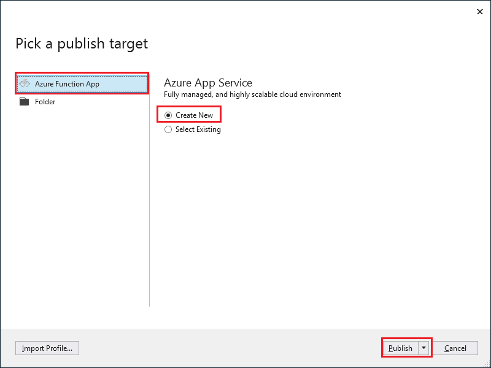
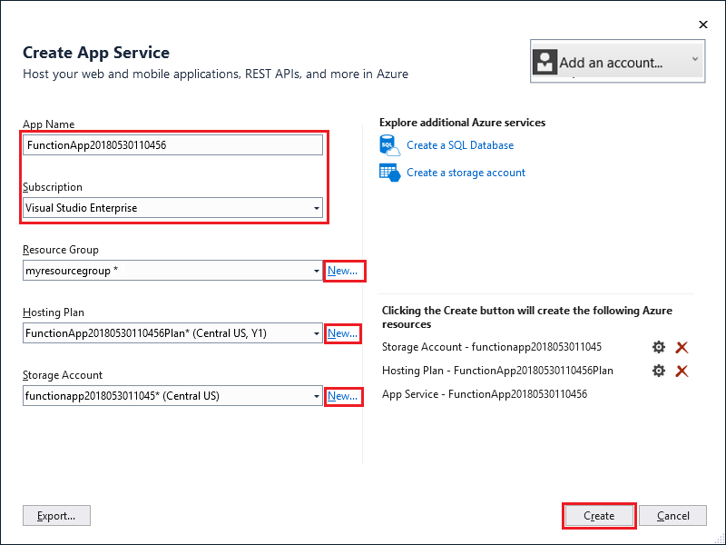

1. In **Solution Explorer**, right-click the project and select **Publish**.

2. Select **Azure Function App**, choose **Create New**, and then select **Publish**.

    

2. If you haven't already connected Visual Studio to your Azure account, select **Add an account...**.

3. In the **Create App Service** dialog, use the **Hosting** settings as specified in the table below the image:

    

    | Setting      | Suggested value  | Description                                |
    | ------------ |  ------- | -------------------------------------------------- |
    | **App Name** | Globally unique name | Name that uniquely identifies your new function app. |
    | **Subscription** | Choose your subscription | The Azure subscription to use. |
    | **[Resource Group](../articles/azure-resource-manager/resource-group-overview.md)** | myResourceGroup |  Name of the resource group in which to create your function app. Choose **New** to create a new resource group.|
    | **[App Service Plan](../articles/azure-functions/functions-scale.md)** | Consumption plan | Make sure to choose the **Consumption** under **Size** after you click **New** to create a plan. Also, choose a **Location** in a [region](https://azure.microsoft.com/regions/) near you or near other services your functions access.  |
    | **[Storage Account](../articles/storage/common/storage-create-storage-account.md#create-a-storage-account)** | General purpose storage account | An Azure storage account is required by the Functions runtime. Click **New** to create a general purpose storage account, or use an existing one.  |

4. Click **Create** to create a function app and related resources in Azure with these settings and deploy your function project code. 

5. After the deployment is complete, make a note of the **Site URL** value, which is the address of your function app in Azure.

    
